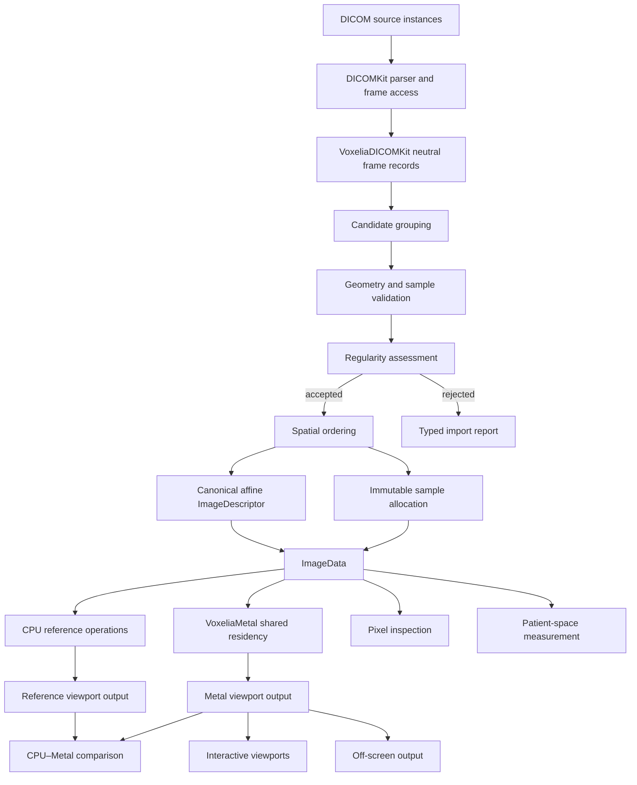

# Voxelia First Vertical Slice Plan v0.1.1

> **Platform applicability:** Voxelia exclusively targets Apple Silicon ARM64 hardware and Apple operating systems. References to operation across more than one platform mean only macOS, iOS/iPadOS, visionOS and tvOS within the Apple ecosystem. No alternate processor architecture, operating system, hosted Swift toolchain, renderer or compatibility target is within scope.

## Document control

| Field | Value |
|---|---|
| Document | Voxelia First Vertical Slice Plan |
| Document identifier | `VOXELIA-FVSP` |
| Version | 0.1.1 |
| Status | Corrective Release |
| Date | 2 August 2026 |
| Project | Voxelia |
| Milestone | M4 — First DICOM CT Vertical Slice |
| Governing documents | Voxelia Project Foundation v0.1.1; Voxelia Master Technical Architecture v0.1.1; Voxelia Requirements Baseline v0.1.1; Voxelia Validation and Benchmark Strategy v0.1.1; Voxelia Repository and Package Scaffold Specification v0.1.1; Voxelia Core Data Model Specification v0.1.1 |
| Licence | MIT |
| Language | British English |
| Intended audience | Project maintainers, architects, Swift implementers, DICOMKit maintainers, CPU and Metal developers, validation engineers, benchmark engineers, clinical engineering reviewers and downstream DICOM Workstation developers |

### Revision history

| Version | Date | Summary |
|---|---:|---|
| 0.1 | 2026-08-02 | Initial end-to-end plan for DICOM CT ingestion, spatial assembly, canonical Voxelia data, CPU reference reconstruction, Metal diagnostic presentation, orthogonal MPR, linked crosshair, pixel inspection, distance measurement, off-screen output, validation and benchmark evidence. |

### Approval record

This version is a draft for architecture, implementation, DICOM, validation, benchmark and clinical-engineering review. Formal approval roles, signatories, repository commit and approved execution baseline shall be added when Milestone M4 is authorised.

---

## 1. Purpose

This document defines the first complete implementation slice for Voxelia.

The slice shall prove that the approved project architecture can support a clinically meaningful, end-to-end CT workflow without bypassing the canonical data model, diagnostic presentation rules, strict-concurrency design, unified-memory strategy or validation process.

The vertical slice shall implement:

```text
DICOM CT source
        ↓
DICOMKit parsing and decoded frame access
        ↓
VoxeliaDICOMKit frame records and series validation
        ↓
Regularity assessment and patient-space affine assembly
        ↓
Immutable Voxelia ImageData
        ↓
One full decoded sample allocation at steady state
        ↓
CPU reference value transformation and resampling
        ↓
Metal diagnostic slice renderer
        ↓
Axial, coronal and sagittal viewports
        ↓
Window centre and width interaction
        ↓
Linked patient-space crosshair
        ↓
Quantitative pixel inspection
        ↓
Patient-space distance measurement
        ↓
Interactive and off-screen output
        ↓
CPU–Metal differential validation
        ↓
Memory and performance benchmark evidence
```

The vertical slice is not a throwaway prototype. Its accepted components shall become the validated starting point for later Voxelia imaging and rendering capabilities.

---

## 2. Authority and precedence

The **Voxelia Project Foundation v0.1.1** is the highest-level project-specific authority.

The **Voxelia Master Technical Architecture v0.1.1** defines the vertical-slice objective, supported input, exclusions and acceptance principles.

The **Voxelia Requirements Baseline v0.1.1** defines the 21 `VOX-VS1-*` requirements and associated supporting requirements.

The **Voxelia Validation and Benchmark Strategy v0.1.1** defines evidence, comparison, tolerance, dataset and benchmark methodology.

The **Voxelia Repository and Package Scaffold Specification v0.1.1** defines module ownership and repository integration.

The **Voxelia Core Data Model Specification v0.1.1** defines canonical image, geometry, identity, provenance and storage contracts.

Where this plan conflicts with the Project Foundation, the Foundation takes precedence. Any other conflict shall be resolved before implementation by:

- correction of this plan;
- revision of the governing document; or
- an approved Architecture Decision Record.

No vertical-slice implementation shall bypass the canonical architecture merely to accelerate a demonstration.

---

## 3. Programme position

The first vertical slice is Milestone M4.

Its prerequisites are:

| Milestone | Required capability |
|---|---|
| M0 | Repository, package, CI, documentation, validation and benchmark scaffold |
| M1 | Core image, spatial, identity, metadata, provenance and storage model |
| M2 | CPU reference processing and execution lifecycle |
| M3 | Metal context, shader identity, shared-resource strategy and CPU–Metal differential harness |
| M4 | End-to-end DICOM CT vertical slice defined by this plan |

M4 shall not be used to excuse incomplete M0–M3 evidence.

The slice may be developed incrementally while prerequisite modules mature, but final acceptance requires the approved prerequisite baselines.

---

## 4. Objectives

The vertical slice shall demonstrate that Voxelia can:

1. ingest supported CT data through DICOMKit;
2. derive a correct patient-space volume from DICOM spatial metadata;
3. distinguish regular and irregular geometry;
4. preserve source-frame provenance;
5. represent CT samples through the canonical data model;
6. apply modality value transformation correctly;
7. provide independent CPU reference reconstruction;
8. provide Metal-accelerated diagnostic presentation;
9. render axial, coronal and sagittal planes;
10. maintain one patient-space crosshair across all views;
11. report quantitative sample values independently from display pixels;
12. measure physical distance in millimetres;
13. produce equivalent interactive and off-screen presentation;
14. reject stale asynchronous results;
15. operate under Swift 6 strict concurrency;
16. demonstrate a unified-memory-aware steady-state sample allocation;
17. produce objective validation evidence;
18. produce reproducible benchmark evidence; and
19. establish reusable APIs rather than application-specific shortcuts.

---

## 5. Non-objectives

The first vertical slice shall not implement:

- general PACS or VNA access;
- DICOM C-FIND, C-MOVE, C-GET or storage services beyond what a host may use externally;
- a diagnostic workstation product;
- study browser, worklist or reporting;
- enhanced multi-dimensional CT beyond an explicitly accepted simple frame stack;
- arbitrary irregular-frame resampling;
- gantry-tilt correction;
- segmentation objects;
- registration;
- curved planar reconstruction;
- thick-slab rendering;
- MIP, MinIP or AIP;
- conventional direct volume rendering;
- surface extraction;
- Photorealistic Rendering;
- compressed Voxelia brick caches;
- JP3D internal caches;
- distributed execution;
- browser transport;
- RealityKit integration;
- patient data persistence;
- clinical presets beyond basic window centre and width;
- monitor calibration claims;
- regulatory certification; or
- complete DICOM conformance for every CT object.

These exclusions shall be visible in the example application and documentation.

---

## 6. Success statement

M4 is successful when a supported CT series can be opened in the macOS reference application and displayed as three linked, spatially correct diagnostic viewports, with:

- correct CT value transformation;
- deterministic CPU reference results;
- validated Metal output;
- nearest-neighbour and linear interpolation;
- interactive windowing;
- patient-space crosshair;
- quantitative pixel inspection;
- distance measurement;
- off-screen output;
- stale-result prevention;
- one full decoded sample allocation at steady state;
- provenance;
- validation evidence; and
- benchmark evidence.

A visually plausible viewport without these properties is not an accepted vertical slice.

---

# Part I — Supported input contract

## 7. DICOM object scope

### 7.1 Primary object class

The initial supported domain shall be a conventional CT image series represented as a set of single-frame DICOM CT image instances.

A simple Enhanced CT frame stack may be evaluated only if DICOMKit exposes it through the same validated frame-record contract and every frame satisfies this plan’s geometry and value constraints. Enhanced multi-dimensional organisation is otherwise out of scope.

### 7.2 Source access

DICOMKit shall own:

- DICOM file and stream parsing;
- dataset access;
- transfer-syntax interpretation;
- frame extraction;
- encapsulated pixel-data access;
- metadata value decoding; and
- DICOM-specific errors.

Voxelia shall own:

- conversion into neutral frame records;
- series grouping;
- geometry validation;
- regularity assessment;
- frame ordering;
- value-transform mapping;
- canonical descriptor creation;
- immutable storage;
- provenance; and
- downstream processing.

### 7.3 Transfer syntaxes

The first slice shall support:

- uncompressed transfer syntaxes accepted by DICOMKit for the required sample domain; and
- compressed transfer syntaxes decoded through approved Raster-Lab codec integrations.

The adapter boundary shall receive decoded logical samples.

The exact transfer-syntax support matrix shall be maintained as a validation-controlled artefact and shall not be inferred from all codecs present in the dependency graph.

### 7.4 Source retention

The host application may retain original DICOM objects.

Voxelia shall preserve technical source identity without owning a PACS, database or long-term source-object archive.

---

## 8. Required CT sample domain

A supported source frame shall satisfy:

| Property | M4 supported domain |
|---|---|
| Samples per pixel | 1 |
| Photometric interpretation | MONOCHROME1 or MONOCHROME2 |
| Bits allocated | 16 |
| Pixel representation | Signed or unsigned |
| Decoded container | `Int16` or `UInt16` logical samples |
| Rows | Positive and consistent across frames |
| Columns | Positive and consistent across frames |
| Pixel spacing | Present, positive and consistent within tolerance |
| Image orientation | Present and consistent within tolerance |
| Image position | Present for every frame |
| Frame of reference | Present and consistent where supplied |
| Rescale slope | Finite; one consistent value across the accepted series |
| Rescale intercept | Finite; one consistent value across the accepted series |
| Pixel padding | Optional; explicitly represented when present |
| Number of frames | At least two for a three-dimensional stack |
| Component semantics | Scalar CT intensity |

### 8.1 Variable rescale values

A series with frame-varying rescale slope or intercept shall not be silently represented by one descriptor-level linear transform.

For v0.1, such a series shall:

- be rejected as unsupported; or
- be explicitly normalised through a separately specified materialisation path before acceptance.

The default M4 path shall reject it with a typed explanation.

### 8.2 Valid bits

Bits stored and high-bit information shall be interpreted by the DICOMKit and codec boundary.

The canonical decoded sample shall be a correctly sign-extended or zero-extended 16-bit logical value.

### 8.3 Pixel padding

Padding shall be represented as source metadata and operation policy.

Padding shall not be converted silently into air, zero, black or any other quantitative CT value.

---

## 9. Required spatial domain

A supported series shall have:

- one common row count;
- one common column count;
- one common pixel spacing pair within tolerance;
- one common row direction within tolerance;
- one common column direction within tolerance;
- finite image positions;
- one compatible patient coordinate convention;
- one compatible frame of reference;
- no duplicate frame position within tolerance;
- monotonically orderable positions along one slice normal;
- regular inter-frame spacing within tolerance; and
- no missing position that violates the regularity policy.

The source acquisition order, filename order and Instance Number order shall not be trusted as the spatial order.

---

## 10. Series membership

### 10.1 Candidate grouping

The DICOM adapter shall construct candidate groups using technical source attributes sufficient to prevent incompatible frames from being combined.

Candidate grouping should consider:

- study identity;
- series identity;
- frame of reference;
- SOP class;
- dimensions;
- photometric interpretation;
- pixel representation;
- orientation;
- pixel spacing;
- reconstruction type where relevant; and
- value-transform compatibility.

### 10.2 Geometry is authoritative

Series identity alone shall not prove spatial compatibility.

Every candidate group shall pass Voxelia geometry validation before volume assembly.

### 10.3 Mixed objects

Localiser, scout, dose report, reformatted image or other incompatible objects shall not be merged into the accepted volume merely because they share a series identifier.

---

## 11. Geometry regularity policy

### 11.1 Direction vectors

DICOM orientation shall be converted into:

- row-direction vector;
- column-direction vector; and
- slice normal as their cross product.

For the canonical image-axis convention:

```text
axis 0 = DICOM column index
axis 1 = DICOM row index
axis 2 = ordered slice index
```

The physical basis shall be:

```text
basisAxis0 = rowDirection × columnSpacing
basisAxis1 = columnDirection × rowSpacing
basisAxis2 = sliceNormal × sliceSpacing
origin     = imagePositionOfFirstOrderedFrame
```

### 11.2 Voxel-centre convention

DICOM Image Position maps to the centre of the first transmitted voxel of the frame.

Voxelia integer indices shall map to sample centres.

### 11.3 Frame ordering

For each frame:

```text
projectedPosition = dot(imagePosition, referenceSliceNormal)
```

Frames shall be sorted by increasing projected position.

The accepted affine slice basis shall point from ordered frame zero towards increasing ordered frame index.

### 11.4 Provisional regularity tolerances

The following defaults are provisional M4 tolerances and shall be placed in a versioned tolerance profile before implementation acceptance.

| Quantity | Provisional limit |
|---|---:|
| Row- or column-direction norm error | ≤ `1 × 10⁻⁴` |
| Absolute row/column orthogonality dot product | ≤ `1 × 10⁻⁴` |
| Orientation variation between frames | ≤ `0.1°` |
| Relative in-plane spacing variation | ≤ `1 × 10⁻⁴` |
| Duplicate-position threshold | ≤ `0.01 mm` |
| Slice-spacing residual | ≤ `max(0.01 mm, 0.5% of median spacing)` |
| Frame-of-reference mismatch | Not permitted |
| Non-finite spatial value | Not permitted |

These values shall be justified and may be tightened by validation review. They shall not be relaxed solely to pass a problematic dataset.

### 11.5 Missing and duplicated slices

A repeated projected position within the duplicate threshold shall be reported as a duplicate.

A gap outside the regular spacing tolerance shall be reported as irregular or missing.

The adapter shall not interpolate a missing slice during M4 import.

### 11.6 Orientation normalisation

Direction vectors may be normalised only after:

- finite-value validation;
- norm validation;
- orthogonality assessment; and
- recording the original values in source metadata or provenance.

The normalised values shall remain within the approved difference tolerance.

---

## 12. Accepted, rejected and warning outcomes

### 12.1 Accepted

An accepted series creates:

- ordered frame records;
- an affine-grid geometry;
- one immutable `ImageData`;
- source identities;
- import provenance; and
- no unresolved P0 geometry warning.

### 12.2 Rejected

The series shall be rejected for:

- missing required geometry;
- contradictory dimensions;
- incompatible sample format;
- unsupported components;
- unsupported photometric interpretation;
- variable rescale transform;
- mixed frame of reference;
- non-finite values;
- duplicate positions;
- irregular spacing beyond tolerance;
- orientation variation beyond tolerance;
- singular geometry;
- unsafe allocation;
- decode failure; or
- incomplete source data.

### 12.3 Warning without semantic compromise

A warning may be emitted for:

- non-sequential Instance Number;
- descending source order;
- filename order differing from spatial order;
- harmless source metadata inconsistency not used by the canonical model; or
- normalisation of direction vectors within tolerance.

Warnings shall be structured and included in provenance.

---

## 13. Minimum tested data envelope

M4 shall test the following functional envelope:

| Dimension | Minimum validation coverage |
|---|---|
| Rows and columns | From small synthetic frames to 512 × 512 |
| Slice count | From 2 to at least 1,024 |
| Decoded scalar allocation | At least approximately 512 MiB on `A-WORKSTATION` reference hardware |
| Pixel spacing | Isotropic and anisotropic in-plane spacing |
| Slice spacing | Sub-millimetre to multi-millimetre examples |
| Orientation | Axis-aligned and consistently oblique stacks |
| Value transform | Identity and non-identity slope/intercept |
| Source signedness | Signed and unsigned |
| Photometric interpretation | MONOCHROME1 and MONOCHROME2 |
| Padding | Absent and present |

This table defines validation coverage, not a hard public maximum.

Runtime acceptance shall remain subject to safe allocation and device memory policy.

---

# Part II — End-to-end architecture

## 14. Module participation

| Module | Vertical-slice responsibility |
|---|---|
| `VoxeliaSpatial` | Patient coordinate space, matrix, affine geometry, planes, points, bounds and measurements |
| `VoxeliaCore` | Shapes, axes, scalar formats, descriptor, metadata, identity and provenance |
| `VoxeliaStorage` | Immutable contiguous or mapped sample storage and region access |
| `VoxeliaExecution` | Tasks, cancellation, progress, generation and result publication |
| `VoxeliaImaging` | Value transformation, resampling, windowing and pixel-inspection semantics |
| `VoxeliaRendering` | Viewport, camera/plane, presentation and output request models |
| `VoxeliaInteraction` | Crosshair, pan, zoom, scroll, windowing and measurement commands |
| `VoxeliaCPU` | Reference import normalisation, resampling, windowing and measurement kernels |
| `VoxeliaMetal` | Shared-buffer bridge, slice kernel, presentation kernel, output textures and telemetry |
| `VoxeliaValidation` | Comparisons, manifests, tolerances, requirement traits and evidence |
| `VoxeliaDICOMKit` | DICOM frame-record adapter and series assembly input |
| Reference application | Three-view macOS integration, interaction and evidence demonstration |

---

## 15. Logical pipeline



---

## 16. Neutral DICOM frame record

`VoxeliaDICOMKit` shall convert each source frame into an internal, neutral frame record before series assembly.

A proposed shape is:

```swift
package struct CTFrameRecord: Sendable {
    package let sourceIdentity: SourceIdentity
    package let rows: Int
    package let columns: Int
    package let scalarFormat: ScalarFormat
    package let photometricInterpretation: MonochromeInterpretation
    package let rowSpacingMillimetres: Double
    package let columnSpacingMillimetres: Double
    package let rowDirection: SIMD3<Double>
    package let columnDirection: SIMD3<Double>
    package let imagePosition: SIMD3<Double>
    package let frameOfReference: ExternalFrameReference?
    package let rescaleSlope: Double
    package let rescaleIntercept: Double
    package let pixelPadding: PixelPaddingDescriptor?
    package let decodedSamples: CTFrameSamples
    package let sourceMetadata: MetadataCollection
}
```

This is a planning contract, not a final public API.

### 16.1 Frame sample ownership

`decodedSamples` shall support transfer into the final volume without unnecessary intermediate copies.

The DICOMKit/codec adapter shall document whether it:

- writes directly into a caller-provided destination;
- returns an owned immutable frame buffer;
- returns a borrowed frame buffer requiring copy; or
- streams decoded rows.

### 16.2 Source metadata

Only metadata needed for:

- series validation;
- value semantics;
- provenance;
- diagnostic warnings; and
- future traceability

shall enter the neutral record.

Patient-identifying metadata shall not be included by default.

---

## 17. Series assembly result

A proposed internal result is:

```swift
package struct CTSeriesAssemblyResult: Sendable {
    package let imageData: ImageData
    package let orderedFrames: ContiguousArray<CTFrameSummary>
    package let regularityReport: CTRegularityReport
    package let importReport: CTImportReport
}
```

The result shall contain enough information to validate:

- source order versus spatial order;
- accepted geometry;
- source-frame mapping;
- warnings;
- rejected objects;
- transform;
- value mapping; and
- storage identity.

---

## 18. Canonical CT image descriptor

The accepted descriptor shall use:

```text
shape = [columns, rows, slices]
```

Axis semantics shall be:

```text
axis 0 = spatialX / column index
axis 1 = spatialY / row index
axis 2 = spatialZ / ordered slice index
```

The descriptor shall include:

- source scalar format;
- one scalar component;
- intensity semantic;
- three spatial axes;
- DICOM patient LPS coordinate space;
- affine-grid geometry;
- linear value transform;
- authoritative unit identifying CT value semantics;
- technical metadata; and
- no presentation window.

### 18.1 Authoritative CT values

For the M4 accepted domain:

```text
authoritativeValue = storedValue × rescaleSlope + rescaleIntercept
```

The source sample allocation may remain `Int16` or `UInt16`.

The linear transform shall be applied explicitly by CPU and Metal operations.

### 18.2 Window values

Window centre and width are presentation state.

They shall not alter `ImageData`, its content identity or its authoritative value transform.

---

## 19. Storage and unified-memory plan

### 19.1 Steady-state rule

After complete volume assembly and steady-state viewport initialisation, M4 shall retain no unnecessary second full uncompressed sample allocation.

Compressed source objects and small frame-level temporary buffers do not count as a second complete decoded volume.

### 19.2 Primary allocation path

The preferred path shall be:

1. determine safe complete-volume byte count;
2. allocate page-aligned immutable-capable shared storage;
3. decode or copy each ordered frame directly into its final slice offset;
4. publish the storage through `VoxeliaStorage`;
5. bridge the same allocation internally into a `.storageModeShared` Metal buffer;
6. use manual Metal addressing for nearest and trilinear sampling; and
7. keep backend-specific resources outside the canonical data model.

### 19.3 Fallback allocation path

If direct Metal bridging is not safe or supported for the source allocation:

1. allocate one Metal-shareable shared destination;
2. populate it during assembly or one controlled copy;
3. validate content equality;
4. publish it through a storage adapter;
5. release the original complete decoded source buffer; and
6. retain only the shared canonical full-volume allocation.

### 19.4 Prohibited M4 baseline path

The accepted baseline shall not retain simultaneously:

- one complete canonical CPU sample array; and
- one complete private Metal 3D texture containing the same samples

unless an approved exception demonstrates necessity and the redundant allocation is removed from the default accepted path.

A private-texture variant may be benchmarked experimentally and retained only behind an explicit non-default policy.

### 19.5 Output resources

Permitted additional resources include:

- one output texture per in-flight viewport frame;
- small constant buffers;
- transfer-function or window parameters;
- readback buffer for off-screen output;
- measurement geometry;
- pipeline caches; and
- bounded temporary reduction or conversion buffers.

### 19.6 Memory evidence

The validation report shall include:

- source decoded byte count;
- final canonical storage byte count;
- Metal full-volume resource byte count;
- output resource byte count;
- peak resident memory;
- steady-state resident memory;
- bytes copied during import;
- retained compressed-source footprint where measured; and
- evidence that a second full decoded volume is absent.

---

## 20. CPU reference architecture

### 20.1 Purpose

CPU implementations shall define the reference semantics for:

- value transformation;
- nearest-neighbour sampling;
- linear sampling;
- orthogonal plane reconstruction;
- window centre and width;
- MONOCHROME inversion;
- padding treatment;
- pixel inspection;
- crosshair mapping; and
- distance measurement.

### 20.2 Precision

CPU coordinate calculations shall use `Double`.

Reference interpolation and value transformation shall use `Double` accumulation before conversion to the requested output representation.

### 20.3 Output stages

The CPU reference shall be able to produce:

1. authoritative scalar plane;
2. normalised presentation-luminance plane; and
3. final output pixel plane.

This separation enables stage-wise CPU–Metal comparison.

### 20.4 Determinism

For a fixed input, request, implementation version and output format, the CPU reference shall be deterministic.

Parallel optimised CPU implementations shall remain distinct from the reference implementation.

---

## 21. Metal slice architecture

### 21.1 M4 Metal path

The initial Metal renderer shall use:

- one shared sample buffer;
- explicit scalar-type specialisation;
- explicit patient-plane request;
- patient-to-continuous-index transform;
- manual nearest or trilinear sampling;
- explicit value transformation;
- explicit padding policy;
- explicit windowing;
- explicit MONOCHROME inversion;
- an output texture; and
- a separate lightweight presentation pass where required by the viewport.

### 21.2 Integer texture filtering

The implementation shall not rely on unsupported or semantically inappropriate automatic linear filtering of integer textures.

Manual trilinear interpolation over integer source samples is the preferred M4 path.

### 21.3 Kernel stages

The slice renderer may use one fused kernel or validated separate kernels.

The logical stages shall remain identifiable:

```text
output pixel
    ↓
patient-space plane position
    ↓
continuous source index
    ↓
source sample interpolation
    ↓
stored-to-authoritative transform
    ↓
padding policy
    ↓
window centre and width
    ↓
MONOCHROME presentation
    ↓
output pixel conversion
```

### 21.4 Shader ownership

M4 shaders shall be owned under:

```text
Sources/VoxeliaMetal/Resources/Shaders/
├── Common/
├── Resampling/
└── Imaging/
```

Each shader family shall have:

- identifier;
- semantic version;
- source digest;
- entry points;
- resource bindings;
- precision policy;
- scalar-format support;
- validation tests; and
- compiled-library fingerprint.

### 21.5 Device capability

The kernel shall be selected through capability policy, not device-name checks.

The M4 path shall not require ray tracing, sparse textures or Photorealistic Rendering features.

---

## 22. Execution and generation model

### 22.1 Import session

A CT import session shall be cancellable and shall report progress through stages such as:

- source discovery;
- metadata read;
- candidate grouping;
- frame validation;
- decode;
- assembly;
- identity;
- publication; and
- viewport readiness.

### 22.2 Viewport generation

Each state change that affects output shall advance a viewport generation.

Examples include:

- crosshair movement;
- slice scroll;
- viewport resize;
- pan;
- zoom;
- interpolation change;
- window centre or width;
- MONOCHROME state;
- dataset replacement; and
- output colour descriptor.

### 22.3 Publication rule

A CPU or Metal result may be presented only if its generation equals the current viewport generation.

### 22.4 GPU cancellation

Already submitted GPU work may not be physically interrupted.

Cancellation acceptance shall be achieved by:

- preventing obsolete command preparation where possible;
- tagging command buffers with generation;
- not presenting obsolete completion;
- reusing resources only after completion; and
- prioritising current work.

### 22.5 Cache safety

Cancelled or obsolete operations shall not publish incomplete results into a cache under a valid complete-result identity.

---

# Part III — Presentation and interaction

## 23. Patient-space viewport model

A viewport request shall contain:

- source data identity;
- plane origin in patient space;
- horizontal basis vector;
- vertical basis vector;
- output pixel spacing;
- output dimensions;
- interpolation;
- window centre;
- window width;
- MONOCHROME presentation;
- padding policy;
- pan and zoom;
- output pixel format;
- output colour descriptor;
- quality profile; and
- generation.

The plane basis shall use millimetres per output pixel or a mathematically equivalent explicit representation.

---

## 24. Orthogonal viewport conventions

The M4 reference application shall use DICOM patient LPS coordinates.

### 24.1 Axial viewport

```text
screen horizontal positive = patient left  (+LPS X)
screen vertical positive   = patient posterior (+LPS Y)
plane normal               = patient superior (+LPS Z)
```

The screen is therefore displayed using conventional radiological left/right orientation.

### 24.2 Coronal viewport

```text
screen horizontal positive = patient left (+LPS X)
screen vertical positive   = patient inferior (-LPS Z)
plane normal               = patient posterior (+LPS Y)
```

### 24.3 Sagittal viewport

```text
screen horizontal positive = patient posterior (+LPS Y)
screen vertical positive   = patient inferior (-LPS Z)
plane normal               = patient left (+LPS X)
```

### 24.4 Orientation labels

The reference application shall display patient orientation labels derived from the viewport basis.

Labels shall not be hard-coded solely from viewport names.

### 24.5 Consistently oblique source stacks

A consistently oblique regular CT stack may be accepted.

The orthogonal viewports remain patient-axis planes and shall resample through the affine volume.

The example application may additionally expose a source-plane view later, but this is not required for M4.

---

## 25. Crosshair

### 25.1 Canonical state

The crosshair shall be one `Point3D` in the source patient coordinate space.

No viewport shall own an independent slice index as the authoritative crosshair state.

### 25.2 Initial position

The initial crosshair shall be the centre of the volume sample-support bounds in patient space.

### 25.3 View update

Each viewport plane shall pass through the shared crosshair unless the host explicitly decouples it.

### 25.4 Interaction

Clicking or dragging in one viewport shall:

1. map the screen position to the viewport plane;
2. derive the patient-space point;
3. clamp or reject according to volume bounds policy;
4. update the shared crosshair; and
5. trigger new generations for all linked viewports.

### 25.5 Crosshair acceptance

Round-trip mapping across viewports shall remain within the approved spatial tolerance.

---

## 26. Scrolling

Scrolling in one orthogonal viewport shall move the crosshair along that viewport’s normal.

The default scroll increment shall be explicitly derived from:

- source spacing;
- requested patient-space step; or
- a host-selected validated step.

The implementation shall not assume one screen scroll unit equals one source slice for all orientations.

For the M4 reference application, a one-source-voxel-equivalent increment along the applicable patient axis may be used where defined and documented.

---

## 27. Pan and zoom

Pan and zoom shall modify viewport sampling geometry without altering source `ImageData`.

### 27.1 Zoom

Zoom shall change output pixel spacing around a defined anchor point.

### 27.2 Pan

Pan shall translate the viewport plane origin within its plane.

### 27.3 Quantitative independence

Pan and zoom shall not alter:

- authoritative sample values;
- patient-space crosshair;
- measurement points; or
- pixel-inspection source mapping.

---

## 28. Interpolation

M4 shall support:

- nearest neighbour; and
- linear interpolation.

### 28.1 Nearest neighbour

Nearest-neighbour sampling shall choose one well-defined source index using a documented tie rule.

CPU and Metal shall agree exactly for in-bounds integer samples and accepted tie cases.

### 28.2 Linear interpolation

Linear interpolation shall operate in three-dimensional continuous index space.

For the accepted uniform linear value transform, either of the following is mathematically permitted:

- interpolate stored values then apply the linear transform; or
- transform corner values then interpolate.

The implementation shall choose one semantics and validate CPU–Metal equivalence.

### 28.3 Out-of-bounds policy

The M4 default shall mark samples outside volume support as background presentation output and as unavailable for quantitative inspection.

No implicit edge replication shall occur unless explicitly selected.

### 28.4 Padding policy

Padding samples shall be excluded from authoritative interpolation according to a separately approved rule.

For M4, the initial rule shall be one of:

- any-padding sample makes the interpolated quantitative value unavailable; or
- valid-corner renormalisation with explicit provenance.

The simpler any-padding rule is preferred for the first accepted implementation.

---

## 29. Window centre and width

### 29.1 State

Window centre and width shall be viewport presentation parameters.

### 29.2 Semantics

The M4 implementation shall use one explicitly specified diagnostic linear window function compatible with the source presentation requirements.

The exact formula, width edge cases, output range and rounding shall be recorded in the Diagnostic Two-Dimensional Presentation Specification before implementation acceptance.

### 29.3 Interaction

The reference application shall support:

- direct numeric centre and width entry;
- drag interaction;
- reset to source recommendation where available; and
- synchronisation policy chosen by the host.

### 29.4 Validation

CPU and Metal outputs shall be compared before final colour conversion and after final pixel conversion.

---

## 30. MONOCHROME presentation

### 30.1 MONOCHROME2

Lower presented values shall map towards black and higher values towards white under the default output transfer.

### 30.2 MONOCHROME1

The final grayscale presentation shall be inverted relative to MONOCHROME2.

The authoritative CT value shall not be inverted.

### 30.3 Source recommendation

The DICOM adapter shall preserve source photometric interpretation.

A host may allow an explicit user override, which shall be recorded in presentation state and provenance.

---

## 31. Pixel padding

Pixel padding shall be treated separately from CT intensity.

For M4:

- padding shall be identifiable at source-sample level;
- padding shall not be reported as a quantitative CT value;
- padding shall map to a defined background presentation value;
- padding shall be excluded from histograms used by later automatic windowing;
- padding treatment shall be consistent in CPU and Metal paths; and
- padding policy shall appear in render provenance.

---

## 32. Quantitative pixel inspection

### 32.1 Result model

The result should include:

```swift
public struct PixelInspectionResult: Sendable {
    public let patientPoint: Point3D
    public let continuousIndex: SIMD3<Double>
    public let nearestIndex: ImageIndex?
    public let sourceFrameIdentity: SourceIdentity?
    public let storedValue: PixelNumericValue?
    public let authoritativeValue: Double?
    public let interpolatedAuthoritativeValue: Double?
    public let unit: MeasurementUnit?
    public let interpolation: InterpolationMode
    public let status: PixelInspectionStatus
}
```

This is a planning shape, not a final approved public API.

### 32.2 Semantics

For an exact voxel-centre position, the inspection shall report:

- stored sample;
- transformed authoritative CT value;
- source identity; and
- patient point.

For an interpolated position, the result shall distinguish:

- nearest source sample; and
- interpolated authoritative value.

### 32.3 Presentation independence

The result shall not be derived by reading the displayed grayscale pixel.

Changing window centre, width, zoom, output colour or MONOCHROME inversion shall not change the authoritative value.

### 32.4 Unavailable result

Out-of-bounds and padding positions shall return an explicit unavailable status.

---

## 33. Distance measurement

### 33.1 Measurement state

A distance measurement shall contain two patient-space points.

### 33.2 Result

The reported distance shall be:

```text
sqrt((x₂-x₁)² + (y₂-y₁)² + (z₂-z₁)²)
```

in the coordinate space’s length unit, displayed in millimetres for DICOM patient space.

### 33.3 View independence

A measurement created in one viewport shall remain spatially correct when displayed in another compatible viewport.

### 33.4 Storage

The reference application may own measurement collections.

The reusable measurement geometry and calculation shall be in Voxelia modules.

### 33.5 No screen-pixel measurement

Screen distance shall never be used as the authoritative physical distance.

---

## 34. Interactive output

The M4 macOS reference application shall provide:

- three simultaneous viewports;
- axial, coronal and sagittal labels;
- patient orientation labels;
- linked crosshair;
- slice scroll;
- pan;
- zoom;
- nearest/linear selector;
- window centre and width;
- pixel inspection;
- one distance measurement tool;
- source and validation status;
- current backend;
- current generation;
- frame-time telemetry; and
- import warnings.

The application is a reference integration, not the future DICOM Workstation user interface.

---

## 35. Off-screen output

### 35.1 Shared semantics

Off-screen output shall use the same:

- viewport request;
- plane geometry;
- interpolation;
- value transformation;
- padding policy;
- windowing;
- MONOCHROME handling;
- shader or CPU implementation; and
- output colour descriptor

as interactive output.

### 35.2 Output

M4 shall provide:

- raw pixel buffer;
- dimensions;
- row bytes;
- pixel format;
- colour-space descriptor;
- generation;
- provenance; and
- optional image export in the reference application.

### 35.3 Comparison

For the same Metal request and controlled colour-management path, off-screen and interactive render targets shall be byte-identical or differ only by an explicitly validated final display conversion.

---

# Part IV — Work packages

## 36. Work-package overview

| Work package | Title | Principal milestone dependency |
|---|---|---|
| WP-00 | Readiness and decisions | M0–M3 |
| WP-01 | CT validation dataset catalogue | M0 |
| WP-02 | DICOMKit neutral frame adapter | M1 |
| WP-03 | Series validator and regularity assessor | M1 |
| WP-04 | Canonical volume assembly and provenance | M1 |
| WP-05 | CPU reference operations | M2 |
| WP-06 | Metal shared residency and slice kernel | M3 |
| WP-07 | Diagnostic presentation model | M2/M3 |
| WP-08 | Interaction and linked viewports | M3 |
| WP-09 | Pixel inspection and measurement | M2/M3 |
| WP-10 | Off-screen output | M3 |
| WP-11 | macOS reference application | M4 |
| WP-12 | Validation execution | M4 |
| WP-13 | Benchmark execution | M4 |
| WP-14 | Evidence, documentation and acceptance | M4 |

---

## 37. WP-00 — Readiness and decisions

### 37.1 Objectives

Complete all architecture decisions needed before coding the slice.

### 37.2 Required decisions

The following ADRs shall be approved:

| ADR | Decision |
|---|---|
| ADR-M4-001 | DICOM patient coordinate and viewport orientation convention |
| ADR-M4-002 | CT regularity and rejection policy |
| ADR-M4-003 | Canonical CT source storage and Metal shared-buffer bridge |
| ADR-M4-004 | Nearest and linear interpolation semantics |
| ADR-M4-005 | Diagnostic linear window function and output pixel format |
| ADR-M4-006 | Padding interpolation and display policy |
| ADR-M4-007 | Generation, cancellation and stale-result publication |
| ADR-M4-008 | Reference application repository boundary and lifecycle |
| ADR-M4-009 | Off-screen output colour-management path |
| ADR-M4-010 | M4 tolerance profile |

### 37.3 Entry criteria

- M0 scaffold specification approved.
- Core Data Model Specification approved or implementation-ready.
- Requirement IDs available in traceability tooling.

### 37.4 Exit criteria

- All listed ADRs approved.
- No unresolved architecture decision blocks implementation.
- Validation and benchmark specifications have assigned owners.

---

## 38. WP-01 — CT validation dataset catalogue

### 38.1 Deliverables

Create versioned dataset manifests for:

- synthetic signed 16-bit CT;
- synthetic unsigned 16-bit CT;
- identity rescale;
- non-identity rescale;
- MONOCHROME1;
- MONOCHROME2;
- padding;
- descending source order;
- non-sequential Instance Number;
- duplicate position;
- missing slice;
- non-uniform spacing;
- inconsistent orientation;
- mixed frame of reference;
- incompatible dimensions;
- oblique regular stack;
- malformed required metadata;
- large memory dataset; and
- de-identified public representative series.

### 38.2 Minimum catalogue identifiers

Recommended identifiers:

```text
voxelia.ct.synthetic.regular-s16
voxelia.ct.synthetic.regular-u16
voxelia.ct.synthetic.rescale
voxelia.ct.synthetic.monochrome1
voxelia.ct.synthetic.padding
voxelia.ct.synthetic.descending
voxelia.ct.synthetic.oblique
voxelia.ct.invalid.duplicate-position
voxelia.ct.invalid.missing-slice
voxelia.ct.invalid.irregular-spacing
voxelia.ct.invalid.orientation
voxelia.ct.invalid.mixed-frame-of-reference
voxelia.ct.invalid.dimensions
voxelia.ct.invalid.metadata
voxelia.ct.benchmark.large-512
```

### 38.3 Ground truth

Synthetic datasets shall record:

- sample formula;
- image positions;
- directions;
- spacing;
- transform;
- expected ordering;
- expected patient-space bounds;
- expected values;
- expected rejection or warning; and
- checksums.

### 38.4 Exit criteria

- Manifests validate.
- Dataset licences and privacy status are recorded.
- Ground truth is independently reviewed.
- At least three de-identified representative CT series are approved for non-synthetic integration testing.

---

## 39. WP-02 — DICOMKit neutral frame adapter

### 39.1 Deliverables

Implement:

- DICOM dataset-to-frame-record mapping;
- decoded sample ownership contract;
- source identity;
- geometry extraction;
- scalar format extraction;
- rescale extraction;
- photometric interpretation;
- padding extraction;
- frame-of-reference extraction;
- source metadata filtering;
- typed adapter errors; and
- unit tests.

### 39.2 DICOMKit boundary tests

Tests shall verify:

- correct field mapping;
- no core-module DICOMKit dependency;
- signed and unsigned decoding;
- source frame identity;
- no patient identifiers in default provenance;
- codec failure propagation; and
- cancellation.

### 39.3 Exit criteria

Every supported frame can be represented as a neutral record without loss of required semantics.

---

## 40. WP-03 — Series validator and regularity assessor

### 40.1 Deliverables

Implement:

- candidate-group validation;
- dimension consistency;
- scalar consistency;
- orientation validation;
- pixel-spacing validation;
- frame-of-reference compatibility;
- projected-position calculation;
- spatial sorting;
- duplicate detection;
- spacing estimation;
- regularity classification;
- warning and rejection report; and
- deterministic ordering.

### 40.2 Reference implementation

The regularity assessor shall use double precision and a transparent reference implementation.

### 40.3 Exit criteria

Every validation dataset receives the expected accepted, warned or rejected status with an explanatory report.

---

## 41. WP-04 — Canonical volume assembly and provenance

### 41.1 Deliverables

Implement:

- safe volume byte-count calculation;
- one final sample allocation;
- frame placement by ordered slice;
- affine matrix construction;
- `ImageDescriptor`;
- `ImageData`;
- source identities;
- import provenance;
- content or derivation identity;
- storage compatibility validation;
- publication only after complete success; and
- cancellation-safe cleanup.

### 41.2 Frame-copy validation

Tests shall verify:

- no frame permutation error;
- exact sample equality;
- correct signedness;
- no row/column transposition;
- correct axis-zero-fastest layout;
- correct source-frame mapping; and
- no incomplete publication.

### 41.3 Exit criteria

A supported CT source produces one immutable, spatially correct canonical Voxelia volume.

---

## 42. WP-05 — CPU reference operations

### 42.1 Deliverables

Implement reference:

- patient-to-continuous-index mapping;
- nearest-neighbour sampling;
- trilinear sampling;
- value transformation;
- padding handling;
- orthogonal plane generation;
- windowing;
- MONOCHROME inversion;
- final grayscale output;
- pixel inspection;
- crosshair projection; and
- distance measurement.

### 42.2 Algorithm specifications

Before acceptance, publish:

```text
Voxelia_CT_Value_Transformation_Specification_v0.1.md
Voxelia_Nearest_and_Linear_Interpolation_Specification_v0.1.md
Voxelia_Diagnostic_Linear_Windowing_Specification_v0.1.md
Voxelia_Orthogonal_MPR_Specification_v0.1.md
Voxelia_Pixel_Inspection_and_Measurement_Specification_v0.1.md
```

### 42.3 Exit criteria

Analytical phantoms pass the reference tolerance profile.

---

## 43. WP-06 — Metal shared residency and slice kernel

### 43.1 Deliverables

Implement:

- Metal context;
- device capability record;
- shared canonical-storage bridge;
- scalar specialisation for `Int16` and `UInt16`;
- viewport parameter buffer;
- manual nearest sampling;
- manual trilinear sampling;
- value transformation;
- padding treatment;
- windowing;
- MONOCHROME inversion;
- output texture;
- pipeline cache;
- shader fingerprint;
- generation tagging;
- completion handling; and
- telemetry.

### 43.2 CPU–Metal stage comparison

Tests shall compare:

- patient point;
- continuous index;
- corner indices;
- interpolation weights;
- interpolated stored value;
- authoritative value;
- windowed luminance;
- final output code value; and
- unavailable/padding status.

### 43.3 Exit criteria

All Metal paths pass differential validation on the declared `A-WORKSTATION` capability class.

---

## 44. WP-07 — Diagnostic presentation model

### 44.1 Deliverables

Implement backend-neutral:

- viewport request;
- plane description;
- interpolation mode;
- window state;
- monochrome state;
- padding policy;
- output descriptor;
- generation;
- render result;
- provenance; and
- error state.

### 44.2 No hidden processing

The model shall have no implicit:

- smoothing;
- sharpening;
- denoising;
- tone mapping;
- resampling-quality switch;
- colour enhancement; or
- AI processing.

### 44.3 Exit criteria

CPU, Metal, interactive and off-screen paths consume equivalent presentation descriptions.

---

## 45. WP-08 — Interaction and linked viewports

### 45.1 Deliverables

Implement:

- shared crosshair state;
- axial viewport state;
- coronal viewport state;
- sagittal viewport state;
- patient-space click mapping;
- scroll;
- pan;
- zoom;
- window drag;
- interpolation selection;
- linked generation updates;
- orientation labels; and
- stale-result prevention.

### 45.2 Exit criteria

Crosshair movement in any view updates all three views within the spatial and responsiveness targets.

---

## 46. WP-09 — Pixel inspection and measurement

### 46.1 Deliverables

Implement:

- screen-to-patient mapping;
- patient-to-source mapping;
- exact and interpolated value result;
- source-frame identity;
- padding and out-of-bounds status;
- two-point distance tool;
- measurement rendering geometry; and
- serialisable measurement snapshot.

### 46.2 Exit criteria

Known phantoms produce the expected CT values and physical distances independently of windowing and zoom.

---

## 47. WP-10 — Off-screen output

### 47.1 Deliverables

Implement:

- off-screen render request;
- raw output buffer;
- output descriptor;
- Metal readback;
- CPU output path;
- deterministic generation;
- provenance;
- cancellation; and
- optional reference-app export.

### 47.2 Exit criteria

Equivalent interactive and off-screen render requests pass the approved output comparison.

---

## 48. WP-11 — macOS reference application

### 48.1 Location

The reference application should be placed under:

```text
Examples/VoxeliaCTReference/
```

It shall be a separate application project or package integration and shall not become a public runtime dependency of the root Voxelia package.

### 48.2 Responsibilities

The application shall own:

- file selection or host-provided source selection;
- application lifecycle;
- three-view layout;
- control bindings;
- measurement collection;
- telemetry display;
- error presentation;
- export action; and
- user-facing disclaimer.

### 48.3 Prohibited responsibilities

The application shall not contain duplicate implementations of:

- series geometry;
- resampling;
- value transformation;
- windowing;
- pixel inspection;
- measurement;
- provenance; or
- stale-generation policy.

### 48.4 Exit criteria

The application demonstrates every `VOX-VS1-*` capability using public or approved package APIs.

---

## 49. WP-12 — Validation execution

### 49.1 Validation package

Produce:

```text
Voxelia_First_Vertical_Slice_Validation_Specification_v0.1.md
Voxelia_First_Vertical_Slice_Validation_Report_v0.1.md
```

### 49.2 Required validation groups

- DICOM adapter mapping;
- series acceptance and rejection;
- affine geometry;
- stored and authoritative values;
- nearest interpolation;
- linear interpolation;
- windowing;
- MONOCHROME;
- padding;
- crosshair;
- pixel inspection;
- distance measurement;
- CPU–Metal differential;
- interactive/off-screen equivalence;
- cancellation and stale result;
- strict concurrency;
- memory allocation; and
- provenance.

### 49.3 Exit criteria

All P0 M4 validation tests pass or have an approved deviation that does not invalidate the milestone claim.

---

## 50. WP-13 — Benchmark execution

### 50.1 Benchmark package

Produce:

```text
Voxelia_First_Vertical_Slice_Benchmark_Specification_v0.1.md
Voxelia_First_Vertical_Slice_Benchmark_Report_v0.1.md
```

### 50.2 Scenarios

Benchmark:

- DICOM metadata scan;
- frame decode;
- full volume assembly;
- time to first useful axial view;
- time to complete three-view readiness;
- axial scroll;
- coronal scroll;
- sagittal scroll;
- crosshair update;
- window adjustment;
- nearest rendering;
- linear rendering;
- off-screen rendering;
- cancellation;
- peak import memory;
- steady-state memory;
- bytes copied; and
- sustained interaction.

### 50.3 Exit criteria

Results are reproducible, correctness-gated and associated with a declared hardware capability class.

---

## 51. WP-14 — Evidence and acceptance

### 51.1 Deliverables

Produce:

- requirement traceability;
- validation report;
- benchmark report;
- memory report;
- shader identity report;
- DICOM support matrix;
- known limitations;
- example application guide;
- M4 evidence index; and
- M4 acceptance report.

### 51.2 Exit criteria

The Project Lead, Architecture Maintainer, Validation Lead and designated clinical-engineering reviewer approve the M4 conclusion.

---

# Part V — Validation plan

## 52. Validation levels

The slice shall use:

- unit tests for value types and local invariants;
- kernel tests for CPU and Metal functions;
- operation tests for resampling and presentation;
- pipeline tests for DICOM-to-output stages;
- integration tests for DICOMKit and Metal;
- system-reference tests in the macOS application;
- cross-device tests within the initial capability class;
- memory-pressure tests;
- cancellation tests; and
- release-regression tests after baseline approval.

---

## 53. Comparison classes

| Subject | Required comparison |
|---|---|
| Decoded sample copy | Exact scalar equality |
| Frame ordering | Exact expected order |
| Affine matrix | Bounded numerical and spatial equality |
| Index/patient round trip | Spatial equality |
| Nearest sampling | Exact numeric equality |
| CPU linear interpolation | Analytical bounded numerical equality |
| Metal linear interpolation | CPU differential bounded numerical equality |
| Rescale | Exact where arithmetic is exactly representable; otherwise bounded numerical equality |
| Windowing intermediate | Bounded numerical equality |
| Final grayscale output | Exact or one-code-value bounded equality as approved |
| Crosshair | Spatial equality |
| Distance | Physical-space equality |
| Interactive/off-screen | Exact output or approved final-conversion equivalence |
| Provenance | Structural and identity inspection |
| Memory | Allocation analysis and measurement |
| Performance | Distribution comparison after correctness gate |

---

## 54. Provisional M4 tolerance profile

The following values are provisional and shall be approved as `voxelia.m4.ct.diagnostic` version `1.0.0` before acceptance.

| Quantity | Provisional acceptance |
|---|---:|
| CPU affine point transform against analytic oracle | Absolute coordinate error ≤ `1 × 10⁻⁹ mm` for controlled phantoms |
| Patient-to-index-to-patient CPU round trip | ≤ `1 × 10⁻⁸ mm` for controlled phantoms |
| Metal patient position / continuous-index mapping | ≤ `0.001 mm` equivalent spatial error |
| Nearest-neighbour in-bounds sample | Exact |
| CPU linear interpolation on linear-ramp phantom | Absolute error ≤ `1 × 10⁻⁹ × max(1, |expected|)` |
| Metal linear interpolation authoritative CT value | Absolute error ≤ `0.001` authoritative units, unless scalar range analysis approves another tighter profile |
| Linear rescale CPU | Exact for exactly representable integer cases; otherwise ≤ `1 × 10⁻⁹` relative/absolute profile |
| Metal rescale | ≤ `0.001` authoritative units |
| Final 8-bit grayscale | Exact preferred; maximum difference ≤ 1 code value if rounding path is approved |
| Crosshair agreement across views | ≤ `0.01 mm` |
| Distance measurement | ≤ `max(0.05 mm, 0.05% of expected distance)` |
| Interactive/off-screen Metal output | Exact bytes under controlled output descriptor |
| CPU/Metal padding classification | Exact |
| Source-frame identity mapping | Exact |
| Frame order | Exact |
| Descriptor and provenance fields | Exact structural match |

These provisional limits shall be validated against:

- floating-point analysis;
- field-of-view size;
- device variation;
- shader compiler variation; and
- diagnostic use.

---

## 55. Analytical phantoms

M4 shall use at least:

### 55.1 Linear ramp volume

```text
value(i, j, k) = 2i + 3j - 5k + 100
```

Purpose:

- trilinear interpolation;
- value transformation;
- MPR;
- CPU–Metal difference.

### 55.2 Physical-coordinate ramp

```text
value(patientX, patientY, patientZ)
    = patientX + 2patientY - 0.5patientZ
```

Purpose:

- affine geometry;
- oblique stack;
- patient-plane reconstruction.

### 55.3 Fiducial point phantom

Sparse high-value points at known patient coordinates.

Purpose:

- crosshair;
- screen mapping;
- nearest sampling;
- source identity.

### 55.4 Distance phantom

Two or more endpoints at known physical distances and oblique orientations.

Purpose:

- patient-space measurement.

### 55.5 Padding phantom

Known padding border around valid CT values.

Purpose:

- padding classification;
- interpolation boundary;
- presentation background;
- inspection unavailability.

### 55.6 MONOCHROME phantom

Known grayscale levels in both photometric interpretations.

Purpose:

- inversion stage;
- authoritative-value independence.

---

## 56. DICOM dataset cases

The validation matrix shall include:

| Case | Expected outcome |
|---|---|
| Normal signed CT | Accept |
| Normal unsigned CT | Accept |
| Descending acquisition/source order | Accept and reorder |
| Non-sequential Instance Number | Accept; ignore as spatial order |
| Oblique but regular stack | Accept |
| Non-identity rescale | Accept |
| MONOCHROME1 | Accept |
| Pixel padding | Accept |
| Duplicate frame position | Reject |
| Missing slice creating irregular spacing | Reject |
| Non-uniform spacing beyond tolerance | Reject |
| Orientation variation beyond tolerance | Reject |
| Mixed frame of reference | Reject |
| Inconsistent Rows/Columns | Reject |
| Variable rescale transform | Reject in default M4 path |
| Unsupported photometric interpretation | Reject |
| Missing Image Position | Reject |
| Missing Image Orientation | Reject |
| Malformed pixel data | Reject |
| Cancelled import | No published partial volume |

---

## 57. CPU–Metal differential matrix

Tests shall vary:

- signed and unsigned source;
- nearest and linear interpolation;
- axial, coronal and sagittal planes;
- patient-centred and off-centre planes;
- anisotropic spacing;
- oblique affine input;
- positive and negative authoritative values;
- identity and non-identity rescale;
- MONOCHROME1 and MONOCHROME2;
- padding;
- different window centres and widths;
- small and large output dimensions;
- pan and zoom;
- boundary and out-of-bounds positions; and
- repeated generations.

---

## 58. Cancellation and stale-result tests

### 58.1 Import cancellation

Cancel during:

- metadata scan;
- decode;
- volume copy;
- identity calculation; and
- publication.

Expected:

- no partial `ImageData`;
- resources released;
- typed cancellation;
- no corrupt cache entry.

### 58.2 View cancellation

Rapidly change:

- crosshair;
- window;
- viewport size;
- interpolation; and
- dataset.

Expected:

- only current generation presented;
- obsolete completion ignored;
- no output-resource race;
- stable cache;
- no crash or leak.

### 58.3 Application shutdown

Close the reference application during import and during active GPU work.

Expected:

- orderly cancellation;
- no invalid resource access;
- no unbounded task lifetime.

---

## 59. Memory validation

### 59.1 Import accounting

Measure:

- source-object memory;
- DICOMKit metadata;
- frame decode buffer;
- final volume allocation;
- temporary copy;
- content digest;
- Metal bridge;
- output textures; and
- peak process memory.

### 59.2 Steady-state criterion

At steady state, the retained complete decoded sample footprint shall be one full logical volume allocation.

Any additional complete representation shall be identified and justified.

### 59.3 Stress cases

Test:

- 512 × 512 × 1,024 signed 16-bit volume;
- rapid three-view interaction;
- repeated dataset replacement;
- cancellation during import;
- repeated open/close cycles; and
- off-screen export during interactive rendering.

### 59.4 Leak criterion

After releasing a study and completing GPU work, retained memory shall return to the documented cache baseline.

---

## 60. Provenance validation

The accepted `ImageData` provenance shall identify:

- DICOMKit adapter version;
- source instance and frame identities;
- source frame ordering;
- decode implementation where known;
- sample scalar format;
- affine transform;
- value transform;
- regularity report;
- warnings;
- import operation version; and
- validation status.

Render provenance shall identify:

- data identity;
- plane;
- output geometry;
- interpolation;
- window;
- MONOCHROME state;
- padding policy;
- backend;
- implementation version;
- shader identity;
- quality profile; and
- generation.

No patient-identifying metadata shall be required.

---

# Part VI — Benchmark plan

## 61. Reference hardware

M4 formal performance acceptance shall use at least one approved `A-WORKSTATION` Apple Silicon Mac.

The report shall record:

- model;
- SoC;
- CPU and GPU cores;
- physical memory;
- storage;
- operating system;
- Xcode;
- Swift compiler;
- display refresh rate;
- power state;
- thermal state; and
- source commit.

Additional Apple Silicon Macs may be used to establish variation.

---

## 62. Benchmark datasets

### 62.1 Small functional series

Purpose:

- cold start;
- import overhead;
- test iteration.

### 62.2 Typical CT series

Recommended approximate domain:

```text
512 × 512 × 300–600
```

Purpose:

- routine interaction;
- first useful image;
- three-view readiness.

### 62.3 Large M4 series

Minimum target:

```text
512 × 512 × 1,024 × 2 bytes
```

Purpose:

- approximately 512 MiB decoded sample allocation;
- peak and steady-state memory;
- sustained MPR;
- cancellation.

### 62.4 Oblique series

Purpose:

- patient-space reconstruction cost;
- non-axis-aligned source geometry.

---

## 63. Benchmark modes

Each applicable scenario shall measure:

- cold start;
- warm pipeline;
- steady-state interaction;
- cancellation;
- memory pressure;
- repeated study replacement; and
- off-screen batch.

---

## 64. Performance targets

### 64.1 Interaction

On the declared `A-WORKSTATION` reference hardware:

- crosshair and window interaction should show visible response within 50 milliseconds;
- common MPR interaction should target 60 frames per second;
- routine 2D scrolling and windowing should sustain the active display refresh rate; and
- stale output shall never be presented as current output.

### 64.2 Frame-time reporting

Report:

- median;
- 90th percentile;
- 95th percentile;
- 99th percentile;
- maximum;
- missed-frame count; and
- time to final current-generation frame.

### 64.3 First useful image

The first useful axial image shall be available before optional full-study cache generation or non-essential preprocessing completes.

The report shall distinguish:

- metadata-ready;
- first decoded frame;
- geometry accepted;
- first axial image;
- complete volume;
- first three-view image; and
- steady state.

M4 shall establish a reproducible baseline even where no absolute first-image threshold has yet been approved.

### 64.4 Memory

The report shall confirm:

- one full decoded sample allocation at steady state;
- output and scratch allocations;
- no retained obsolete study allocation;
- no unbounded viewport resource growth; and
- stable repeated-study behaviour.

---

## 65. Benchmark scenarios

| ID | Scenario |
|---|---|
| `BEN-M4-IMPORT-METADATA` | Metadata scan and candidate grouping |
| `BEN-M4-IMPORT-DECODE` | Complete frame decode |
| `BEN-M4-ASSEMBLY` | Spatial order and volume assembly |
| `BEN-M4-FIRST-AXIAL` | Source selection to first useful axial image |
| `BEN-M4-THREE-VIEW` | Source selection to three-view readiness |
| `BEN-M4-AXIAL-NEAREST` | Axial nearest interaction |
| `BEN-M4-AXIAL-LINEAR` | Axial linear interaction |
| `BEN-M4-CORONAL-LINEAR` | Coronal linear interaction |
| `BEN-M4-SAGITTAL-LINEAR` | Sagittal linear interaction |
| `BEN-M4-CROSSHAIR` | Linked crosshair updates |
| `BEN-M4-WINDOW` | Window drag updates |
| `BEN-M4-OFFSCREEN` | Controlled off-screen render |
| `BEN-M4-CANCEL` | Rapid generation supersession |
| `BEN-M4-MEMORY-IMPORT` | Peak import memory |
| `BEN-M4-MEMORY-STEADY` | Steady-state memory |
| `BEN-M4-REPLACE` | Repeated study replacement |
| `BEN-M4-SUSTAINED` | Sustained 10-minute MPR interaction |

---

## 66. Benchmark correctness gate

No result shall be accepted unless:

- the dataset manifest validates;
- the applicable CPU reference test passes;
- the applicable CPU–Metal comparison passes;
- output provenance matches the scenario;
- no stale result is detected; and
- raw results are retained.

---

# Part VII — Requirement traceability

## 67. Vertical-slice requirement matrix

| Requirement | Planned evidence |
|---|---|
| `VOX-VS1-001` | DICOMKit adapter integration tests and system demonstration |
| `VOX-VS1-002` | Spatial ordering tests and assembly report |
| `VOX-VS1-003` | Irregular and invalid dataset rejection matrix |
| `VOX-VS1-004` | Affine descriptor and patient-coordinate validation |
| `VOX-VS1-005` | Signed and unsigned sample tests |
| `VOX-VS1-006` | Rescale analytical and DICOM tests |
| `VOX-VS1-007` | MONOCHROME1/2 presentation tests |
| `VOX-VS1-008` | Padding classification and presentation tests |
| `VOX-VS1-009` | CPU orthogonal MPR validation |
| `VOX-VS1-010` | Metal three-view differential validation and demonstration |
| `VOX-VS1-011` | Nearest and linear analytical tests |
| `VOX-VS1-012` | Windowing interaction and CPU–Metal tests |
| `VOX-VS1-013` | Crosshair spatial round-trip tests |
| `VOX-VS1-014` | Pixel-inspection ground-truth tests |
| `VOX-VS1-015` | Distance phantom tests |
| `VOX-VS1-016` | Interactive/off-screen equivalence tests |
| `VOX-VS1-017` | Generation and cancellation stress tests |
| `VOX-VS1-018` | Allocation trace and steady-state memory report |
| `VOX-VS1-019` | Import and render provenance inspection |
| `VOX-VS1-020` | macOS 15 Swift 6 strict-concurrency CI report |
| `VOX-VS1-021` | Approved M4 validation and benchmark reports |

---

## 68. Supporting requirement groups

M4 shall also trace relevant requirements from:

- `DAT`;
- `SPA`;
- `RGN`;
- `META`;
- `STO`;
- `EXE`;
- `CON`;
- `CCH`;
- `CPU`;
- `MTL`;
- `IMG`;
- `R2D`;
- `MPR`;
- `INT`;
- `DCM`;
- `HLS`;
- `ERR`;
- `SEC`;
- `VAL`;
- `PER`;
- `DOC`; and
- `REL`.

The M4 traceability index shall not contain only the 21 vertical-slice requirements where supporting P0 requirements are implemented by the slice.

---

# Part VIII — Delivery sequence and gates

## 69. Implementation increments

### Increment 1 — Data opens without rendering

Deliver:

- frame records;
- series validation;
- ordering;
- affine descriptor;
- immutable storage;
- import report; and
- provenance.

Gate:

- accepted and rejected datasets behave correctly.

### Increment 2 — CPU axial reference

Deliver:

- axial patient-plane request;
- nearest and linear CPU resampling;
- value transform;
- windowing;
- MONOCHROME;
- padding;
- off-screen CPU output.

Gate:

- analytical validation passes.

### Increment 3 — CPU three-view reference

Deliver:

- coronal and sagittal planes;
- shared crosshair;
- pixel inspection;
- distance measurement.

Gate:

- spatial and measurement validation passes.

### Increment 4 — Metal axial

Deliver:

- shared residency;
- Metal nearest and linear;
- windowing;
- output texture;
- differential tests.

Gate:

- axial CPU–Metal comparison passes.

### Increment 5 — Metal three-view interaction

Deliver:

- linked viewports;
- generation handling;
- pan, zoom and scroll;
- interactive windowing.

Gate:

- stale-result and responsiveness tests pass.

### Increment 6 — Off-screen and evidence

Deliver:

- off-screen Metal output;
- provenance;
- validation report;
- benchmark report;
- memory report;
- known limitations.

Gate:

- M4 acceptance review.

---

## 70. Entry criteria for M4 implementation

Implementation of M4 application integration may begin when:

- M0 package scaffold is accepted;
- required M1 data and spatial types are implemented;
- required M2 reference operations exist;
- required M3 Metal context and validation harness exist;
- all WP-00 ADRs are approved;
- validation datasets are available;
- DICOMKit integration version is selected;
- codec dependencies required for the selected dataset matrix are available; and
- no unresolved P0 architecture conflict remains.

---

## 71. Exit criteria

M4 shall be accepted only when:

1. all 21 `VOX-VS1-*` requirements pass;
2. supporting P0 requirements implemented by the slice pass;
3. the supported DICOM input matrix is published;
4. unsupported and rejected cases are published;
5. CPU reference algorithms are specified and validated;
6. Metal shaders are versioned and fingerprinted;
7. CPU–Metal differential evidence is approved;
8. spatial and measurement tolerances are approved;
9. interactive and off-screen semantics agree;
10. cancellation and stale-result tests pass;
11. steady-state memory evidence demonstrates one full decoded sample allocation;
12. Swift 6 strict-concurrency checks pass;
13. no patient-identifying data appears in public evidence;
14. validation and benchmark reports are approved;
15. known limitations are documented;
16. the example application demonstrates the accepted scope; and
17. the M4 evidence index is complete.

---

## 72. M4 evidence package

Recommended structure:

```text
docs/releases/m4/
├── M4_Evidence_Index.md
├── M4_Acceptance_Report.md
├── M4_DICOM_Support_Matrix.md
├── M4_Known_Limitations.md
├── M4_Requirement_Traceability.yaml
├── Validation/
│   ├── M4_DICOM_Adapter_Report.md
│   ├── M4_Geometry_Report.md
│   ├── M4_CPU_Reference_Report.md
│   ├── M4_CPU_Metal_Differential_Report.md
│   ├── M4_Presentation_Report.md
│   ├── M4_Interaction_Report.md
│   ├── M4_Cancellation_Report.md
│   ├── M4_Memory_Report.md
│   └── M4_Provenance_Report.md
├── Benchmarks/
│   ├── M4_Benchmark_Specification.md
│   ├── M4_Benchmark_Report.md
│   └── M4_Benchmark_Raw_Result_Index.yaml
├── Shader/
│   ├── M4_Shader_Identity_Report.md
│   └── M4_Shader_Checksums.sha256
└── checksums.sha256
```

---

# Part IX — Risks and controls

## 73. Risk register

| Risk | Consequence | Control |
|---|---|---|
| DICOMKit API does not expose the required decoded-frame ownership path | Extra copies or schedule delay | Define adapter contract early and raise concrete requirements to DICOMKit |
| Codec destination cannot use caller-provided storage | Frame-level copy overhead | Copy directly into final slice offset and measure; request codec enhancement |
| Irregular geometry is accepted accidentally | Spatially incorrect MPR | Independent regularity assessor and rejection dataset |
| Row and column direction are transposed | Incorrect orientation and measurement | Analytical patient-coordinate phantoms and source-frame mapping tests |
| DICOM source order is trusted | Reversed or scrambled volume | Projected-position sorting |
| Integer Metal texture cannot provide correct linear sampling | Incorrect or unsupported interpolation | Manual buffer-based trilinear interpolation |
| Shared Metal allocation has alignment or lifetime constraints | Failure or hidden copy | Approved shared-buffer bridge with fallback ownership transfer |
| Private texture is faster and adopted prematurely | Full-volume duplication | Keep as experimental policy until memory/performance ADR |
| Windowing formula differs between CPU and Metal | Presentation mismatch | One normative algorithm specification and stage-wise comparison |
| Padding contaminates interpolated CT values | Incorrect inspection or display | Explicit padding policy and phantom tests |
| GPU work cannot be cancelled after submission | Stale frames | Generation-tagged publication and bounded in-flight work |
| Crosshair uses viewport index instead of patient point | Linked-view drift | One authoritative patient-space point |
| Measurement uses screen pixels | Incorrect distance | Patient-space endpoint model |
| Colour management changes off-screen bytes | False comparison failure | Controlled output descriptor and documented final conversion |
| Large validation data exposes patient information | Privacy breach | Dataset review, de-identification and manifest classification |
| Example application duplicates library logic | Architecture erosion | Code-owner review and prohibited implementation checks |
| Tolerances are loosened to pass a device | Invalid evidence | Versioned tolerance governance and independent review |
| Performance tuning changes correctness | Diagnostic regression | Correctness gate before benchmark acceptance |
| Strict concurrency is bypassed | Race and stale-result defects | CI enforcement and actor-isolation review |
| M4 scope expands into full workstation | Delayed foundation | Enforce non-objectives and change control |

---

## 74. Dependency issues

Concrete issues discovered in DICOMKit or Raster-Lab codec packages shall be recorded with:

- required behaviour;
- affected Voxelia requirement;
- current limitation;
- minimal reproducer;
- platform;
- performance or correctness impact;
- proposed upstream change;
- temporary adapter status; and
- owner.

Voxelia shall not silently implement a second DICOM parser or duplicate codec to avoid upstream coordination.

---

## 75. Known planned limitations

The M4 accepted baseline is expected to document at least:

- conventional single-frame CT focus;
- one consistent linear rescale transform per volume;
- regular affine stack only;
- no gantry-tilt correction;
- no missing-slice interpolation;
- scalar 16-bit source samples only;
- MONOCHROME1 and MONOCHROME2 only;
- nearest and linear interpolation only;
- one linear diagnostic window function;
- no presentation-state object support;
- no colour CT;
- no segmentation;
- no thick slab;
- no volume rendering;
- macOS reference application as the primary demonstration;
- initial formal performance claim limited to declared `A-WORKSTATION` hardware; and
- toolkit evidence does not constitute product regulatory approval.

---

# Part X — Governance and reporting

## 76. Roles

| Role | M4 responsibility |
|---|---|
| Project Lead | Scope, priority and milestone acceptance |
| Architecture Maintainer | Boundary and ADR approval |
| Core Model Maintainer | Descriptor, storage and identity correctness |
| DICOMKit Integration Maintainer | Adapter and series assembly |
| CPU Reference Maintainer | Independent algorithms |
| Metal Maintainer | Residency, shaders and telemetry |
| Interaction Maintainer | Linked viewport and generation behaviour |
| Validation Lead | Dataset, tolerance and evidence approval |
| Benchmark Lead | Scenario and baseline approval |
| Security Reviewer | Input, memory and CI review |
| Clinical Engineering Reviewer | Spatial, presentation, inspection and measurement review |
| Release Manager | Evidence index and milestone package |

The author of a diagnostic implementation shall not be the sole approver of its tolerance or golden output.

---

## 77. Status reporting

Each work package shall report:

- status;
- requirement coverage;
- completed deliverables;
- open defects;
- validation failures;
- benchmark observations;
- dependency blockers;
- scope changes;
- risks;
- next gate; and
- evidence links.

A green implementation status without passing validation shall not be reported as complete.

---

## 78. Change control

A change to any of the following requires review before implementation:

- supported DICOM input domain;
- coordinate convention;
- regularity tolerance;
- storage allocation path;
- interpolation semantics;
- window function;
- padding policy;
- output pixel format;
- patient viewport orientation;
- crosshair semantics;
- measurement semantics;
- validation tolerance;
- performance claim; or
- M4 exit criterion.

Material changes shall update this plan or an approved linked ADR.

---

## 79. Definition of done

A work item is done only when:

- implementation is complete;
- code review is complete;
- strict-concurrency build passes;
- requirement IDs are linked;
- unit tests pass;
- applicable analytical or differential tests pass;
- documentation is updated;
- provenance is implemented;
- errors are typed;
- no prohibited dependency is added;
- benchmark impact is recorded where relevant;
- known limitations are updated; and
- evidence is stored in the expected location.

---

## 80. Immediate next actions after approval

Upon approval of this plan, the project shall:

1. approve or create the M0 repository scaffold;
2. create the ten M4 ADRs;
3. create the CT dataset catalogue;
4. create the DICOMKit adapter contract;
5. create the M4 tolerance profile;
6. create the CT series assembly specification;
7. create the CPU interpolation and MPR specifications;
8. create the diagnostic windowing specification;
9. create the Metal slice-renderer specification;
10. create the M4 validation specification;
11. create the M4 benchmark specification;
12. assign work-package owners; and
13. commence implementation through the defined increments.

---

## 81. Acceptance criteria for this plan

This plan is ready to govern M4 when reviewers agree that it:

- conforms to all six governing Voxelia documents;
- preserves the DICOMKit and application boundaries;
- defines an exact supported CT domain;
- defines explicit rejection behaviour;
- defines patient-space assembly;
- defines canonical sample and value semantics;
- defines one-full-volume steady-state memory policy;
- defines independent CPU reference behaviour;
- defines the Metal buffer-based slice path;
- defines orthogonal patient viewport conventions;
- defines linked crosshair, pixel inspection and distance measurement;
- defines off-screen equivalence;
- defines validation datasets and provisional tolerances;
- defines benchmarks and performance targets;
- maps all 21 `VOX-VS1-*` requirements;
- defines work packages and gates;
- defines evidence and ownership;
- documents limitations and risks; and
- does not expand into later rendering or workstation scope.

---

# Appendix A — M4 requirement checklist

- [ ] `VOX-VS1-001` DICOMKit ingestion
- [ ] `VOX-VS1-002` Spatial metadata assembly
- [ ] `VOX-VS1-003` Irregular geometry rejection or warning
- [ ] `VOX-VS1-004` Patient-space affine volume
- [ ] `VOX-VS1-005` Signed and unsigned 16-bit source samples
- [ ] `VOX-VS1-006` Rescale slope and intercept
- [ ] `VOX-VS1-007` MONOCHROME1 and MONOCHROME2
- [ ] `VOX-VS1-008` Pixel padding
- [ ] `VOX-VS1-009` CPU axial, coronal and sagittal reconstruction
- [ ] `VOX-VS1-010` Metal axial, coronal and sagittal rendering
- [ ] `VOX-VS1-011` Nearest and linear interpolation
- [ ] `VOX-VS1-012` Window centre and width
- [ ] `VOX-VS1-013` Linked patient-space crosshair
- [ ] `VOX-VS1-014` Quantitative pixel inspection
- [ ] `VOX-VS1-015` Patient-space distance measurement
- [ ] `VOX-VS1-016` Off-screen output
- [ ] `VOX-VS1-017` Stale-result prevention
- [ ] `VOX-VS1-018` No unnecessary complete CPU-to-GPU duplicate
- [ ] `VOX-VS1-019` Provenance
- [ ] `VOX-VS1-020` Swift 6 strict-concurrency build and tests
- [ ] `VOX-VS1-021` Validation and benchmark reports

---

# Appendix B — Patient-space basis summary

Using DICOM patient LPS:

| View | Screen right | Screen down | Plane normal |
|---|---|---|---|
| Axial | Patient left `(+X)` | Patient posterior `(+Y)` | Patient superior `(+Z)` |
| Coronal | Patient left `(+X)` | Patient inferior `(-Z)` | Patient posterior `(+Y)` |
| Sagittal | Patient posterior `(+Y)` | Patient inferior `(-Z)` | Patient left `(+X)` |

These bases shall be reviewed by clinical engineering before implementation acceptance.

---

# Appendix C — Volume affine construction summary

Given:

- DICOM row direction `R`;
- DICOM column direction `C`;
- DICOM Pixel Spacing `[rowSpacing, columnSpacing]`;
- ordered slice spacing `sliceSpacing`;
- first ordered Image Position `P`;
- slice normal `N = normalise(cross(R, C))`;

the Voxelia basis is:

```text
B0 = R × columnSpacing
B1 = C × rowSpacing
B2 = N × sliceSpacing
O  = P
```

and:

```text
patientPoint(i, j, k) = O + iB0 + jB1 + kB2
```

where:

```text
i = column index
j = row index
k = ordered slice index
```

---

# Appendix D — Proposed render request

```swift
public struct DiagnosticSliceRequest: Sendable {
    public let source: DataIdentity
    public let planeOrigin: Point3D
    public let horizontalStep: Vector3D
    public let verticalStep: Vector3D
    public let outputWidth: Int
    public let outputHeight: Int
    public let interpolation: InterpolationMode
    public let window: WindowDescriptor
    public let monochrome: MonochromePresentation
    public let paddingPolicy: PaddingPresentationPolicy
    public let output: PixelOutputDescriptor
    public let quality: ExecutionProfileDescriptor
    public let generation: UInt64
}
```

This is a planning contract. Final public API requires review against the rendering and execution specifications.

---

# Appendix E — Proposed CT import report

```swift
public struct CTImportReport: Sendable, Codable {
    public let candidateCount: Int
    public let acceptedFrameCount: Int
    public let rejectedSourceIdentities: ContiguousArray<SourceIdentity>
    public let sourceOrder: ContiguousArray<SourceIdentity>
    public let spatialOrder: ContiguousArray<SourceIdentity>
    public let regularity: CTRegularityReport
    public let warnings: ContiguousArray<ProvenanceWarning>
    public let status: CTImportStatus
}
```

---

# Appendix F — M4 deliverable index

| Deliverable | Owner |
|---|---|
| M4 ADR set | Architecture Maintainer |
| CT dataset catalogue | Validation Lead |
| DICOMKit adapter contract | DICOMKit Integration Maintainer |
| CT series assembly specification | DICOMKit Integration Maintainer |
| CT value transformation specification | CPU Reference Maintainer |
| Interpolation specification | CPU Reference Maintainer |
| Orthogonal MPR specification | CPU Reference Maintainer |
| Diagnostic windowing specification | Imaging Maintainer |
| Metal slice-renderer specification | Metal Maintainer |
| Interaction specification | Interaction Maintainer |
| Pixel inspection and measurement specification | Imaging/Spatial Maintainers |
| Validation specification and report | Validation Lead |
| Benchmark specification and report | Benchmark Lead |
| Memory report | Metal and Storage Maintainers |
| Reference application | Application Integration Owner |
| M4 evidence index | Release Manager |
| M4 acceptance report | Project Lead |

---

# Appendix G — Foundation statement

The first Voxelia vertical slice shall prove:

> **That a DICOM CT series can be converted through DICOMKit into an immutable, patient-space Voxelia volume and presented through independent CPU and Metal paths as spatially correct axial, coronal and sagittal diagnostic views, with explicit CT value semantics, linked crosshair, quantitative inspection, physical measurement, off-screen equivalence, strict-concurrency safety, unified-memory-aware storage, provenance and objective validation evidence.**
