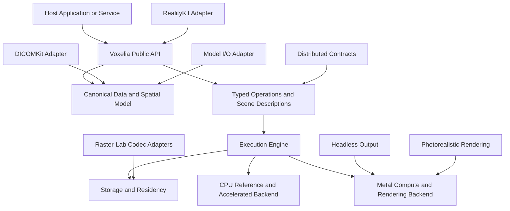
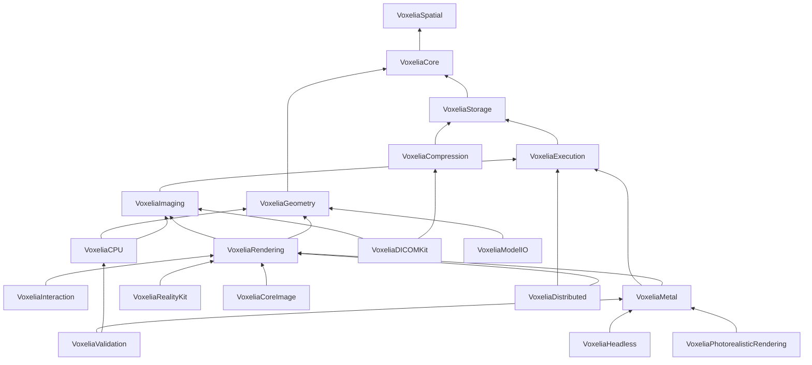
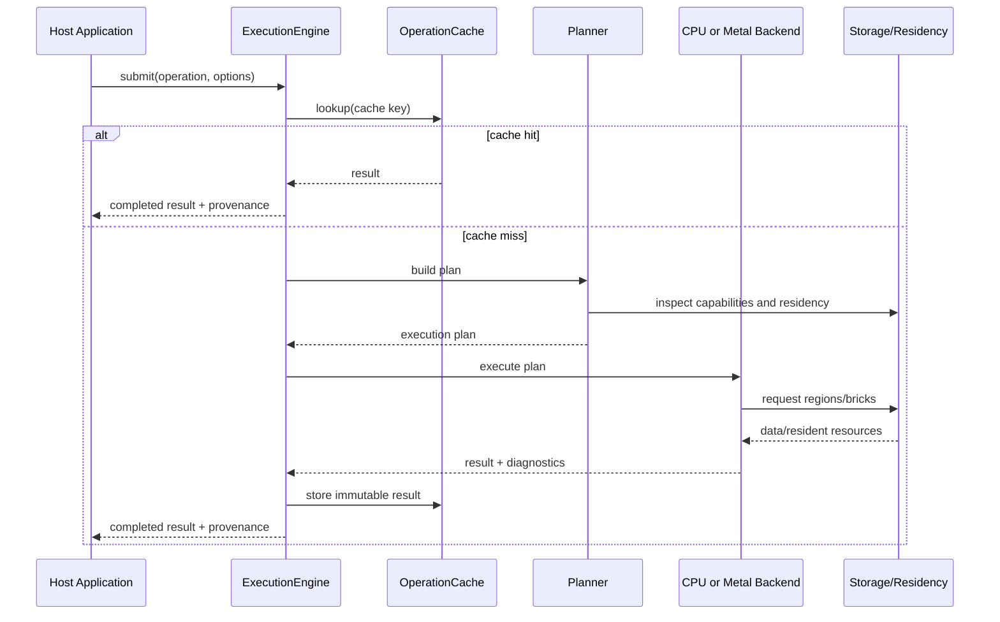
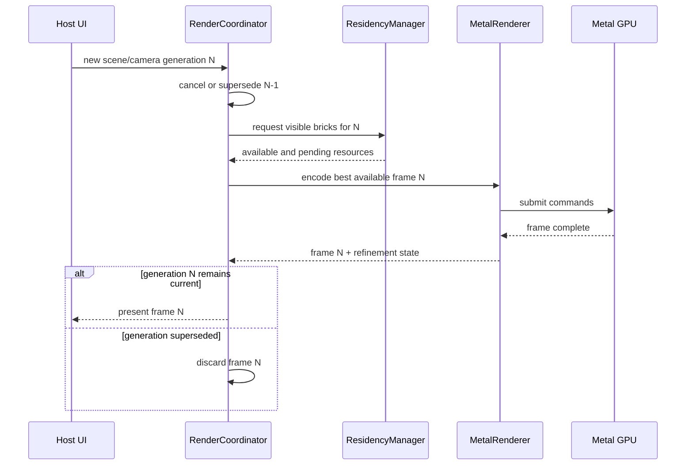
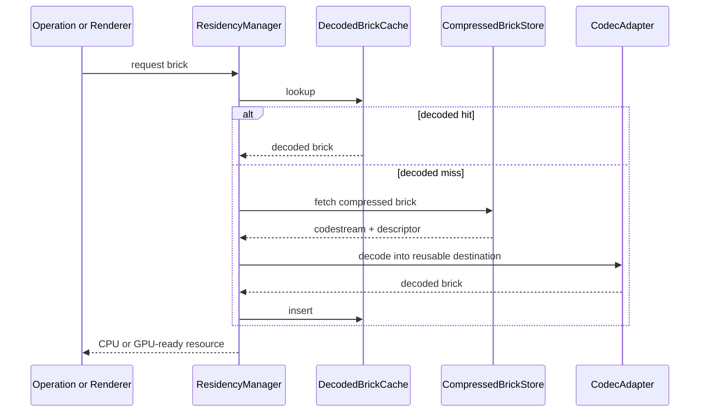

# Voxelia Master Technical Architecture v0.1.1

> **Platform applicability:** Voxelia exclusively targets Apple Silicon ARM64 hardware and Apple operating systems. References to operation across more than one platform mean only macOS, iOS/iPadOS, visionOS and tvOS within the Apple ecosystem. No alternate processor architecture, operating system, hosted Swift toolchain, renderer or compatibility target is within scope.

## Document control

| Field | Value |
|---|---|
| Document | Voxelia Master Technical Architecture |
| Document identifier | `VOXELIA-MTA` |
| Version | 0.1.1 |
| Status | Corrective Release |
| Date | 2 August 2026 |
| Project | Voxelia |
| Governing document | Voxelia Project Foundation v0.1.1 |
| Licence | MIT |
| Language | British English |
| Intended audience | Project maintainers, architects, implementers, algorithm developers, validation engineers, integrators and downstream product teams |

### Revision history

| Version | Date | Summary |
|---|---:|---|
| 0.1 | 2026-08-01 | Initial master technical architecture resolving the principal structural, data-model, execution, storage, rendering, integration and validation decisions required before implementation. |
| 0.1.1 | 2026-08-02 | Corrective platform revision making Apple Silicon ARM64 and Apple operating systems the exclusive architecture and validation baseline. |

### Approval record

This version is a technical architecture draft. Formal approval roles, signatories and repository references shall be added when project governance is established.

---

## 1. Purpose

This document defines the authoritative technical architecture for **Voxelia**, an Apple-native, open-source scientific image processing, spatial computing and visualisation toolkit.

It translates the Voxelia Project Foundation into concrete architectural decisions covering:

- repository and Swift package structure;
- module boundaries and dependency direction;
- canonical image, volume, geometry and spatial data models;
- storage, bricking, compression and cache architecture;
- Apple Silicon unified-memory strategy;
- typed processing operations and execution graphs;
- Swift concurrency and actor isolation;
- CPU reference and Metal acceleration backends;
- diagnostic rendering;
- direct volume and surface rendering;
- optional Photorealistic Rendering;
- DICOMKit and Raster-Lab codec integration;
- off-screen and headless rendering;
- distributed work contracts;
- RealityKit, Model I/O and Core Image adapters;
- extensibility and plug-in boundaries;
- security, provenance and reproducibility;
- validation and benchmark infrastructure; and
- the first complete implementation vertical slice.

This architecture shall guide the initial repository scaffold, requirements baseline, implementation plans, public APIs, algorithm specifications, validation programme and release roadmap.

---

## 2. Authority, conformance and change control

### 2.1 Governing authority

The **Voxelia Project Foundation v0.1.1** governs this architecture. If this document conflicts with the Foundation, the Foundation takes precedence.

### 2.2 Conformance

A Voxelia implementation conforms to this architecture when it:

- preserves the defined module boundaries;
- maintains the backend-neutral canonical data model;
- uses explicit, versioned operations;
- separates authoritative data from execution resources;
- conforms to the execution and concurrency model;
- follows the diagnostic quality and provenance requirements;
- respects the library-versus-application boundaries; and
- records any intentional deviation through an approved architecture decision record.

### 2.3 Architecture change classes

Changes shall be classified as:

| Class | Examples | Approval route |
|---|---|---|
| Editorial | Clarifications, corrected diagrams, terminology alignment | Maintainer review |
| Compatible technical refinement | New internal optimisation, additional kernel, optional adapter | Module maintainer and architecture review |
| Public architectural change | Public API shape, module dependency, storage contract, operation semantics | Architecture decision record and maintainer approval |
| Foundation-impacting change | Licence, scope, platform policy, diagnostic commitments | Foundation revision and project approval |

### 2.4 Architecture decision records

Important choices shall be recorded under `docs/architecture/decisions/` using stable identifiers such as `ADR-0001`.

This document includes the initial decision register in Appendix A.

---

## 3. Architectural goals

Voxelia shall optimise for the following goals, in priority order.

### 3.1 Correctness and diagnostic suitability

- Spatial relationships shall be explicit and testable.
- Quantitative values shall remain independent of presentation.
- Diagnostic operations shall use validated implementations and bounded error.
- Hidden enhancement or undocumented approximation is prohibited.
- Failures shall be explicit rather than silently corrected or ignored.

### 3.2 Performance and responsiveness

- Routine two-dimensional and multiplanar interactions should remain display-rate responsive on supported reference hardware.
- Long-running work shall be cancellable and shall not block interactive work.
- Large datasets shall stream and refine progressively.
- CPU and GPU work shall be scheduled according to capability, latency and memory cost.

### 3.3 Memory and energy efficiency

- Full-volume duplication shall be avoided.
- Compressed storage, decoded brick caches and GPU residency shall be managed separately.
- Unified memory shall reduce unnecessary copies without forcing every resource into shared storage.
- Processing shall operate on regions, tiles or bricks where the algorithm permits.

### 3.4 Modularity and reuse

- The canonical model shall not depend on DICOM, Metal, RealityKit or one host application.
- Optional integrations shall not pollute the core dependency graph.
- Public interfaces shall describe behaviour rather than implementation details.

### 3.5 Validation and reproducibility

- Reference and accelerated implementations shall be distinguishable.
- Operations, kernels and shaders shall be versioned.
- Execution provenance shall be generated automatically.
- Test and benchmark infrastructure shall be available from the beginning.

### 3.6 Extensibility

- New operations, storage providers, backends and render layers shall be addable without modifying unrelated modules.
- Source-level Swift extension is the primary cross-Apple-platform extension mechanism.
- Runtime plug-ins shall remain optional and platform-specific.

---

## 4. Architectural constraints

The architecture is constrained by the following approved project decisions:

1. The project name is **Voxelia**.
2. The project is licensed under the **MIT Licence**.
3. Swift 6.2 or later and strict concurrency are the implementation baseline.
4. Apple Silicon is the primary performance target.
5. Metal is the primary compute and diagnostic rendering backend.
6. macOS, iOS, iPadOS, visionOS and tvOS are target platforms.
7. DICOMKit and Raster-Lab codec libraries shall be reused through adapters.
8. Photorealistic Rendering is optional and may be disabled.
9. Voxelia shall support off-screen and headless rendering.
10. Voxelia shall define distributed work contracts but shall not implement cluster orchestration or peer enrolment.
11. Voxelia shall not become a PACS, web server, browser client or complete workstation application.
12. The canonical scientific data model shall remain independent of Apple rendering frameworks.

---

## 5. Architecture overview

### 5.1 Logical architecture



### 5.2 Architectural layers

| Layer | Responsibility |
|---|---|
| Host integration | Application UI, PACS access, workflow, authentication, reporting, server transport and deployment policy |
| Public domain API | Images, volumes, geometry, operations, scenes, cameras, render requests, measurements and results |
| Canonical model | Scientific values, spatial geometry, metadata, provenance and backend-neutral storage contracts |
| Execution services | Graph evaluation, scheduling, cancellation, progress, cache identity, backend selection and provenance capture |
| Storage services | Contiguous, mapped, tiled, bricked, compressed and remotely supplied data |
| CPU backend | Deterministic references, Accelerate/vImage paths and CPU fallbacks |
| Metal backend | GPU compute, diagnostic rendering, volume rendering, resource residency and off-screen rendering |
| Optional adapters | DICOMKit, codecs, RealityKit, Model I/O, Core Image, distributed contracts and external interoperability |

### 5.3 Principal data flow

```text
External source
    ↓
Adapter and validation
    ↓
Canonical Voxelia descriptor + storage
    ↓
Typed operation or scene snapshot
    ↓
Execution planning
    ↓
CPU, Metal or hybrid kernels
    ↓
Authoritative result + provenance
    ↓
Rendering, export or downstream processing
```

### 5.4 Authoritative versus derived representations

The following distinction is fundamental:

- **Authoritative data** contains the values and spatial meaning used for quantitative interpretation.
- **Derived data** is produced by explicit processing and retains provenance to its inputs.
- **Execution resources** are transient CPU or GPU representations used to compute or render.
- **Presentation output** is a visual result and shall not replace authoritative data for measurement.

A Metal texture is therefore never the sole definition of an image or volume.

---

## 6. Platform and toolchain baseline

### 6.1 Initial deployment targets

The initial architectural deployment baseline is:

| Platform | Minimum target | Primary role |
|---|---:|---|
| macOS | 15 | Diagnostic workstation, development, headless rendering and distributed worker |
| iOS | 18 | Mobile viewing, processing and rendering |
| iPadOS | 18 | Mobile diagnostic and advanced visualisation workflows |
| visionOS | 2 | Spatial visualisation and RealityKit integration |
| tvOS | 18 | Large-screen presentation and controlled visualisation |

A later requirements review may lower a deployment target if this does not compromise concurrency, Metal capability or maintenance efficiency.

### 6.2 Toolchain

- Swift tools version: **6.2** or later.
- Swift language mode: **Swift 6**.
- Strict concurrency checking: enabled for all targets.
- Primary package manager: Swift Package Manager.
- Shader language: Metal Shading Language.
- Documentation: Markdown and DocC.
- Testing: Swift Testing, with XCTest retained where required by platform tooling or existing integrations.

### 6.3 Capability tiers

Voxelia shall not hard-code behaviour around commercial device names. Devices shall be classified by capabilities such as:

- unified versus discrete memory model;
- supported Metal GPU family;
- sparse texture support;
- ray tracing support;
- function and argument-buffer support;
- maximum working-set guidance;
- recommended in-flight concurrency;
- supported pixel and texture formats; and
- available CPU, GPU and memory resources.

### 6.4 Metal evolution

The baseline backend shall use broadly supported Metal capabilities on the minimum operating systems. Newer Metal features may be used through capability-gated internal paths.

No public Voxelia API shall require a caller to select a Metal generation.

---

## 7. Repository and distribution architecture

### 7.1 Repository model

Voxelia shall initially use a **single public monorepo** containing the core library, optional products, tests, benchmarks, validation assets, examples and architecture documents.

This provides:

- atomic changes across module boundaries;
- one issue and design process;
- consistent release tagging;
- shared CI and validation;
- easier refactoring before 1.0; and
- straightforward contributor onboarding.

### 7.2 Proposed repository structure

```text
Voxelia/
├── Package.swift
├── README.md
├── LICENSE
├── CHANGELOG.md
├── CONTRIBUTING.md
├── CODE_OF_CONDUCT.md
├── SECURITY.md
├── CODEOWNERS
├── THIRD_PARTY_NOTICES.md
├── Documentation.docc/
├── Sources/
│   ├── VoxeliaSpatial/
│   ├── VoxeliaCore/
│   ├── VoxeliaStorage/
│   ├── VoxeliaExecution/
│   ├── VoxeliaImaging/
│   ├── VoxeliaGeometry/
│   ├── VoxeliaRendering/
│   ├── VoxeliaInteraction/
│   ├── VoxeliaCPU/
│   ├── VoxeliaMetal/
│   ├── VoxeliaCompression/
│   ├── VoxeliaDICOMKit/
│   ├── VoxeliaPhotorealisticRendering/
│   ├── VoxeliaHeadless/
│   ├── VoxeliaRealityKit/
│   ├── VoxeliaModelIO/
│   ├── VoxeliaCoreImage/
│   ├── VoxeliaDistributed/
│   ├── VoxeliaInterop/
│   └── VoxeliaValidation/
├── Tests/
├── Benchmarks/
├── Validation/
│   ├── Manifests/
│   ├── Phantoms/
│   ├── ReferenceResults/
│   └── Reports/
├── Examples/
├── Tools/
├── docs/
│   ├── architecture/
│   │   ├── decisions/
│   │   └── diagrams/
│   ├── requirements/
│   ├── algorithms/
│   ├── shaders/
│   ├── validation/
│   └── benchmarks/
└── .github/
    ├── workflows/
    ├── ISSUE_TEMPLATE/
    └── PULL_REQUEST_TEMPLATE.md
```

### 7.3 Swift package products

The package shall expose focused products rather than forcing every adopter to import an umbrella module.

Initial products:

- `VoxeliaSpatial`
- `VoxeliaCore`
- `VoxeliaStorage`
- `VoxeliaExecution`
- `VoxeliaImaging`
- `VoxeliaGeometry`
- `VoxeliaRendering`
- `VoxeliaInteraction`
- `VoxeliaCPU`
- `VoxeliaMetal`
- `VoxeliaValidation`
- `Voxelia`

Optional products:

- `VoxeliaCompression`
- `VoxeliaDICOMKit`
- `VoxeliaPhotorealisticRendering`
- `VoxeliaHeadless`
- `VoxeliaRealityKit`
- `VoxeliaModelIO`
- `VoxeliaCoreImage`
- `VoxeliaDistributed`
- `VoxeliaInterop`

The umbrella `Voxelia` product shall re-export the stable general-purpose modules but shall not automatically re-export every optional integration.

### 7.4 External dependency handling

External libraries shall be attached only to the targets that require them. Core targets shall not import DICOMKit or codec modules.

Swift Package Manager may still resolve declared package dependencies at package-resolution time. If this becomes a material adoption or build issue, optional integrations may later move to companion packages without changing the canonical Voxelia model.

---

## 8. Module dependency architecture

### 8.1 Dependency direction

Dependencies shall flow from specialised modules towards stable foundational modules. Cycles are prohibited.



The arrows in this diagram indicate “depends on”.

### 8.2 Module responsibilities

#### VoxeliaSpatial

Owns:

- coordinate spaces;
- coordinate conventions;
- axis descriptors;
- physical units;
- affine transforms;
- frame-of-reference identifiers;
- planes, rays and bounds;
- regular, rectilinear and frame-set geometry; and
- spatial conversion utilities.

It shall depend only on the Swift standard library, Foundation where necessary and `simd`.

#### VoxeliaCore

Owns:

- shapes and extents;
- scalar and component formats;
- image semantics;
- image and volume descriptors;
- storage protocols and type erasure;
- immutable image data handles;
- metadata and provenance types;
- content identities;
- regions and views; and
- common errors.

#### VoxeliaStorage

Owns concrete storage implementations:

- contiguous storage;
- memory-mapped storage;
- tiled storage;
- bricked storage;
- compressed brick stores;
- remote or callback-backed storage;
- storage views;
- cache services; and
- integrity checking.

#### VoxeliaExecution

Owns:

- typed operations;
- type-erased graph nodes;
- execution sessions;
- scheduling;
- cancellation;
- progress streams;
- generation tracking;
- backend registration and selection;
- operation cache keys;
- result caching; and
- execution provenance.

#### VoxeliaImaging

Owns operation definitions and domain semantics for:

- scalar conversion;
- resampling;
- interpolation;
- convolution;
- windowing and LUTs;
- projections;
- histograms;
- morphology;
- segmentation foundations;
- registration foundations; and
- quantitative image operations.

It shall not own the Metal command lifecycle.

#### VoxeliaGeometry

Owns:

- point sets;
- lines and curves;
- triangle and polygon meshes;
- mesh attributes;
- acceleration-structure abstractions;
- geometry operations;
- surface extraction operation definitions; and
- geometry measurements.

#### VoxeliaRendering

Owns backend-neutral:

- scene snapshots;
- cameras;
- viewports;
- render layers;
- transfer functions;
- presentation pipelines;
- render-quality descriptions;
- render requests;
- render results;
- renderer protocols; and
- render provenance.

#### VoxeliaInteraction

Owns UI-framework-neutral interaction state and commands:

- camera manipulation;
- crosshairs;
- window and level;
- picking;
- clipping and cropping;
- measurement construction; and
- synchronisation between viewports.

#### VoxeliaCPU

Owns:

- deterministic reference kernels;
- optimised CPU kernels;
- Accelerate and vImage integration;
- CPU backend registration; and
- deterministic reductions.

#### VoxeliaMetal

Owns:

- Metal device contexts;
- compute kernels;
- diagnostic renderers;
- conventional volume renderers;
- GPU residency;
- render-graph execution;
- shader libraries;
- pipeline caches;
- heaps and sparse resources; and
- GPU telemetry.

#### Optional modules

Optional modules shall adapt the stable core rather than change it.

---

## 9. Canonical type system

### 9.1 Design approach

Voxelia shall use a dynamic-rank canonical image model with validated convenience wrappers for frequent cases.

This avoids forcing every image into a fixed three-dimensional type while preserving efficient APIs for two-dimensional images and three-dimensional volumes.

### 9.2 Shape

```swift
public struct ImageShape: Sendable, Hashable, Codable {
    public let extents: ContiguousArray<Int>

    public var rank: Int { extents.count }
    public var elementCount: Int? { get }
}
```

Requirements:

- Every extent shall be greater than zero.
- Element-count multiplication shall detect overflow.
- Core types shall not impose a small fixed rank.
- Each operation shall declare supported rank and axis semantics.
- Initial optimised paths shall focus on rank-two and rank-three spatial data, with time or phase axes supported as additional dimensions.

### 9.3 Indexing convention

Voxelia shall use:

- zero-based integer indices;
- voxel or pixel centres located at integer index coordinates;
- half-open regions `[lower, upper)`; and
- row-major logical ordering with axis zero changing fastest for contiguous canonical storage.

A storage provider may use another physical layout but shall expose correct logical strides or region access.

### 9.4 Scalar formats

```swift
public enum ScalarType: String, Sendable, Codable, Hashable {
    case int8, uint8
    case int16, uint16
    case int32, uint32
    case int64, uint64
    case float16, float32, float64
}

public struct ScalarFormat: Sendable, Codable, Hashable {
    public let type: ScalarType
    public let validBitCount: Int?
    public let byteOrder: ByteOrder
}
```

Notes:

- Decoded native storage should normally use native byte order.
- Source byte order and source bit layout may be retained in provenance or source metadata.
- `validBitCount` supports values stored in a larger container, such as 12-bit values in 16-bit storage.
- Complex, vector and tensor data shall use component descriptors rather than new packed scalar cases unless a specific packed format is required.

### 9.5 Components

```swift
public struct ComponentDescriptor: Sendable, Codable, Hashable {
    public let count: Int
    public let interpretation: ComponentInterpretation
    public let layout: ComponentLayout
}
```

Initial interpretations include:

- scalar;
- red-green-blue;
- red-green-blue-alpha;
- vector;
- tensor;
- complex;
- label probability;
- generic multi-component.

Layouts include:

- interleaved;
- planar; and
- storage-defined.

### 9.6 Image semantics

```swift
public enum ImageSemantic: Sendable, Codable, Hashable {
    case intensity
    case label
    case probability
    case colour
    case vectorField
    case deformationField
    case tensor
    case parametric
    case mask
    case generic
}
```

Semantics shall influence valid interpolation, rendering and measurement behaviour. For example, label images default to nearest-neighbour interpolation.

### 9.7 Image descriptor

```swift
public struct ImageDescriptor: Sendable, Hashable, Codable {
    public let shape: ImageShape
    public let scalarFormat: ScalarFormat
    public let components: ComponentDescriptor
    public let semantic: ImageSemantic
    public let axes: ContiguousArray<AxisDescriptor>
    public let spatialGeometry: SpatialGeometry?
    public let valueTransform: ValueTransform?
    public let units: MeasurementUnit?
}
```

The descriptor describes logical data. It does not contain a Metal texture or a DICOM dataset.

### 9.8 Convenience wrappers

Validated wrappers shall provide rank-specific behaviour without duplicating storage:

```swift
public struct Image2D: Sendable {
    public let data: ImageData
}

public struct Volume3D: Sendable {
    public let data: ImageData
}

public struct TimeVolume4D: Sendable {
    public let data: ImageData
}
```

Initialisers shall reject incompatible descriptors.

### 9.9 Value transforms

A value transform represents the relationship between stored decoded values and authoritative physical or modality values.

```swift
public enum ValueTransform: Sendable, Codable, Hashable {
    case identity
    case linear(scale: Double, offset: Double)
    case lookupTable(LookupTableDescriptor)
    case composed([ValueTransform])
}
```

Applications shall be able to request:

- raw decoded values;
- transformed authoritative values; and
- presentation values.

These stages shall not be conflated.

---

## 10. Spatial model

### 10.1 Spatial principle

Voxelia shall distinguish index space from physical space. All measurements, cross-volume alignment and clinical coordinates shall be performed in explicit physical coordinate spaces.

### 10.2 Coordinate spaces

```swift
public struct CoordinateSpaceID: Sendable, Hashable, Codable {
    public let rawValue: String
}

public enum CoordinateConvention: Sendable, Hashable, Codable {
    case cartesianRightHanded
    case dicomPatientLPS
    case neuroimagingRAS
    case custom(name: String)
}
```

A coordinate space includes:

- a stable identifier;
- a convention;
- physical units;
- handedness; and
- optional external frame-of-reference identifiers.

### 10.3 Spatial geometry variants

```swift
public enum SpatialGeometry: Sendable, Hashable, Codable {
    case affineGrid(AffineGridGeometry)
    case rectilinearGrid(RectilinearGridGeometry)
    case frameSet(FrameSetGeometry)
}
```

#### Affine grid

Represents a regular grid where a single affine transform maps index coordinates to world coordinates.

```swift
public struct AffineGridGeometry: Sendable, Hashable, Codable {
    public let spatialAxes: SIMD3<Int>
    public let indexToWorld: Matrix4x4Double
    public let coordinateSpace: CoordinateSpaceDescriptor
}
```

The transform maps integer voxel centres to physical coordinates.

#### Rectilinear grid

Represents separable but non-uniform coordinates along axes.

#### Frame set

Represents a collection of independently positioned frames or slices. Each frame may have its own plane and transform.

This is required to model:

- irregularly spaced DICOM slices;
- localiser images;
- multi-planar acquisitions;
- moving frames; and
- enhanced objects where frames do not form one simple regular volume.

### 10.4 Regular-volume requirement

Algorithms that require a regular three-dimensional grid shall accept only affine-grid volumes.

A frame set shall not be silently treated as a regular volume. It must first be:

- validated as regular within a declared tolerance; or
- explicitly resampled to a target affine grid.

### 10.5 Precision

- Authoritative transforms and physical coordinates shall use `Double`.
- Rendering may derive camera-relative `Float` transforms.
- Measurement results shall use `Double`.
- Accumulated transform composition shall occur in `Double`.

### 10.6 Axis descriptors

Each logical axis shall have a descriptor containing:

- name;
- semantic;
- unit;
- spacing where regular;
- sampling type;
- optional coordinates where irregular; and
- relationship to the spatial geometry.

Initial axis semantics include:

- spatial X, Y and Z;
- time;
- cardiac phase;
- respiratory phase;
- energy;
- echo;
- diffusion direction;
- channel; and
- generic.

### 10.7 Transform types

Voxelia shall support:

- identity;
- rigid;
- similarity;
- affine;
- composite; and
- deformation-field transforms.

The public transform protocol shall support:

- forward mapping;
- inverse availability;
- coordinate-space compatibility;
- point, vector and normal transformation; and
- provenance.

---

## 11. Regions, views and data identity

### 11.1 Regions

```swift
public struct ImageRegion: Sendable, Hashable, Codable {
    public let lowerBounds: ContiguousArray<Int>
    public let upperBounds: ContiguousArray<Int>
}
```

Regions are half-open and shall match the image rank.

### 11.2 Views

A view shall reference an existing storage object with:

- an index transform;
- a logical descriptor;
- optional component selection; and
- preserved provenance.

Views shall support:

- crops;
- slices;
- component selection;
- time-point selection;
- axis permutation;
- axis reversal; and
- stride-compatible subsampling.

A view shall be zero-copy where the underlying storage capabilities permit it. A materialisation operation shall be explicit where contiguous output is required.

### 11.3 Content identity

Every immutable data object shall have a content identity.

```swift
public struct ContentID: Sendable, Hashable, Codable {
    public let algorithm: DigestAlgorithm
    public let digest: Data
}
```

Content identities may be:

- eagerly calculated;
- supplied by a trusted content-addressed store; or
- lazily calculated and cached.

A source identity and a full-content digest are distinct concepts. Large remote sources may initially have a source identity and receive a content digest only after validation.

### 11.4 Data handle

```swift
public struct ImageData: Sendable {
    public let descriptor: ImageDescriptor
    public let storage: AnyImageStorage
    public let metadata: MetadataCollection
    public let provenance: ProvenanceRecord
    public let identity: DataIdentity
}
```

`ImageData` is immutable. Editing shall use explicit builders, transactions or operations that produce a new immutable result.

---

## 12. Metadata and provenance

### 12.1 Metadata model

Core metadata shall be typed where Voxelia requires semantic behaviour. Unrecognised source metadata may be retained through namespaced values.

```swift
public struct MetadataKey<Value: Sendable>: Sendable {
    public let namespace: String
    public let name: String
}
```

Metadata shall not become an unstructured substitute for required descriptor fields.

### 12.2 Provenance record

Every derived result shall be capable of recording:

- operation identifier;
- operation semantic version;
- implementation identifier;
- input identities;
- parameters;
- execution profile;
- backend;
- device capability class;
- kernel or shader version;
- creation time;
- software version;
- warnings;
- approximation status; and
- validation status.

### 12.3 Provenance graph

Provenance shall form a directed acyclic graph of derivations. Applications may retain:

- complete provenance;
- compact provenance with referenced parent records; or
- a signed external provenance manifest.

### 12.4 Presentation provenance

Rendered output shall additionally record:

- camera;
- viewport size;
- presentation transform;
- transfer function;
- clipping and cropping;
- colour output configuration;
- render mode;
- accumulation state;
- denoising state; and
- random seed where applicable.

---

## 13. Geometry model

### 13.1 Geometry data

Voxelia geometry shall be independent of Model I/O and RealityKit.

Initial geometry types include:

- point sets;
- line sets;
- polylines;
- centre lines;
- triangle meshes;
- polygon meshes; and
- bounding volumes.

### 13.2 Mesh representation

```swift
public struct MeshDescriptor: Sendable, Hashable, Codable {
    public let primitive: MeshPrimitive
    public let vertexCount: Int
    public let indexCount: Int
    public let indexType: IndexType
    public let attributes: [MeshAttributeDescriptor]
    public let coordinateSpace: CoordinateSpaceDescriptor
}
```

Mesh storage shall follow the same separation as image storage:

- logical descriptor;
- backend-neutral buffers;
- optional mapped storage;
- optional GPU residency; and
- explicit provenance.

### 13.3 Attributes

Supported initial attributes include:

- position;
- normal;
- tangent;
- colour;
- texture coordinate;
- scalar value;
- label;
- confidence; and
- custom namespaced attributes.

### 13.4 Geometry operations

Operation definitions shall include:

- marching cubes;
- flying-edges-style extraction;
- contour extraction;
- smoothing;
- normal generation;
- decimation;
- clipping;
- intersection;
- connected components;
- surface measurement; and
- acceleration-structure construction.

The exact implementation portfolio shall be staged through requirements and milestone plans.

---

## 14. Segmentation and registration architecture

### 14.1 Segmentation model

Segmentation shall be represented as scientific data with explicit segment semantics rather than as a display overlay alone.

The canonical segmentation model shall support:

- binary segments;
- multi-label integer images;
- fractional or probability segments;
- overlapping segments;
- sparse segment storage;
- segment-specific metadata;
- segment-to-source relationships;
- independent display recommendations; and
- provenance for creation and editing.

### 14.2 Segment descriptor

```swift
public struct SegmentDescriptor: Sendable, Hashable, Codable {
    public let id: SegmentID
    public let label: String
    public let category: CodedConcept?
    public let type: CodedConcept?
    public let algorithm: SegmentAlgorithmDescriptor
    public let recommendedDisplay: SegmentDisplayRecommendation?
    public let trackingIdentity: String?
}
```

The generic core shall not require DICOM coded concepts. `CodedConcept` shall be a neutral namespace-and-code model that the DICOMKit adapter can populate from DICOM terminology.

### 14.3 Segmentation representations

Voxelia shall support two principal canonical forms.

#### Label image

A label image assigns one label value per sample and is efficient when segments do not overlap.

#### Segment collection

A segment collection contains one binary, fractional or sparse mask per segment and permits overlap.

```swift
public struct Segmentation: Sendable {
    public let sourceSpace: CoordinateSpaceDescriptor
    public let geometry: SpatialGeometry
    public let representation: SegmentationRepresentation
    public let segments: [SegmentDescriptor]
    public let provenance: ProvenanceRecord
}
```

Conversion between representations shall be explicit because converting overlapping segments to one label image can lose information.

### 14.4 Fractional segments

Fractional segmentation shall define:

- numerical domain;
- maximum stored value where integer encoded;
- interpretation as probability or occupancy;
- interpolation rules;
- threshold used for binary conversion; and
- provenance of that conversion.

### 14.5 Segmentation operations

The operation portfolio may include:

- thresholding;
- region growing;
- connected components;
- morphology;
- watershed;
- contour rasterisation;
- mask Boolean operations;
- label statistics;
- surface extraction;
- surface-to-mask conversion;
- resampling; and
- explicit editing transactions.

An AI inference engine may supply a segmentation through an optional adapter, but inference frameworks shall not be embedded into the foundational segmentation model.

### 14.6 Segmentation resampling

- Binary and label images shall default to nearest-neighbour resampling.
- Fractional segments may use defined continuous interpolation.
- Segment identity and overlap semantics shall be preserved.
- Resampling shall record source and target geometry, interpolation and thresholding.

### 14.7 Registration model

Registration shall be represented by an explicit relationship between coordinate spaces.

```swift
public struct RegistrationResult: Sendable {
    public let fixedSpace: CoordinateSpaceDescriptor
    public let movingSpace: CoordinateSpaceDescriptor
    public let transform: AnySpatialTransform
    public let metricHistory: [MetricSample]
    public let convergence: ConvergenceReport
    public let provenance: ProvenanceRecord
}
```

The transform maps moving-space coordinates into fixed-space coordinates unless the operation specification explicitly declares another direction.

### 14.8 Registration operation

A registration operation shall define:

- fixed data and coordinate space;
- moving data and coordinate space;
- initial transform;
- transform model;
- metric;
- optimiser;
- interpolator;
- masks or regions;
- multi-resolution schedule;
- stopping criteria;
- execution profile; and
- output requirements.

### 14.9 Transform models

The staged registration architecture shall support:

- landmark-derived rigid transforms;
- intensity-based rigid transforms;
- similarity transforms;
- affine transforms;
- composite transforms;
- displacement fields; and
- later deformable transform models.

### 14.10 Metrics and optimisation

Initial metric abstractions shall permit:

- mean squared difference;
- normalised correlation;
- mutual information;
- landmark residual; and
- custom registered metrics.

Optimiser abstractions shall expose:

- iteration state;
- current parameters;
- metric value;
- convergence condition;
- cancellation; and
- reproducible configuration.

### 14.11 Multi-resolution registration

Pyramid generation, smoothing, subsampling and per-level parameters shall be explicit. Registration shall not silently change the moving or fixed data without recording the derived levels and filters.

### 14.12 Registration backends

Registration planning may combine CPU and Metal kernels. Reference mode shall use a deterministic path where defined. Metal acceleration may be used for:

- resampling;
- metric evaluation;
- gradient calculation;
- histogram generation; and
- deformation application.

Optimiser control may remain on the CPU while high-volume metric work executes on the GPU.

### 14.13 Convergence and failure

A registration result shall distinguish:

- converged;
- stopped by iteration limit;
- stopped by tolerance;
- cancelled;
- numerically invalid;
- insufficient overlap;
- unsupported geometry; and
- failed.

Failure to converge shall not be presented as a valid transform without an explicit host decision.

### 14.14 Registration quality

The architecture shall support quality information such as:

- final metric value;
- landmark error;
- inverse-consistency error;
- Jacobian statistics for deformation fields;
- overlap metrics; and
- warnings about extrapolated regions.

These values assist validation but do not by themselves guarantee clinical acceptability.

---

## 15. Storage architecture

### 15.1 Storage abstraction

The canonical storage protocol shall provide capabilities rather than expose one byte container.

```swift
public protocol ImageStorage: Sendable {
    var descriptor: StorageDescriptor { get }
    var capabilities: StorageCapabilities { get }

    func read(
        region: ImageRegion,
        into destination: ImageWriteDestination
    ) async throws
}
```

Optional capabilities shall support:

- synchronous contiguous byte access;
- memory mapping;
- writable transactions;
- region enumeration;
- native tile or brick access;
- compressed representation access; and
- prefetch hints.

The public API shall use `AnyImageStorage` for type erasure.

### 15.2 Storage kinds

#### Contiguous storage

Use for:

- small and medium images;
- operation outputs requiring contiguous memory;
- CPU reference data; and
- temporary scratch results.

#### Memory-mapped storage

Use for:

- large local files;
- immutable caches;
- rapid startup; and
- operating-system-managed paging.

#### Tiled storage

Use for:

- large two-dimensional images;
- image pyramids;
- browser-like pan and zoom; and
- localised filtering.

#### Bricked storage

Use for:

- large three-dimensional volumes;
- volume rendering;
- region processing;
- distributed computation; and
- controlled GPU residency.

#### Compressed storage

Use for:

- original compressed frames;
- compressed bricks;
- multi-resolution caches;
- remote content stores; and
- transfer between distributed workers.

#### Callback or remote storage

Use for data supplied by an application, service or remote object store. Voxelia shall define the storage contract but not the transport or authentication mechanism.

### 15.3 Storage capabilities

```swift
public struct StorageCapabilities: OptionSet, Sendable {
    public static let randomRead
    public static let sequentialRead
    public static let directByteAccess
    public static let memoryMapped
    public static let writable
    public static let tiled
    public static let bricked
    public static let compressed
    public static let multiresolution
    public static let remote
}
```

### 15.4 Mutability

Canonical image data is immutable. Mutable editing shall use one of:

- a new mutable storage builder not yet published as authoritative data;
- a transactional editor that commits a new immutable result; or
- an operation that produces a new result.

This prevents untracked in-place changes from invalidating cache keys and provenance.

### 15.5 Storage alignment

Concrete storage shall expose alignment and stride requirements. GPU-facing paths may request aligned destinations, but core operations shall not assume one alignment globally.

### 15.6 Storage integrity

Persistent and distributed storage should support:

- checksums per object;
- checksums per brick;
- manifest checksums;
- size validation;
- bounds validation; and
- optional authenticated integrity supplied by the host system.

---

## 16. Bricked and multi-resolution volume architecture

### 16.1 Brick model

A brick is an independently addressable three-dimensional region.

```swift
public struct BrickKey: Sendable, Hashable, Codable {
    public let level: Int
    public let coordinates: SIMD3<Int>
}

public struct BrickDescriptor: Sendable, Hashable, Codable {
    public let key: BrickKey
    public let logicalRegion: ImageRegion
    public let storedRegion: ImageRegion
    public let halo: SIMD3<Int>
    public let scalarFormat: ScalarFormat
    public let contentID: ContentID?
}
```

### 16.2 Halo regions

Operations such as convolution and gradients may require neighbouring voxels. A brick may therefore include a halo beyond its logical output region.

The manifest shall distinguish logical and stored regions so that halos do not change image indexing.

### 16.3 Brick-size policy

Brick size shall be selected through a policy using:

- scalar size;
- component count;
- operation access pattern;
- decoder granularity;
- GPU texture limits;
- memory budget;
- expected network transfer; and
- device capability.

Initial benchmark candidates shall include `64³` and `128³` voxels for common 16-bit scalar volumes, but no public API guarantee shall depend on these dimensions.

### 16.4 Multi-resolution hierarchy

A volume pyramid shall contain independently addressable levels. Every level shall define:

- image descriptor;
- downsampling method;
- relationship to the source geometry;
- brick grid;
- value semantics; and
- provenance.

Downsampling of intensity, label, probability and vector data shall use semantics-appropriate algorithms.

### 16.5 Brick manifest

The logical manifest shall include:

- format schema version;
- source data identity;
- image descriptor;
- level descriptors;
- brick shape and halo;
- codec identifier;
- codec parameters;
- brick locations or content IDs;
- checksums;
- creation operation;
- implementation version; and
- optional statistics.

The initial reference serialisation shall be canonical JSON. Binary serialisations may be added later under explicit schema versions.

### 16.6 Brick statistics

Optional per-brick statistics may include:

- minimum and maximum;
- histogram summary;
- occupancy flag;
- gradient range;
- label presence; and
- checksum.

These statistics may accelerate empty-space skipping and transfer-function-aware residency decisions. They are derived data and shall be versioned.

---

## 17. Compression architecture

### 17.1 Compression layers

Voxelia shall distinguish:

1. **Source compression** — the representation supplied by the source format, such as encapsulated DICOM frames.
2. **Cache compression** — a Voxelia-managed derived representation optimised for local or distributed access.
3. **Execution representation** — decoded values used by CPU or GPU kernels.

### 17.2 Codec adapter protocol

```swift
public protocol VolumeCodecAdapter: Sendable {
    var codecID: CodecID { get }
    var capabilities: CodecCapabilities { get }

    func makeDecodePlan(
        source: CompressedAssetDescriptor,
        request: DecodeRequest
    ) async throws -> DecodePlan

    func decode(
        plan: DecodePlan,
        into destination: ImageWriteDestination
    ) async throws -> DecodeResult
}
```

Codec capabilities shall describe:

- supported scalar formats;
- dimensionality;
- lossless and lossy modes;
- region decoding;
- resolution decoding;
- progressive decoding;
- parallel safety;
- GPU acceleration; and
- determinism.

### 17.3 Raster-Lab codec integration

`VoxeliaCompression` shall provide adapters for:

- J2KSwift;
- JLSwift;
- JLISwift;
- JXLSwift;
- CompressionFamily; and
- future approved Raster-Lab codecs.

Codec-specific public types shall remain behind adapter boundaries unless an advanced user explicitly imports the codec module.

### 17.4 JP3D and HTJ2K

JP3D and HTJ2K shall be evaluated for:

- lossless compressed three-dimensional bricks;
- multi-resolution volume caches;
- partial-resolution loading;
- region-of-interest decode;
- parallel brick decoding;
- distributed brick transport; and
- rapid cache construction.

A JP3D codestream shall not be treated as directly sampleable GPU memory. The runtime path is:

```text
Compressed brick
    ↓
Decode plan
    ↓
Aligned shared destination or CPU storage
    ↓
Optional conversion or blit
    ↓
GPU-resident brick or CPU operation
```

### 17.5 Decode destinations

The codec interface shall permit the caller to supply reusable output storage.

Destinations may include:

- mutable contiguous memory;
- an aligned shared `MTLBuffer`-backed region through an internal adapter;
- a brick-cache page;
- a mapped scratch region; or
- a caller-provided sink.

A codec shall not require an additional full-volume intermediate where a region destination is available.

### 17.6 Cache-generation policy

Cache generation shall be:

- explicit;
- cancellable;
- resumable where practical;
- content-addressed;
- versioned; and
- reproducible from source plus parameters.

Original DICOM objects or other authoritative sources shall remain unchanged.

---

## 18. Unified-memory and residency architecture

### 18.1 Three-level memory model

Voxelia shall manage three conceptually separate levels:

```text
Compressed or mapped source
            ↓
Decoded CPU/shared working set
            ↓
GPU-optimised residency
```

A representation may be shared between levels where the device and access pattern make that efficient, but the levels remain separate in policy and accounting.

### 18.2 Residency policies

```swift
public enum ResidencyPolicy: Sendable, Codable {
    case automatic
    case cpuOnly
    case shared
    case gpuOptimised
    case streamed
    case sparse
}
```

`automatic` is the normal public choice. Other cases support advanced integration, validation and benchmark control.

### 18.3 Residency manager

A per-device `ResidencyManager` actor shall own:

- decoded brick cache budget;
- GPU resource budget;
- residency state;
- request coalescing;
- prefetch;
- eviction;
- pinning for in-flight work;
- memory-pressure response;
- sparse mapping where supported; and
- telemetry.

### 18.4 Shared versus private resources

Shared storage is preferred when:

- CPU and GPU both access the data;
- the data is short-lived;
- avoiding a copy dominates repeated sampling cost;
- the resource is a staging or result buffer; or
- CPU inspection is frequent.

GPU-private resources are preferred when:

- the resource is sampled repeatedly;
- GPU-local texture layout provides measurable advantage;
- CPU access is not needed during its lifetime; or
- a conversion is already required.

The backend shall decide using measurement rather than assuming `.shared` is always faster.

### 18.5 Texture upload model

Metal textures do not expose a general CPU pointer suitable for arbitrary direct decoding. The preferred path shall therefore be:

1. decode into an aligned shared buffer or reusable CPU brick page;
2. perform format conversion if required;
3. upload or blit into a GPU-optimised texture when beneficial; and
4. retain the shared buffer only if CPU reuse justifies its memory cost.

For operations that can sample buffers efficiently, a buffer-based kernel may avoid texture creation.

### 18.6 Sparse resources

Sparse textures may be used where supported and beneficial. Voxelia shall always provide a bricked fallback because:

- sparse support varies by device and format;
- brick caches are also required for CPU and distributed execution; and
- diagnostic behaviour shall not depend on one optional GPU feature.

### 18.7 Memory pressure

Memory-pressure response shall prioritise eviction in this order unless data are pinned:

1. reproducible render intermediates;
2. high-resolution GPU bricks outside the current working set;
3. decoded CPU bricks with compressed backing;
4. derived multi-resolution data that can be regenerated; and
5. other unpinned caches.

Authoritative unsaved data shall never be discarded.

### 18.8 Prefetch

Prefetch hints may derive from:

- current and predicted slice position;
- camera frustum;
- ray-volume intersection;
- transfer-function occupancy;
- active clipping region;
- current operation region; and
- expected interaction direction.

Prefetch shall never block higher-priority demanded work.

---

## 19. Execution model

### 19.1 Operation definition

A Voxelia operation is an immutable, typed description of a transformation or analysis.

```swift
public protocol VoxeliaOperation: Sendable {
    associatedtype Output: Sendable

    static var operationID: OperationID { get }
    static var semanticVersion: OperationVersion { get }

    var parameters: OperationParameters { get }
}
```

Inputs may be stored properties of the concrete operation. The execution engine shall type-erase operations internally.

### 19.2 Operation versus kernel

- An **operation** defines semantics and expected output.
- A **kernel** implements an operation for a backend, data type and capability set.
- A **plan** selects kernels, partitions work and defines resources.
- A **task** executes a plan.

This separation permits CPU, Metal and future backends to implement the same operation without changing public semantics.

### 19.3 Kernel registry

Backends shall register kernels against:

- operation ID and version;
- scalar formats;
- component layout;
- supported rank;
- geometry requirements;
- execution profile;
- determinism class;
- device capabilities; and
- implementation version.

### 19.4 Execution engine

```swift
public actor ExecutionEngine {
    public func submit<Operation: VoxeliaOperation>(
        _ operation: Operation,
        options: ExecutionOptions = .diagnostic
    ) -> ExecutionTask<Operation.Output>
}
```

The engine shall own:

- graph construction;
- dependency evaluation;
- cache lookup;
- backend selection;
- plan construction;
- scheduling;
- cancellation propagation;
- progress aggregation;
- result publication; and
- provenance assembly.

### 19.5 Execution task

```swift
public struct ExecutionTask<Output: Sendable>: Sendable {
    public let events: AsyncStream<ExecutionEvent>
    public func value() async throws -> Output
    public func cancel()
}
```

Events may include:

- queued;
- planning;
- waitingForData;
- decoding;
- executing;
- refining;
- validating;
- completed;
- cancelled; and
- failed.

### 19.6 Execution session

A session groups related work and contains:

- priority;
- execution profile;
- determinism requirement;
- memory budget;
- time budget where relevant;
- generation token;
- cancellation token;
- provenance context; and
- diagnostics collector.

Interactive viewport work should use a short-lived session generation. When the scene or camera changes, obsolete generations shall be cancelled or prevented from publishing.

### 19.7 Quality profiles

#### Reference

- deterministic algorithm where defined;
- CPU reference implementation by default;
- highest defined numerical precision;
- fixed reduction order;
- no temporal reuse;
- full provenance; and
- suitable for verification.

#### Diagnostic

- validated CPU or Metal implementation;
- documented numerical tolerance;
- no undocumented approximation;
- stable presentation behaviour; and
- suitable for downstream medical-device validation.

#### Interactive

- may use validated lower resolution, lower sample count or progressive refinement;
- shall identify intermediate output as non-final;
- shall converge to the requested final quality; and
- shall not supply approximate presentation buffers as authoritative measurement input.

#### Preview

- may use experimental or non-validated shortcuts;
- shall be explicitly marked;
- shall not be the default for diagnostic workflows; and
- shall not be used for quantitative measurement.

### 19.8 Cancellation

Cancellation shall be cooperative and checked:

- before expensive planning;
- before data fetch or decode;
- between tiles or bricks;
- between iterative algorithm steps;
- before command-buffer submission where possible; and
- before result publication.

Submitted GPU work may not always be physically cancellable. Its result shall be ignored if the generation is obsolete.

### 19.9 Progress

Progress shall be hierarchical. A parent operation may aggregate:

- data acquisition;
- decode;
- processing;
- upload;
- render; and
- validation.

Progress fractions shall be treated as estimates unless the work size is known exactly.

---

## 20. Concurrency architecture

### 20.1 Principles

- Public immutable value types shall conform to `Sendable`.
- Shared mutable services shall be actor-isolated.
- Unsafe `Sendable` conformance shall be internal, documented and reviewed.
- Main-actor isolation shall be restricted to UI adapters.
- GPU and codec callbacks shall be bridged into structured concurrency.

### 20.2 Actor boundaries

Initial actors include:

- `ExecutionEngine`;
- `OperationCache`;
- `StorageCache`;
- `ResidencyManager` per Metal device;
- `MetalPipelineCache` per device;
- `RenderCoordinator` per viewport or headless render session; and
- optional distributed worker session actors.

### 20.3 Immutable snapshots

Render scenes, operation descriptions and descriptors shall be immutable snapshots. A host application creates a new snapshot when state changes.

This avoids long-lived locking of mutable scene graphs.

### 20.4 Non-Sendable Apple objects

Metal, Core Video, RealityKit and other Apple objects shall be contained inside actor-isolated or otherwise controlled internal wrappers.

Public APIs shall expose stable Voxelia handles rather than requiring callers to move non-Sendable framework objects between tasks.

### 20.5 Stale-result prevention

Every interactive request shall carry a generation identifier. Result publication requires that:

- the generation is still current;
- the target still exists; and
- the operation was not cancelled.

Completion order shall never determine correctness.

---

## 21. Planning, backend selection and caching

### 21.1 Execution planning

The planner shall consider:

- operation semantics;
- input descriptor and storage;
- requested output;
- active profile;
- available kernels;
- data locality;
- device capability;
- transfer cost;
- cache state;
- memory budget;
- expected latency; and
- determinism.

### 21.2 Hybrid plans

An operation may use a hybrid plan. Examples include:

- CPU metadata analysis followed by Metal resampling;
- codec decode followed by Metal windowing;
- Metal histogram generation followed by deterministic CPU reduction; and
- CPU scene preparation followed by GPU rendering.

### 21.3 Cache identity

A result cache key shall include:

```text
Operation ID
+ operation semantic version
+ implementation version
+ canonical parameters
+ input content identities
+ execution profile
+ backend and capability class
+ precision policy
+ shader or kernel version
+ relevant environment version
```

Including the backend prevents accidental reuse of results whose numerical behaviour differs across implementations.

### 21.4 Cache scopes

Voxelia shall support:

- operation result cache;
- decoded brick cache;
- GPU residency cache;
- geometry cache;
- transfer-function cache;
- gradient cache;
- render-intermediate cache;
- pipeline-state cache; and
- validation reference cache.

### 21.5 Cache invalidation

Immutable data and content identities minimise invalidation. Cache entries shall be invalidated by versioned identity changes rather than broad manual “dirty” flags.

---

## 22. CPU backend

### 22.1 Roles

The CPU backend serves three roles:

1. deterministic reference implementation;
2. optimised fallback or preferred path for suitable workloads; and
3. independent oracle for Metal validation.

### 22.2 Implementation classes

CPU kernels may be:

- pure Swift reference kernels;
- SIMD-optimised Swift kernels;
- Accelerate-backed kernels;
- vImage-backed kernels; or
- approved external numerical routines isolated behind adapters.

### 22.3 Deterministic reductions

Histogram, sum, mean and registration metrics shall use defined reduction order in reference mode.

Parallel diagnostic implementations may use bounded non-deterministic ordering only where the resulting tolerance is specified and validated.

### 22.4 Tiling

CPU image processing shall partition work into tiles or bricks when possible. Partitioning shall account for:

- cache locality;
- halo size;
- task overhead;
- deterministic merge order; and
- cancellation granularity.

### 22.5 CPU precision

Reference kernels shall use the precision defined by each algorithm specification, commonly `Double` for geometry and accumulation even when source samples use lower precision.

---

## 23. Metal backend

### 23.1 Responsibilities

The Metal backend shall implement:

- compute operations;
- diagnostic two-dimensional rendering;
- MPR and projection rendering;
- conventional volume rendering;
- mesh rendering;
- compositing;
- picking;
- GPU resource residency;
- off-screen output; and
- performance telemetry.

### 23.2 Device context

Each `MTLDevice` shall have one internal `MetalDeviceContext` containing:

- command submission lanes;
- pipeline cache;
- shader libraries;
- heap manager;
- residency manager;
- transient resource pool;
- capability descriptor;
- telemetry; and
- validation configuration.

### 23.3 Submission lanes

The architecture defines logical lanes:

- interactive rendering;
- background compute;
- transfer and preparation; and
- low-priority refinement.

The backend may map multiple logical lanes to fewer command queues when that performs better. Public callers shall not own command encoders.

### 23.4 Encoder ownership

Render and compute command encoders shall be created, used and ended entirely within the backend frame or task lifecycle.

No operation output shall be an `MTLRenderCommandEncoder` or `MTLComputeCommandEncoder`.

### 23.5 Shader distribution

- Metal source shall be stored under the owning target.
- Debug builds may compile through the normal Xcode or SwiftPM resource process.
- Release builds should use precompiled shader libraries where supported by the distribution model.
- Runtime compilation shall not be required for diagnostic operation.
- Shader source, build settings and generated library fingerprints shall be versioned.

### 23.6 Pipeline cache

Pipeline states shall be cached by:

- function identity;
- function constants;
- pixel formats;
- blend and depth configuration;
- sample count; and
- implementation version.

Pipeline creation shall not occur repeatedly in the interactive frame path.

### 23.7 Function specialisation

Function constants may specialise:

- scalar type;
- interpolation mode;
- component count;
- render mode;
- transfer-function features; and
- output format.

The implementation shall avoid uncontrolled shader-variant explosion.

### 23.8 Resource hazards

Automatic hazard tracking is the default. Untracked resources or manual synchronisation may be introduced only when:

- a benchmark shows material benefit;
- the lifetime is clearly modelled;
- validation covers the path; and
- an architecture decision records the change.

### 23.9 In-flight resources

Interactive rendering shall use a bounded in-flight frame pool. The count shall be capability and latency dependent rather than fixed globally.

### 23.10 Render and compute precision

Kernel specifications shall state:

- input representation;
- accumulation precision;
- intermediate precision;
- output precision;
- expected error; and
- overflow or underflow behaviour.

Use of reduced precision shall be profile- and algorithm-specific.

### 23.11 GPU errors

Command-buffer failures, device removal, out-of-memory conditions and shader errors shall be converted into typed Voxelia diagnostics with context sufficient for troubleshooting.

---

## 24. Rendering architecture

### 24.1 Backend-neutral scene

A render scene is an immutable snapshot.

```swift
public struct RenderScene: Sendable {
    public let coordinateSpace: CoordinateSpaceDescriptor
    public let layers: [AnyRenderLayer]
    public let environment: RenderEnvironment
    public let provenanceContext: ProvenanceContext
}
```

### 24.2 Layer types

Initial layer types include:

- slice image;
- projected slab;
- volume;
- segmentation;
- mesh;
- line and point geometry;
- annotation;
- measurement;
- crosshair and reference line;
- clipping and cropping guides; and
- background.

### 24.3 Camera

The camera model shall support:

- orthographic and perspective projection;
- physical coordinate spaces;
- explicit near and far planes;
- view and projection matrices;
- camera-relative rendering for precision; and
- serialisable state.

Diagnostic slice viewports normally use orthographic projection.

### 24.4 Viewport

```swift
public struct ViewportDescriptor: Sendable, Codable {
    public let pixelSize: SIMD2<Int>
    public let pixelScale: Double
    public let outputFormat: RenderOutputFormat
    public let colourConfiguration: ColourConfiguration
}
```

### 24.5 Renderer protocol

```swift
public protocol Renderer: Sendable {
    func render(
        scene: RenderScene,
        camera: Camera,
        viewport: ViewportDescriptor,
        options: RenderOptions
    ) -> RenderTask
}
```

### 24.6 Render graph

The Metal renderer shall compile a scene snapshot into a render graph consisting of passes such as:

1. resource preparation;
2. volume brick residency update;
3. image or volume computation;
4. surface rendering;
5. segmentation and overlay rendering;
6. annotation rendering;
7. colour and presentation transform;
8. output conversion; and
9. optional readback.

Passes may be fused where correctness and profiling justify it.

### 24.7 Render-task lifecycle

```text
Scene snapshot
    ↓
Validation and capability check
    ↓
Render-graph compilation
    ↓
Resource and brick requests
    ↓
Command encoding
    ↓
GPU submission
    ↓
Completion and provenance
    ↓
Presentation or off-screen result
```

### 24.8 Scene changes

Each layer and scene snapshot shall have an identity. The renderer may reuse resources from prior snapshots when identities and parameters match.

---

## 25. Diagnostic two-dimensional presentation

### 25.1 Presentation chain

Voxelia shall represent the diagnostic presentation chain explicitly:

```text
Decoded stored values
        ↓
Source interpretation
        ↓
Value or modality transform
        ↓
VOI transform or explicit windowing
        ↓
Presentation LUT or inversion
        ↓
Colour or palette transform
        ↓
Image fusion and segmentation overlays
        ↓
Shutters, masks and annotations
        ↓
Display calibration transform supplied by host
        ↓
Output encoding
```

### 25.2 Separation of values

The API shall expose:

- stored decoded value;
- authoritative transformed value;
- presentation value; and
- final output pixel.

Pixel inspection and measurement shall use authoritative values, not final output pixels.

### 25.3 Supported initial presentations

- monochrome intensity;
- MONOCHROME1-style inversion through adapter metadata;
- colour images;
- palette colour;
- linear windowing;
- sigmoid windowing;
- explicit VOI LUT;
- presentation inversion;
- segmentation overlays;
- alpha fusion; and
- display calibration transform supplied by the application.

### 25.4 Interpolation

Supported interpolation policies shall include:

- nearest neighbour;
- linear;
- cubic; and
- operation-defined higher-order methods.

Interpolation is explicit. Label images default to nearest neighbour.

### 25.5 Colour pipeline

- Processing shall occur in declared colour spaces.
- Internal compositing should use a linear-light representation where appropriate.
- Output formats shall include SDR and high-bit-depth paths supported by the platform.
- No tone mapping shall occur unless explicitly requested.
- Diagnostic grayscale calibration remains a host-system responsibility, but Voxelia shall accept and apply a supplied calibration transform.

---

## 26. Multiplanar and projection rendering

### 26.1 MPR input requirements

MPR requires an affine-grid source or an explicitly defined resampling path from another geometry type.

### 26.2 Slice plane

```swift
public struct SlicePlane: Sendable, Codable, Hashable {
    public let origin: SIMD3<Double>
    public let horizontal: SIMD3<Double>
    public let vertical: SIMD3<Double>
    public let pixelSpacing: SIMD2<Double>
}
```

The normal is derived from the horizontal and vertical axes under the coordinate-space convention.

### 26.3 MPR modes

- axial, coronal and sagittal convenience orientations;
- arbitrary oblique planes;
- linked orthogonal views;
- single-slice sampling;
- thick-slab projection;
- curved planar reconstruction in a later module; and
- registered multi-volume sampling.

### 26.4 Slab operators

Initial slab operators include:

- maximum;
- minimum;
- mean;
- sum; and
- first-hit or operation-specific projection.

Slab thickness is specified in physical units.

### 26.5 Geometry accuracy

Sampling shall derive from physical transforms. Slice order, array order or filename order shall not define geometry.

---

## 27. Conventional volume rendering

### 27.1 Render modes

- direct volume rendering;
- maximum-intensity projection;
- minimum-intensity projection;
- average-intensity projection;
- additive projection;
- label-volume rendering; and
- multi-volume fusion.

### 27.2 Ray setup

The renderer shall:

- transform rays into volume index space;
- intersect rays with actual volume bounds;
- derive step length from physical spacing and quality profile;
- handle anisotropic voxels;
- clip against planes and regions; and
- terminate when leaving valid data.

Fixed arbitrary iteration counts are prohibited as the sole termination method.

### 27.3 Transfer functions

Transfer functions shall support:

- scalar-to-colour mapping;
- scalar-to-opacity mapping;
- gradient opacity;
- multi-dimensional transfer functions;
- labelled material classes;
- independent volume channels; and
- serialisation and provenance.

### 27.4 Opacity correction

Opacity shall be corrected when sample spacing changes so that interactive and final-quality sampling remain physically consistent within the defined model.

### 27.5 Acceleration

The renderer may use:

- early ray termination;
- empty-space skipping;
- brick min/max or occupancy metadata;
- multi-resolution sampling;
- adaptive step size;
- transfer-function-aware residency; and
- progressive refinement.

Each acceleration path shall preserve the guarantees of its execution profile.

### 27.6 Gradients and lighting

Gradients may be:

- computed on demand;
- precomputed per brick;
- cached at selected resolutions; or
- derived analytically from interpolation samples.

The chosen method and precision shall be part of the renderer implementation identity.

### 27.7 Multi-volume rendering

Multiple registered volumes shall support:

- independent transfer functions;
- independent value transforms;
- shared patient-space sampling;
- compositing order;
- fusion modes; and
- missing-data behaviour.

---

## 28. Surface and geometry rendering

### 28.1 Surface pipeline

```text
Canonical mesh
    ↓
Optional processing and level selection
    ↓
GPU buffer residency
    ↓
Material and scalar mapping
    ↓
Depth and transparency rendering
    ↓
Picking and annotations
```

### 28.2 Materials

Voxelia shall support:

- unlit materials;
- physically based surface materials;
- scalar colour maps;
- vertex colours;
- opacity;
- clipping; and
- diagnostic wireframe or outline modes.

### 28.3 Transparency

Transparent geometry shall use a defined strategy such as:

- sorted transparency for simple scenes;
- weighted blended transparency; or
- a validated order-independent method on supported devices.

The strategy shall be explicit in render provenance.

### 28.4 Picking

Picking shall return:

- layer identity;
- primitive identity;
- world position;
- source data position where available;
- scalar or label value; and
- confidence or hit details.

Picking shall not depend solely on colour-buffer decoding when a more precise ID or geometric method is available.

---

## 29. Photorealistic Rendering architecture

### 29.1 Module boundary

Photorealistic Rendering shall be implemented in `VoxeliaPhotorealisticRendering` and shall depend on stable scene, storage and Metal abstractions.

It shall not be required by conventional diagnostic rendering.

### 29.2 Shared scene model

Conventional and photorealistic renderers shall consume the same:

- camera;
- volume layers;
- geometry layers;
- coordinate spaces;
- transfer functions;
- clipping state;
- annotations; and
- provenance context.

Switching render mode shall not require reconstructing application state.

### 29.3 Quality modes

```swift
public enum PhotorealisticQuality: Sendable, Codable {
    case interactive
    case progressive
    case reference
}
```

#### Interactive

May use:

- reduced resolution during motion;
- low sample counts;
- temporal accumulation;
- approximate indirect illumination;
- adaptive sampling; and
- rapid reset on interaction.

#### Progressive

Uses:

- volumetric path tracing;
- increasing sample accumulation;
- variance estimation;
- importance sampling;
- multiple light interactions; and
- optional validated denoising.

#### Reference

Uses:

- deterministic random seed;
- fixed algorithm and parameters;
- fixed sample budget or convergence criterion;
- no unrecorded temporal history;
- no unvalidated denoising; and
- complete provenance.

### 29.4 Light transport

The architecture shall support progressive implementation of:

- emission and absorption;
- single scattering;
- multiple scattering;
- volumetric shadows;
- area lights;
- environment lighting;
- phase functions;
- transillumination; and
- surface-volume interaction.

### 29.5 Presentation variants

Photorealistic presentations may include:

- surface illumination;
- translucent volume;
- transillumination;
- cast-like presentation;
- material-separated rendering; and
- multimodal fusion.

### 29.6 Accumulation

The accumulation state shall be invalidated when any relevant scene input changes, including:

- camera;
- viewport;
- transfer function;
- lighting;
- clipping;
- data identity;
- brick resolution; or
- renderer implementation.

### 29.7 Denoising

Denoising is optional.

- It shall be explicit in options and provenance.
- Reference mode defaults to no denoising.
- A denoiser used in a diagnostic context requires separate validation.
- Generative reconstruction is outside the default architecture.

### 29.8 Distributed accumulation

Independent sample ranges shall be mergeable using:

- accumulated radiance;
- sample count;
- variance statistics; and
- deterministic sample-range identifiers.

This allows render-farm scaling without placing orchestration inside Voxelia.

---

## 30. Interaction architecture

### 30.1 UI neutrality

VoxeliaInteraction shall not depend on SwiftUI, AppKit, UIKit or RealityKit.

Platform adapters translate input events into interaction commands.

### 30.2 Interaction state

Interaction state includes:

- active camera;
- crosshair position;
- selected layer;
- window and level;
- active tool;
- clipping planes;
- crop region;
- measurements under construction; and
- synchronisation group.

### 30.3 Commands

Commands include:

- pan;
- zoom;
- rotate;
- scroll;
- set crosshair;
- adjust window and level;
- select;
- pick;
- place measurement point;
- manipulate clipping; and
- reset view.

### 30.4 Measurements

Measurements shall be calculated from authoritative geometry in `Double` precision.

Initial measurement types include:

- distance;
- angle;
- polyline length;
- area;
- volume; and
- region statistics.

Rendering a measurement and computing it are separate responsibilities.

### 30.5 View synchronisation

Synchronised viewports shall exchange explicit state updates rather than share mutable camera objects.

---

## 31. DICOMKit integration architecture

### 31.1 Module boundary

`VoxeliaDICOMKit` shall depend on:

- DICOMKit;
- VoxeliaSpatial;
- VoxeliaCore;
- VoxeliaStorage;
- VoxeliaImaging; and
- VoxeliaCompression where compressed pixels are decoded through Voxelia adapters.

Voxelia core shall not depend on DICOMKit.

### 31.2 Responsibilities

The adapter shall translate DICOM information into canonical Voxelia objects, including:

- pixel value encoding;
- image dimensions;
- frame relationships;
- patient-space geometry;
- modality transforms;
- VOI metadata;
- photometric interpretation;
- pixel padding;
- temporal and enhanced dimensions;
- segment descriptors;
- parametric values;
- frame of reference; and
- source provenance.

### 31.3 Series assembly

A `DICOMSeriesAssembler` shall:

1. validate candidate instances and frames;
2. identify compatible groups;
3. derive frame planes from spatial metadata;
4. order frames by geometric projection when a stack exists;
5. detect duplicate, missing or irregular frames;
6. determine whether an affine grid is valid within tolerance;
7. return either an affine-grid volume or a frame set; and
8. record all decisions and warnings.

Filename order and Instance Number shall not be the primary geometric ordering mechanism.

### 31.4 Enhanced multi-frame data

The adapter shall preserve dimension-index and per-frame functional-group information required to distinguish:

- time;
- phase;
- energy;
- echo;
- diffusion;
- stack position; and
- other acquisition dimensions.

### 31.5 DICOM objects beyond images

The long-term adapter portfolio shall include:

- Segmentation objects;
- Parametric Maps;
- Spatial Registration;
- Deformable Spatial Registration;
- Surface Segmentation;
- Presentation States where applicable; and
- Structured Reports for measurements through separate integration layers.

### 31.6 Provenance

Every imported frame shall be traceable to:

- source object identity;
- SOP Instance UID;
- frame number where applicable;
- transfer syntax;
- decode implementation;
- value transform; and
- geometry derivation.

### 31.7 DICOM presentation

The DICOM adapter shall produce typed presentation descriptors. The renderer remains responsible for applying the general presentation pipeline.

---

## 32. RealityKit, Model I/O and Core Image adapters

### 32.1 RealityKit

`VoxeliaRealityKit` shall provide:

- conversion of Voxelia meshes to RealityKit mesh resources;
- support for frequently updated geometry through suitable low-level APIs;
- mapping of Voxelia transforms to RealityKit entities;
- spatial annotations and interaction bridges; and
- visionOS scene integration.

RealityKit shall not own:

- the canonical data model;
- diagnostic volume sampling;
- measurement truth; or
- the primary diagnostic presentation pipeline.

### 32.2 Model I/O

`VoxeliaModelIO` shall provide:

- import and export of supported asset formats;
- vertex-layout conversion;
- optional normal and tangent preparation; and
- conversion between `MDLMesh` and Voxelia mesh data.

Model I/O voxel objects shall not represent canonical medical volumes.

### 32.3 Core Image

`VoxeliaCoreImage` shall support:

- image export composition;
- thumbnails;
- video-frame integration;
- selected two-dimensional effects; and
- conversion to or from `CIImage` where semantically safe.

Core Image shall not be the N-dimensional processing engine or volume renderer.

---

## 33. Headless and off-screen architecture

### 33.1 Off-screen support

The Metal renderer shall render to explicit off-screen targets without an `MTKView`.

### 33.2 Headless renderer

```swift
public protocol HeadlessRenderer: Sendable {
    func submit(_ request: HeadlessRenderRequest) -> HeadlessRenderTask
}
```

A request contains:

- scene description;
- camera;
- viewport and output format;
- quality profile;
- content references;
- time or frame selection;
- output attachments; and
- provenance requirements.

### 33.3 Output attachments

Outputs may include:

- colour frame;
- linear high-dynamic-range frame;
- depth;
- object or segment identifiers;
- normals;
- accumulation state;
- metadata; and
- provenance.

### 33.4 Output containers

`VoxeliaHeadless` may expose:

- Voxelia-owned pixel buffers;
- `CVPixelBuffer` adapters;
- `CGImage` adapters;
- encoded still images through an optional media layer; and
- video-frame streams.

### 33.5 Network boundary

HTTP, WebSocket, WebRTC, authentication and browser code are outside Voxelia. A remote rendering service shall translate network requests into headless render requests.

---

## 34. Distributed execution contracts

### 34.1 Purpose

`VoxeliaDistributed` shall define serialisable, transport-neutral descriptions. It shall not discover workers or operate a cluster.

### 34.2 Capability descriptor

A worker capability descriptor may contain:

- Voxelia version;
- supported operation and kernel versions;
- platform and architecture;
- device capability classes;
- available memory budget;
- supported codecs;
- supported output formats;
- supported quality profiles; and
- validation status.

### 34.3 Job descriptor

```swift
public struct DistributedJobDescriptor: Sendable, Codable {
    public let schemaVersion: Int
    public let jobID: UUID
    public let operation: SerialisedOperation
    public let inputAssets: [ContentAssetReference]
    public let partition: WorkPartition
    public let expectedImplementations: [ImplementationConstraint]
    public let provenanceRequirements: ProvenanceRequirements
}
```

### 34.4 Partition types

Initial partition types include:

- image tile;
- volume brick set;
- frame range;
- registration evaluation range;
- surface-extraction region;
- render tile; and
- Photorealistic Rendering sample range.

### 34.5 Result merging

Mergeable result types shall define:

- identity and schema version;
- merge preconditions;
- deterministic merge order where required;
- numerical accumulation rules;
- partial-result validation; and
- final provenance assembly.

### 34.6 Serialisation

The reference representation for control descriptors shall be canonical JSON during the 0.x series. Large pixel, mesh and accumulation payloads shall remain separate content-addressed assets.

The semantic contract shall not depend on one network transport.

### 34.7 Security boundary

Voxelia shall not transport protected data. The orchestration system is responsible for:

- encryption;
- authentication;
- authorisation;
- worker trust;
- data locality;
- audit; and
- retention.

---

## 35. Public API design principles

### 35.1 Strong typing

Public APIs shall prefer domain types over loosely typed dictionaries or arrays.

### 35.2 Behaviour over backend

Normal callers specify:

- operation;
- quality;
- precision;
- output; and
- constraints.

They do not construct Metal command buffers or select thread-group sizes.

### 35.3 Async by default for potentially expensive work

Data acquisition, decoding, processing and rendering shall use asynchronous APIs when latency is not trivially bounded.

### 35.4 Explicit options

Defaults shall be safe and documented. Options that affect diagnostic output shall be explicit and serialisable.

### 35.5 No force-unwrapped resources

Library APIs shall return typed errors rather than assume a Metal device, file resource or codec exists.

### 35.6 Stable value types

Descriptors, parameters and results should be value types. Long-lived services and resource owners may be reference types or actors.

### 35.7 Example processing API

```swift
let operation = ResampleVolume(
    input: volume,
    target: targetGeometry,
    interpolation: .linear
)

let task = engine.submit(operation, options: .diagnostic)
let resampled = try await task.value()
```

### 35.8 Example render API

```swift
let scene = RenderScene(
    coordinateSpace: patientSpace,
    layers: [
        .volume(
            VolumeLayer(
                volume: volume,
                presentation: transferFunction
            )
        )
    ],
    environment: .clinicalDefault,
    provenanceContext: context
)

let task = renderer.render(
    scene: scene,
    camera: camera,
    viewport: viewport,
    options: .diagnostic
)
```

---

## 36. Error and diagnostic model

### 36.1 Typed errors

Initial error families include:

- invalid descriptor;
- invalid geometry;
- unsupported format;
- unsupported operation;
- unavailable backend;
- insufficient resources;
- decode failure;
- storage failure;
- shader or pipeline failure;
- numerical failure;
- convergence failure;
- cancellation;
- stale generation;
- validation failure; and
- external adapter failure.

### 36.2 Diagnostic context

Errors should include:

- operation ID;
- data identity where safe;
- affected region;
- backend;
- implementation version;
- underlying error;
- recoverability; and
- suggested corrective action where known.

### 36.3 Warnings

Warnings shall be structured and may include:

- irregular geometry;
- missing source information;
- fallback backend used;
- lower quality selected;
- incomplete data;
- precision reduction;
- unsupported presentation attribute ignored; and
- validation status limitation.

Warnings that can affect interpretation shall appear in provenance.

### 36.4 Logging

Logging shall:

- avoid patient or image data by default;
- use privacy-aware fields;
- support host-provided logging sinks;
- support operation correlation IDs; and
- remain optional for performance-sensitive paths.

---

## 37. Security architecture

### 37.1 Input validation

All external adapters shall validate:

- dimensions;
- integer overflow;
- byte sizes;
- offsets;
- strides;
- region bounds;
- codec output sizes;
- mesh indices;
- serialised schema versions; and
- resource limits.

### 37.2 Unsafe code

Unsafe code is permitted only where required for:

- high-performance byte access;
- C or C++ interoperability;
- Metal buffers;
- codec interfaces; or
- memory mapping.

Every unsafe region shall have:

- documented invariants;
- focused tests;
- code review; and
- sanitiser coverage where available.

### 37.3 Resource exhaustion

The execution engine shall enforce configurable limits on:

- allocation size;
- image dimensions;
- decoded output;
- simultaneous brick requests;
- recursion or graph depth;
- job duration where supplied by the host; and
- distributed payload size.

### 37.4 Temporary data

Temporary files and caches shall:

- use host-supplied locations where possible;
- document encryption assumptions;
- avoid embedding patient identifiers in filenames;
- support cleanup; and
- distinguish purgeable caches from authoritative data.

---

## 38. Validation architecture

### 38.1 Validation module

`VoxeliaValidation` shall provide reusable infrastructure for:

- dataset manifests;
- analytical phantoms;
- expected-result descriptors;
- numerical comparisons;
- image comparisons;
- geometry comparisons;
- CPU/Metal differential testing;
- cross-device execution;
- provenance verification; and
- report generation.

### 38.2 Validation levels

| Level | Purpose |
|---|---|
| Unit | Verify small types, transforms, bounds and local algorithms |
| Kernel | Verify one implementation against analytical or reference output |
| Operation | Verify complete operation semantics across supported formats |
| Pipeline | Verify composed processing and rendering chains |
| Integration | Verify DICOMKit, codecs, platform adapters and headless paths |
| System reference | Verify the first DICOM Workstation vertical slice and representative workflows |

### 38.3 Comparison classes

- exact byte equality;
- exact numeric equality;
- absolute or relative tolerance;
- spatial tolerance;
- topology equivalence;
- perceptual image comparison;
- diagnostic feature preservation; and
- statistical equivalence for stochastic rendering.

### 38.4 Golden data

Golden results shall include:

- source and licence information;
- generating implementation;
- algorithm and parameter version;
- checksums;
- tolerance definition; and
- expected provenance.

A golden image alone is insufficient for quantitative operations.

### 38.5 CPU versus Metal

Every diagnostic Metal kernel shall have one of:

- an independent CPU reference;
- an analytical oracle; or
- a formally approved external reference implementation.

### 38.6 Cross-device matrix

Validation shall cover capability classes rather than only one development computer. The matrix shall include representative:

- mobile Apple GPU;
- tablet-class Apple GPU;
- spatial-computing device;
- workstation Apple GPU; and
- high-memory render worker.

### 38.7 Shader identity

Validation reports shall identify shader source and compiled library fingerprints.

---

## 39. Performance architecture

### 39.1 Benchmark harness

Benchmarks shall run independently of example applications and record:

- device and capability class;
- operating system;
- Swift and compiler version;
- Voxelia version;
- operation and implementation version;
- shader identity;
- dataset descriptor;
- storage form;
- cache state;
- quality profile;
- latency;
- throughput;
- memory;
- frame rate;
- energy where practical; and
- validation status.

### 39.2 Benchmark modes

- cold start;
- warm cache;
- steady state;
- memory pressure;
- interactive cancellation;
- multi-operation contention;
- headless batch; and
- distributed partition and merge.

### 39.3 Preliminary engineering targets

The formal Requirements Baseline shall approve performance requirements. The architecture uses the following preliminary targets to guide design:

- routine 2D scrolling and windowing at the active display refresh rate;
- common MPR interaction at 60 frames per second on workstation reference hardware;
- conventional 512³ volume rendering at 30–60 frames per second depending on quality and hardware;
- visible interactive response within 50 milliseconds for crosshair and camera input;
- first useful image before full study cache generation; and
- prompt cancellation without publication of stale output.

### 39.4 Instrumentation

Internal signposts and metrics shall identify:

- cache hit and miss;
- decode time;
- upload time;
- kernel time;
- command-buffer latency;
- frame time;
- brick faults;
- residency changes;
- memory budget; and
- refinement progress.

Instrumentation shall be removable or low overhead in production builds.

---

## 40. Extensibility architecture

### 40.1 Source-level extension

The primary extension mechanism is a Swift package that:

- depends on public Voxelia modules;
- defines new operations or adapters;
- registers kernels with an execution engine; and
- supplies tests and provenance metadata.

This mechanism works across Apple platforms.

### 40.2 Operation registration

A registration descriptor shall include:

- operation ID and semantic version;
- implementation ID and version;
- supported formats;
- supported ranks;
- required geometry;
- execution profiles;
- determinism class;
- required device capabilities; and
- validation status.

### 40.3 Render-layer extension

Custom render layers may provide:

- backend-neutral layer data;
- bounds;
- resource requirements;
- render-pass contribution; and
- picking behaviour.

Diagnostic hosts may restrict custom layers to approved registrations.

### 40.4 Runtime plug-ins

Runtime binary plug-ins are not required for Voxelia 1.0.

A future macOS-only plug-in system may use:

- a stable C-compatible ABI;
- process isolation through XPC;
- signed manifests;
- capability negotiation; and
- explicit diagnostic approval.

Dynamic third-party code loading is not a cross-Apple-platform assumption for iOS, iPadOS, visionOS or tvOS.

---

## 41. Interoperability architecture

### 41.1 VTK and ITK

Optional interoperability shall support migration, comparison and validation without making VTK or ITK runtime dependencies of core Voxelia.

Potential adapters include:

- image import and export;
- transform import and export;
- polygonal mesh conversion;
- algorithm comparison tools; and
- reference result generation.

### 41.2 File formats

Scientific file formats such as NIfTI or MetaImage shall be implemented as optional adapters. The core data model shall not encode format-specific assumptions.

### 41.3 C and C++ boundary

C or C++ interoperability shall be isolated in dedicated targets with:

- stable ownership rules;
- explicit copying or borrowing semantics;
- exception containment;
- thread-safety documentation; and
- licence review.

---

## 42. Platform-specific architecture

### 42.1 macOS

Primary capabilities:

- full diagnostic rendering;
- headless rendering;
- distributed worker role;
- large-memory volume processing;
- optional runtime plug-ins in the future; and
- AppKit or SwiftUI viewport adapters outside the rendering core.

### 42.2 iOS and iPadOS

Priorities:

- touch-optimised interaction adapters;
- memory-pressure-aware residency;
- background execution limits respected by the host;
- off-screen export; and
- feature scaling according to device capability.

### 42.3 visionOS

Priorities:

- RealityKit adapter;
- spatial scene placement;
- hand and gaze interaction adapters;
- physically scaled models;
- shared coordinate-space conversion; and
- conventional Metal rendering where required for diagnostic image viewports.

### 42.4 tvOS

Priorities:

- controlled large-screen viewing;
- remote-driven interaction;
- conventional rendering;
- memory-aware feature selection; and
- no assumption of local DICOM acquisition or workstation workflow.

### 42.5 Headless worker

The headless worker platform is Apple Silicon macOS. Non-Apple operating systems, Intel processors and alternate GPU backends are excluded from the Voxelia architecture.

---

## 43. Initial Swift package dependency sketch

The following is illustrative and shall be refined when the repository scaffold is created.

```swift
// swift-tools-version: 6.2
import PackageDescription

let package = Package(
    name: "Voxelia",
    platforms: [
        .macOS(.v15),
        .iOS(.v18),
        .tvOS(.v18),
        .visionOS(.v2)
    ],
    products: [
        .library(name: "Voxelia", targets: ["Voxelia"]),
        .library(name: "VoxeliaCore", targets: ["VoxeliaCore"]),
        .library(name: "VoxeliaRendering", targets: ["VoxeliaRendering"]),
        .library(name: "VoxeliaMetal", targets: ["VoxeliaMetal"]),
        .library(name: "VoxeliaDICOMKit", targets: ["VoxeliaDICOMKit"])
    ],
    dependencies: [
        // Raster-Lab dependencies shall be attached to adapter targets.
    ],
    targets: [
        .target(name: "VoxeliaSpatial"),
        .target(
            name: "VoxeliaCore",
            dependencies: ["VoxeliaSpatial"]
        ),
        .target(
            name: "VoxeliaStorage",
            dependencies: ["VoxeliaCore"]
        ),
        .target(
            name: "VoxeliaExecution",
            dependencies: ["VoxeliaStorage"]
        ),
        .target(
            name: "VoxeliaImaging",
            dependencies: ["VoxeliaExecution"]
        ),
        .target(
            name: "VoxeliaGeometry",
            dependencies: ["VoxeliaCore"]
        ),
        .target(
            name: "VoxeliaRendering",
            dependencies: [
                "VoxeliaImaging",
                "VoxeliaGeometry"
            ]
        ),
        .target(
            name: "VoxeliaMetal",
            dependencies: [
                "VoxeliaRendering",
                "VoxeliaExecution"
            ],
            resources: [.process("Shaders")]
        ),
        .target(
            name: "Voxelia",
            dependencies: [
                "VoxeliaCore",
                "VoxeliaImaging",
                "VoxeliaGeometry",
                "VoxeliaRendering",
                "VoxeliaCPU",
                "VoxeliaMetal"
            ]
        )
    ]
)
```

This sketch is not the final `Package.swift`. It demonstrates dependency direction and shader resource ownership.

---

## 44. First implementation vertical slice

### 44.1 Objective

The first vertical slice shall prove the complete architecture using a clinically meaningful CT workflow.

### 44.2 Scope

```text
DICOMKit CT source
        ↓
Series and frame validation
        ↓
Voxelia affine volume + patient-space geometry
        ↓
Immutable storage
        ↓
CPU reference presentation and resampling
        ↓
Metal residency and rendering
        ↓
Axial, coronal and sagittal viewports
        ↓
Crosshair, pixel inspection and distance measurement
        ↓
CPU/Metal validation and benchmark report
```

### 44.3 Supported input

The first slice shall support:

- CT images represented as signed or unsigned 16-bit samples;
- regular axial series;
- explicit rescale slope and intercept;
- image position and orientation;
- pixel spacing and slice spacing;
- MONOCHROME1 and MONOCHROME2 presentation metadata;
- pixel padding where present;
- uncompressed and approved Raster-Lab-decoded transfer syntaxes; and
- source-instance and frame provenance.

### 44.4 Out of scope for the first slice

- irregular frame-set resampling beyond clear rejection or warning;
- enhanced multi-dimensional CT beyond a simple supported stack;
- segmentation objects;
- direct volume rendering;
- Photorealistic Rendering;
- compressed Voxelia brick caches;
- distributed execution; and
- browser transport.

### 44.5 Required components

- `VoxeliaSpatial` affine geometry;
- `VoxeliaCore` descriptor and data identity;
- contiguous or mapped storage;
- `VoxeliaExecution` basic task lifecycle;
- CPU value transformation, windowing and resampling;
- Metal slice rendering;
- diagnostic presentation descriptors;
- DICOMKit adapter;
- macOS viewport example;
- off-screen output; and
- validation harness.

### 44.6 Acceptance criteria

The vertical slice is accepted when:

1. source frames are assembled using spatial metadata;
2. invalid or irregular geometry is not silently accepted;
3. axial, coronal and sagittal images are spatially correct;
4. transformed CT values agree with the CPU reference;
5. windowing output agrees within the approved tolerance;
6. nearest and linear interpolation pass analytical tests;
7. crosshair positions remain consistent across views;
8. distance measurements agree with known phantom dimensions;
9. cancellation prevents stale result publication;
10. no unnecessary full-volume CPU-to-GPU duplicate remains after steady state;
11. off-screen and interactive renders use the same presentation semantics;
12. provenance identifies source frames, transforms, operation versions and backend;
13. memory and latency measurements are recorded; and
14. the code builds under strict Swift 6 concurrency on the supported baseline.

---

## 45. Implementation sequence

### Stage 1 — Repository foundation

- create repository and licence files;
- add CI and documentation structure;
- create module targets;
- enable strict concurrency and warnings;
- add architecture decision templates; and
- establish test and benchmark harnesses.

### Stage 2 — Spatial and core types

- implement shapes, regions and scalar formats;
- implement coordinate spaces and affine geometry;
- implement descriptors and immutable data handles;
- implement metadata and provenance foundations; and
- validate overflow and bounds handling.

### Stage 3 — Storage

- contiguous storage;
- mapped storage;
- type-erased storage;
- views;
- region reads; and
- cache foundations.

### Stage 4 — Execution

- typed operations;
- type erasure;
- execution engine actor;
- task, cancellation, progress and generation;
- backend registry; and
- cache identity.

### Stage 5 — CPU reference

- modality/value transform;
- windowing;
- nearest and linear resampling;
- slice extraction;
- measurements; and
- analytical tests.

### Stage 6 — Metal foundation

- device context;
- shader packaging;
- shared and private resource paths;
- pipeline cache;
- off-screen target;
- diagnostic slice renderer; and
- GPU validation.

### Stage 7 — DICOM vertical slice

- DICOMKit adapter;
- series assembly;
- presentation metadata;
- macOS example;
- crosshair and measurement; and
- vertical-slice validation report.

### Stage 8 — Large-volume architecture

- brick stores;
- multi-resolution hierarchy;
- codec adapters;
- JP3D and HTJ2K evaluation;
- residency manager; and
- memory-pressure tests.

### Stage 9 — Three-dimensional rendering and processing

- projections;
- direct volume rendering;
- surfaces;
- segmentation foundations;
- registration foundations; and
- advanced interaction.

### Stage 10 — Optional and distributed features

- Photorealistic Rendering;
- headless media output;
- RealityKit;
- distributed contracts;
- VTK/ITK interoperability; and
- full platform expansion.

---

## 46. Architecture verification plan

The architecture itself shall be verified through:

- module-cycle checks;
- public dependency inspection;
- strict-concurrency compilation;
- API review against backend independence;
- storage mock implementations;
- CPU and Metal proof-of-concept kernels;
- DICOM series assembly tests;
- memory-copy instrumentation;
- cancellation and stale-result tests;
- headless rendering prototype;
- brick-cache prototype; and
- vertical-slice acceptance testing.

Architecture risks discovered during prototypes shall produce ADRs rather than undocumented deviations.

---

## 47. Initial architecture risks and mitigations

| Risk | Architectural consequence | Mitigation |
|---|---|---|
| Canonical model becomes too abstract | Poor performance and cumbersome APIs | Provide validated 2D/3D wrappers and region-oriented storage |
| Dynamic rank adds overhead | Hot loops become inefficient | Specialise kernels and wrappers for common ranks |
| One monorepo resolves optional dependencies | Lightweight users fetch unnecessary packages | Keep target dependencies isolated; split companion packages later if material |
| Actor isolation adds scheduling overhead | Reduced throughput | Use actors for ownership, immutable values for data flow and coarse-grained calls |
| Shared memory assumed to be universally optimal | Lower GPU sampling performance | Policy-driven shared versus private resources with benchmarks |
| Brick dimensions are poorly chosen | Decode, cache or GPU inefficiency | Benchmark-driven brick policy and no fixed public dimension |
| DICOM stack is incorrectly regularised | Spatially wrong MPR or measurements | Preserve frame sets; require explicit validation or resampling |
| CPU and Metal results diverge | Diagnostic inconsistency | Reference kernels, error budgets and differential tests |
| Render graph becomes tightly coupled to Metal | Difficult future adaptation | Backend-neutral scene and render request; Metal owns implementation |
| Photorealistic mode obscures information | Clinical interpretation risk | Optional mode, provenance, conventional comparison and feature-preservation tests |
| Distributed contracts leak orchestration concerns | Core complexity and security exposure | Keep transport, trust and scheduling outside Voxelia |
| Runtime plug-ins conflict with Apple platform policy | Inconsistent cross-Apple-platform behaviour | Source-level extension is primary; runtime plug-ins deferred and macOS-only |
| External codec limitations block milestones | Delays | Raise concrete dependency issue and preserve adapter boundary |
| Public APIs stabilise too early | Long-term technical debt | 0.x evolution with documented changes and architecture review |

---

## 48. Architectural acceptance criteria

This Master Technical Architecture v0.1 is ready to govern implementation when reviewers agree that it:

- conforms to the Project Foundation;
- defines a cycle-free module graph;
- keeps the canonical model independent of Metal and DICOM;
- defines regular and irregular spatial geometry without silent coercion;
- defines immutable data, explicit operations and content identity;
- defines storage, bricking, compression and residency separately;
- defines actor ownership and stale-result prevention;
- separates operation semantics from backend kernels;
- defines diagnostic rendering and presentation stages;
- positions Photorealistic Rendering as an optional shared-scene renderer;
- defines DICOMKit and codec adapter boundaries;
- defines headless and distributed scope without adding network orchestration;
- establishes validation and benchmark architecture; and
- provides an implementable first vertical slice.

---

## 49. Required follow-on artefacts

Following approval, the next documents shall be created in this order:

1. **Voxelia Requirements Baseline v0.1.1**
2. **Voxelia Validation and Benchmark Strategy v0.1.1**
3. **Voxelia Repository and Package Scaffold Specification v0.1.1**
4. **Voxelia Core Data Model Specification v0.1.1**
5. **Voxelia First Vertical Slice Plan v0.1.1**
6. Algorithm and shader specifications required for the first vertical slice

Substantial production coding should begin only after the requirements baseline is reviewed, although narrow architectural prototypes may be created to retire identified risks.

---

# Appendix A — Initial architecture decision register

| Decision | Summary | Status |
|---|---|---|
| ADR-0001 | Use an independent backend-neutral canonical scientific data model | Accepted in MTA v0.1 |
| ADR-0002 | Use Swift 6.2 and strict concurrency | Accepted in Foundation |
| ADR-0003 | Use Metal as the primary compute and diagnostic rendering backend | Accepted in Foundation |
| ADR-0004 | Use immutable operation descriptions and actor-isolated execution services | Accepted in MTA v0.1 |
| ADR-0005 | Separate operation semantics from backend kernel implementations | Accepted in MTA v0.1 |
| ADR-0006 | Use dynamic-rank images with optimised 2D and 3D wrappers | Accepted in MTA v0.1 |
| ADR-0007 | Map integer indices to voxel centres in physical space | Accepted in MTA v0.1 |
| ADR-0008 | Preserve irregular data as frame sets rather than silently regularising | Accepted in MTA v0.1 |
| ADR-0009 | Use immutable data identity rather than mutable dirty flags | Accepted in MTA v0.1 |
| ADR-0010 | Separate compressed source, decoded working set and GPU residency | Accepted in MTA v0.1 |
| ADR-0011 | Use benchmark-driven brick dimensions | Accepted in MTA v0.1 |
| ADR-0012 | Use DICOMKit and Raster-Lab codecs through optional adapters | Accepted in Foundation |
| ADR-0013 | Use canonical JSON for initial control manifests and distributed descriptors | Accepted for 0.x |
| ADR-0014 | Use one monorepo initially | Accepted for 0.x |
| ADR-0015 | Keep RealityKit as an optional scene adapter | Accepted in MTA v0.1 |
| ADR-0016 | Keep Photorealistic Rendering optional and based on the shared scene model | Accepted in Foundation and MTA v0.1 |
| ADR-0017 | Provide distributed contracts but no orchestration | Accepted in Foundation |
| ADR-0018 | Use source-level Swift packages as the primary extension model | Accepted in MTA v0.1 |
| ADR-0019 | Defer runtime binary plug-ins beyond the 1.0 core commitment | Accepted in MTA v0.1 |
| ADR-0020 | Use a complete CT workflow as the first vertical slice | Accepted in MTA v0.1 |

---

# Appendix B — Core lifecycle sequence diagrams

## B.1 Processing operation



## B.2 Interactive render generation



## B.3 Compressed brick request



---

# Appendix C — Module responsibility matrix

| Capability | Owning module | Supporting modules |
|---|---|---|
| Coordinate spaces and transforms | VoxeliaSpatial | VoxeliaDICOMKit, VoxeliaRealityKit |
| Image descriptors and semantics | VoxeliaCore | VoxeliaDICOMKit |
| Contiguous and mapped storage | VoxeliaStorage | VoxeliaCore |
| Bricked and compressed storage | VoxeliaStorage | VoxeliaCompression |
| Operations and scheduling | VoxeliaExecution | VoxeliaCPU, VoxeliaMetal |
| Image processing semantics | VoxeliaImaging | VoxeliaCPU, VoxeliaMetal |
| Meshes and geometry operations | VoxeliaGeometry | VoxeliaCPU, VoxeliaMetal, VoxeliaModelIO |
| Scene and presentation model | VoxeliaRendering | VoxeliaMetal |
| Interaction state | VoxeliaInteraction | Host UI adapters |
| CPU kernels | VoxeliaCPU | Accelerate, vImage |
| Metal compute and rendering | VoxeliaMetal | Metal |
| DICOM translation | VoxeliaDICOMKit | DICOMKit, VoxeliaCompression |
| Codec adaptation | VoxeliaCompression | J2KSwift, JLSwift, JLISwift, JXLSwift, CompressionFamily |
| Photorealistic Rendering | VoxeliaPhotorealisticRendering | VoxeliaMetal |
| Off-screen and headless output | VoxeliaHeadless | VoxeliaMetal |
| RealityKit scene integration | VoxeliaRealityKit | RealityKit |
| Asset interchange | VoxeliaModelIO | Model I/O |
| 2D media integration | VoxeliaCoreImage | Core Image |
| Distributed descriptions | VoxeliaDistributed | Host orchestration service |
| Validation | VoxeliaValidation | All implementation modules |

---

# Appendix D — Initial type sketches

The sketches in this appendix communicate architectural intent. They are not final API commitments.

## D.1 Storage type erasure

```swift
public struct AnyImageStorage: Sendable {
    private let box: any _ImageStorageBox

    public var descriptor: StorageDescriptor { box.descriptor }
    public var capabilities: StorageCapabilities { box.capabilities }

    public func read(
        region: ImageRegion,
        into destination: ImageWriteDestination
    ) async throws {
        try await box.read(region: region, into: destination)
    }
}
```

## D.2 Execution options

```swift
public struct ExecutionOptions: Sendable, Codable {
    public let profile: ExecutionProfile
    public let priority: ExecutionPriority
    public let determinism: DeterminismRequirement
    public let memoryBudget: MemoryBudget?
    public let backendPreference: BackendPreference
}
```

## D.3 Backend preference

```swift
public enum BackendPreference: Sendable, Codable {
    case automatic
    case cpu
    case metal
    case required(BackendID)
}
```

`automatic` is the normal application choice. `required` is intended for validation, benchmarking and specialised integration.

## D.4 Transfer function

```swift
public struct TransferFunction: Sendable, Codable, Hashable {
    public let colourPoints: [ColourControlPoint]
    public let opacityPoints: [OpacityControlPoint]
    public let gradientOpacity: GradientOpacityFunction?
    public let referenceSampleDistance: Double
    public let valueDomain: ClosedRange<Double>
}
```

## D.5 Render result

```swift
public struct RenderedFrame: Sendable {
    public let image: RenderImage
    public let attachments: [RenderAttachment]
    public let isFinal: Bool
    public let quality: AchievedRenderQuality
    public let provenance: RenderProvenance
    public let diagnostics: [VoxeliaDiagnostic]
}
```

---

# Appendix E — Glossary

| Term | Architectural meaning |
|---|---|
| Affine grid | A regular image grid represented by one index-to-world affine transform |
| Authoritative value | A value used for quantitative interpretation before presentation transforms |
| Backend | An implementation environment such as CPU or Metal |
| Brick | An independently addressable 3D region used for storage, processing or residency |
| Capability class | A backend-neutral description of device features relevant to execution |
| Content identity | A stable identity based on source trust or content digest |
| Diagnostic profile | A validated execution profile with documented error bounds |
| Execution plan | A selected set of kernels, partitions and resources for one operation |
| Frame set | Independently positioned frames that are not assumed to form one regular volume |
| Generation | A token identifying the current interactive request state |
| Halo | Neighbouring samples stored around a brick’s logical region |
| Kernel | A backend-specific implementation of an operation |
| Operation | An immutable semantic description of processing or analysis |
| Photorealistic Rendering | Optional physically based volumetric rendering with interactive, progressive and reference quality modes |
| Provenance | Structured derivation and execution history |
| Residency | Placement of decoded data in CPU/shared or GPU-optimised memory |
| Scene snapshot | Immutable set of render layers and environment state |
| Vertical slice | A narrow complete workflow that proves multiple architectural layers together |

---

# Appendix F — Reference basis

This architecture is derived from and shall be read with:

- **Voxelia Project Foundation v0.1.1**;
- **Voxelia Project Introduction and Technical Overview v0.1**; and
- the approved project decisions recorded in the Voxelia planning discussions.

Implementation teams shall also consult current official Apple and Swift documentation when selecting concrete APIs and deployment availability.
