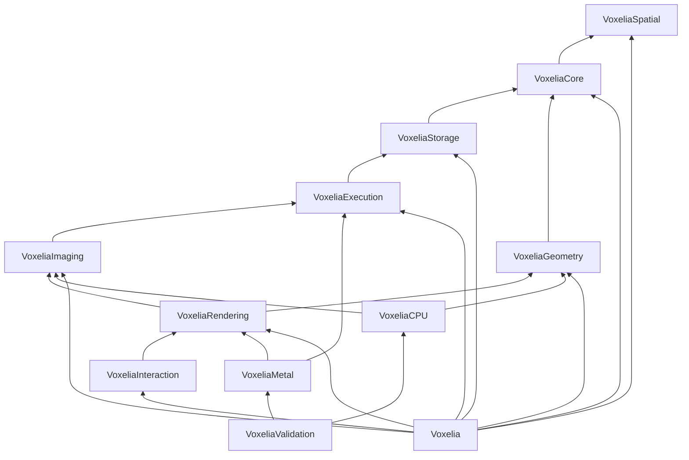

# Voxelia Repository and Package Scaffold Specification v0.1.1

> **Platform applicability:** Voxelia exclusively targets Apple Silicon ARM64 hardware and Apple operating systems. References to operation across more than one platform mean only macOS, iOS/iPadOS, visionOS and tvOS within the Apple ecosystem. No alternate processor architecture, operating system, hosted Swift toolchain, renderer or compatibility target is within scope.

## Document control

| Field | Value |
|---|---|
| Document | Voxelia Repository and Package Scaffold Specification |
| Document identifier | `VOXELIA-RPSS` |
| Version | 0.1.1 |
| Status | Corrective Release |
| Date | 2 August 2026 |
| Project | Voxelia |
| Governing documents | Voxelia Project Foundation v0.1.1; Voxelia Master Technical Architecture v0.1.1; Voxelia Requirements Baseline v0.1.1; Voxelia Validation and Benchmark Strategy v0.1.1 |
| Licence | MIT |
| Language | British English |
| Intended audience | Project maintainers, architects, implementation teams, release engineers, validation engineers, benchmark engineers, security reviewers, documentation contributors and downstream integrators |

### Revision history

| Version | Date | Summary |
|---|---:|---|
| 0.1 | 2026-08-02 | Initial repository and Swift Package Manager scaffold specification defining repository topology, products, targets, package stages, dependency controls, source and shader ownership, tests, validation, benchmarks, documentation, continuous integration, security, release controls and Milestone M0 acceptance. |
| 0.1.1 | 2026-08-02 | M0 corrective revision fixing documentation validation and enforcing Apple Silicon ARM64 plus Apple operating systems as the exclusive repository, CI and release environment. |

### Approval record

This version is a draft for architecture, implementation, validation, security and release-engineering review. Formal approval roles, signatories, repository URL, default branch and approved commit shall be added when the repository is established.

---

## 1. Purpose

This document defines the repository and package scaffold that shall be created before substantive Voxelia implementation begins.

It translates the approved project, architecture, requirements and validation baselines into a concrete, reviewable and reproducible development foundation covering:

- the public repository model;
- root files and policies;
- directory layout;
- Swift Package Manager products and targets;
- module dependency direction;
- staged introduction of optional modules;
- external dependency handling;
- DICOMKit and Raster-Lab codec integration boundaries;
- Metal shader ownership and resources;
- Swift 6.2 and strict-concurrency build policy;
- target-level source and documentation layout;
- test support;
- validation and benchmark auxiliary packages;
- generated artefact policy;
- architecture decision and request-for-comments records;
- continuous integration;
- cross-Apple-platform build checks;
- security and contribution controls;
- software bill of materials;
- release and versioning conventions;
- commands used by contributors and CI; and
- Milestone M0 acceptance criteria.

The scaffold shall establish structure and enforce boundaries. It shall not prematurely implement the scientific data model, processing algorithms, diagnostic renderer, DICOM adapter, codecs or Photorealistic Rendering.

---

## 2. Authority and precedence

The **Voxelia Project Foundation v0.1.1** remains the highest-level project-specific authority.

The **Voxelia Master Technical Architecture v0.1.1** defines the approved module and dependency architecture.

The **Voxelia Requirements Baseline v0.1.1** defines the normative repository, platform, architecture, documentation, licensing, security and release requirements that this scaffold shall satisfy.

The **Voxelia Validation and Benchmark Strategy v0.1.1** defines the required test, validation, benchmark and evidence structures.

If this specification conflicts with the Project Foundation, the Foundation takes precedence. If it conflicts with the Master Technical Architecture or Requirements Baseline without conflicting with the Foundation, the discrepancy shall be resolved before repository creation through:

- correction of this specification;
- revision of the governing architecture or requirement; or
- an approved Architecture Decision Record.

The scaffold shall not use implementation convenience as justification for creating a prohibited dependency cycle, exposing backend types through canonical APIs or importing optional dependencies into core targets.

---

## 3. Scope

### 3.1 Included

This specification covers:

- one public Voxelia monorepo;
- the root public Swift package;
- auxiliary validation, benchmark and tool packages within the monorepo;
- source targets;
- test targets;
- Metal resources;
- DocC catalogues;
- Markdown documentation;
- validation schemas and manifests;
- benchmark scenarios and baselines;
- contribution and security files;
- issue and pull-request templates;
- continuous-integration workflow responsibilities;
- release metadata;
- dependency pinning and review;
- large validation asset handling; and
- repository acceptance evidence.

### 3.2 Excluded

This specification does not define:

- canonical image and spatial type implementations;
- operation protocol implementations;
- CPU or Metal algorithm code;
- DICOM series assembly;
- codec adapter code;
- rendering algorithms;
- application user interfaces;
- PACS or VNA services;
- browser clients;
- render-farm scheduling;
- peer discovery;
- product authentication;
- hospital policy; or
- downstream regulatory evidence.

These shall be addressed by subsequent specifications and implementation milestones.

---

## 4. Scaffold objectives

The scaffold shall:

1. compile under Swift 6 language mode with strict concurrency;
2. expose the approved initial library products;
3. preserve acyclic dependency direction;
4. avoid runtime external dependencies at M0;
5. allow optional dependencies to be introduced only into adapter targets;
6. keep diagnostic and scientific semantics independent from Metal, RealityKit, Model I/O, Core Image and DICOMKit;
7. make Metal shader ownership explicit;
8. support per-module tests and documentation;
9. provide a dedicated validation and benchmark structure;
10. make requirements-to-evidence traceability possible from the first implementation change;
11. enforce licence, DCO, dependency and security policy;
12. support reproducible package resolution and release evidence;
13. support macOS, iOS, iPadOS, visionOS and tvOS build checks;
14. prevent untrusted changes from executing on privileged self-hosted runners;
15. provide a low-friction contributor workflow;
16. remain understandable without IDE-specific project files; and
17. permit later extraction of optional integrations into companion packages without changing canonical Voxelia models.

---

## 5. Fixed scaffold decisions

| Topic | Decision |
|---|---|
| Repository model | One public monorepo |
| Default branch | `main` |
| Primary package manager | Swift Package Manager |
| Swift tools baseline | Swift tools 6.2 or later |
| Swift language mode | Swift 6 |
| Primary platform | Apple Silicon macOS |
| Declared platforms | macOS 15+, iOS/iPadOS 18+, visionOS 2+, tvOS 18+ |
| Architecture | Apple Silicon ARM64 exclusively; Intel, x86/x64 and non-Apple platforms excluded |
| Licence | MIT |
| Contribution provenance | Developer Certificate of Origin |
| Documentation | Markdown and DocC |
| Documentation language | British English |
| Runtime dependency policy at M0 | No external runtime package dependencies |
| External integrations | Added only through staged optional targets |
| Root package | Public library products only |
| Auxiliary packages | Validation CLI, benchmark executables and repository tools |
| Shader ownership | Target-local resources |
| Source-package compatibility | Prioritised before any Voxelia-specific binary ABI commitment |
| Release versioning | Semantic Versioning |
| Large validation data | Manifested, content-addressed and fetched; not committed indiscriminately |
| CI security | Least privilege; untrusted forks excluded from privileged self-hosted runners |

---

## 6. Repository identity and branch policy

### 6.1 Repository name

The repository shall be named:

```text
Voxelia
```

The intended public location is:

```text
https://github.com/Raster-Lab/Voxelia
```

The repository URL shall be inserted into document front matter and package metadata only after it has been created.

### 6.2 Default branch

The default branch shall be:

```text
main
```

`main` shall remain:

- protected;
- buildable;
- testable;
- documentation-valid;
- free of known P0 validation failures; and
- suitable for creating a development snapshot.

### 6.3 Branch types

Short-lived branches should use:

```text
feature/<issue>-<description>
fix/<issue>-<description>
docs/<issue>-<description>
validation/<issue>-<description>
benchmark/<issue>-<description>
security/<private-reference>
release/<major>.<minor>
```

A permanent `develop` branch shall not be required.

### 6.4 Merge policy

Changes to `main` shall use pull requests.

Direct pushes shall be restricted to repository administration and emergency security response under documented procedure.

The preferred merge strategy shall be squash merge unless preserving a structured commit series materially improves traceability.

### 6.5 Branch protection

At minimum, protection for `main` shall require:

- an approved pull request;
- passing required checks;
- DCO status;
- resolved review conversations;
- up-to-date branch or merge queue processing;
- no unauthorised force push;
- no branch deletion; and
- code-owner review for protected paths.

Diagnostic-output-affecting, security-sensitive and architecture-affecting changes shall require an independent reviewer.

---

## 7. Top-level repository structure

The repository shall use the following structure.

```text
Voxelia/
├── .editorconfig
├── .gitattributes
├── .gitignore
├── .spi.yml
├── .swift-format
├── CHANGELOG.md
├── CODE_OF_CONDUCT.md
├── CODEOWNERS
├── CONTRIBUTING.md
├── GOVERNANCE.md
├── LICENSE
├── Package.resolved
├── Package.swift
├── README.md
├── SECURITY.md
├── SUPPORT.md
├── THIRD_PARTY_NOTICES.md
├── Sources/
│   ├── Voxelia/
│   ├── VoxeliaSpatial/
│   ├── VoxeliaCore/
│   ├── VoxeliaStorage/
│   ├── VoxeliaExecution/
│   ├── VoxeliaImaging/
│   ├── VoxeliaGeometry/
│   ├── VoxeliaRendering/
│   ├── VoxeliaInteraction/
│   ├── VoxeliaCPU/
│   ├── VoxeliaMetal/
│   └── VoxeliaValidation/
├── Tests/
│   ├── Support/
│   ├── VoxeliaSpatialTests/
│   ├── VoxeliaCoreTests/
│   ├── VoxeliaStorageTests/
│   ├── VoxeliaExecutionTests/
│   ├── VoxeliaImagingTests/
│   ├── VoxeliaGeometryTests/
│   ├── VoxeliaRenderingTests/
│   ├── VoxeliaInteractionTests/
│   ├── VoxeliaCPUTests/
│   ├── VoxeliaMetalTests/
│   ├── VoxeliaValidationTests/
│   └── VoxeliaTests/
├── Validation/
│   ├── Package.swift
│   ├── README.md
│   ├── Schemas/
│   ├── Datasets/
│   │   ├── Manifests/
│   │   ├── Phantoms/
│   │   └── Fetch/
│   ├── Expected/
│   ├── Tolerances/
│   ├── Sources/
│   ├── Tests/
│   ├── Reports/
│   └── Results/
├── Benchmarks/
│   ├── Package.swift
│   ├── README.md
│   ├── Schemas/
│   ├── Scenarios/
│   ├── Sources/
│   ├── Tests/
│   ├── Baselines/
│   ├── Reports/
│   └── Results/
├── Examples/
│   ├── README.md
│   └── Shared/
├── Tools/
│   ├── Package.swift
│   ├── README.md
│   ├── Plugins/
│   ├── Sources/
│   ├── Tests/
│   └── Scripts/
├── docs/
│   ├── index.md
│   ├── project/
│   ├── architecture/
│   │   ├── index.md
│   │   ├── decisions/
│   │   ├── diagrams/
│   │   └── modules/
│   ├── requirements/
│   ├── rfcs/
│   ├── algorithms/
│   ├── shaders/
│   ├── validation/
│   ├── benchmarks/
│   ├── security/
│   ├── releases/
│   └── templates/
└── .github/
    ├── CODEOWNERS
    ├── dependabot.yml
    ├── ISSUE_TEMPLATE/
    │   ├── bug.yml
    │   ├── feature.yml
    │   ├── performance-regression.yml
    │   ├── validation-deviation.yml
    │   ├── documentation.yml
    │   └── config.yml
    ├── PULL_REQUEST_TEMPLATE.md
    ├── DISCUSSION_TEMPLATE/
    └── workflows/
        ├── ci.yml
        ├── platform-builds.yml
        ├── validation-smoke.yml
        ├── nightly-validation.yml
        ├── nightly-benchmarks.yml
        ├── documentation.yml
        ├── dependency-review.yml
        ├── security.yml
        ├── sbom.yml
        └── release.yml
```

The top-level `CODEOWNERS` file may be a symbolic link only if repository tooling and all supported environments handle it reliably. Otherwise `.github/CODEOWNERS` shall be authoritative and the root duplicate shall be omitted. The initial scaffold should prefer `.github/CODEOWNERS` as the authoritative file to avoid duplication.

---

## 8. Root-file specifications

### 8.1 `README.md`

The root README shall contain:

- project name and one-paragraph purpose;
- project status;
- supported platforms;
- Swift tools requirement;
- minimal integration example;
- product and module overview;
- diagnostic-use disclaimer;
- relationship to the DICOM Workstation;
- links to Foundation, Architecture, Requirements and Validation Strategy;
- build and test commands;
- contribution link;
- security-reporting link;
- licence statement; and
- current limitations.

The README shall not claim complete VTK or ITK equivalence.

### 8.2 `LICENSE`

The file shall contain the unmodified MIT Licence text and the approved copyright statement.

### 8.3 `CHANGELOG.md`

The changelog shall:

- follow a consistent human-readable structure;
- contain an `Unreleased` section;
- classify additions, changes, deprecations, removals, fixes and security changes;
- identify diagnostic-output-affecting changes explicitly;
- identify breaking API changes during `0.x`;
- link releases to tags; and
- avoid generating entries solely from commit messages without review.

### 8.4 `CONTRIBUTING.md`

The contribution guide shall cover:

- code of conduct;
- DCO sign-off;
- issue-first expectations for material changes;
- RFC and ADR process;
- development environment;
- build and test commands;
- formatting;
- source and documentation standards;
- requirement linkage;
- validation expectations;
- benchmark evidence;
- dependency additions;
- security reporting;
- review process; and
- licence provenance.

### 8.5 `CODE_OF_CONDUCT.md`

The project shall adopt an established open-source code of conduct approved by project governance.

### 8.6 `GOVERNANCE.md`

The file shall describe:

- Project Lead;
- maintainers;
- module maintainers;
- committers;
- reviewers;
- security contacts;
- decision-making;
- conflict resolution;
- appointment and removal;
- release authority; and
- escalation.

Named assignments may initially be marked `To be appointed`.

### 8.7 `SECURITY.md`

The security policy shall define:

- private vulnerability reporting channel;
- information required in a report;
- expected acknowledgement process;
- supported release policy;
- coordinated disclosure;
- treatment of malformed medical and compressed data;
- handling of patient information;
- prohibition on filing exploitable vulnerability details as public issues; and
- security release process.

### 8.8 `SUPPORT.md`

The support policy shall distinguish:

- community support;
- security support;
- supported releases;
- unsupported branches;
- questions;
- defects;
- commercial support outside the open-source project; and
- downstream product responsibility.

### 8.9 `THIRD_PARTY_NOTICES.md`

The file shall include:

- dependency name;
- repository;
- version or revision;
- licence;
- usage location;
- whether bundled, linked or optional;
- notice requirements; and
- reviewer.

The file shall be updated whenever an approved dependency changes.

### 8.10 `.editorconfig`

The initial configuration shall require:

- UTF-8;
- LF line endings;
- final newline;
- spaces rather than tabs for Swift, Markdown, YAML and JSON;
- four-space Swift indentation;
- two-space YAML and JSON indentation; and
- removal of trailing whitespace except where Markdown syntax requires it.

### 8.11 `.gitattributes`

The file shall:

- normalise text to LF;
- identify generated binary artefacts where retained;
- prevent inappropriate diffing of binary validation assets;
- preserve Metal and Swift text treatment;
- mark vendored snapshots where applicable; and
- avoid automatic line-ending conversion that changes checksums.

### 8.12 `.gitignore`

The file shall ignore:

- `.build/`;
- `.swiftpm/` user state;
- Xcode user data;
- DerivedData;
- `.DS_Store`;
- local benchmark results;
- local validation results;
- generated reports not designated as approved baselines;
- temporary fetched datasets;
- profiler output;
- coverage intermediates;
- local environment files; and
- secrets.

Approved baseline manifests, approved reports and `Package.resolved` shall not be ignored.

### 8.13 `.swift-format`

The formatter configuration shall be committed and versioned.

Formatting shall be deterministic and applied consistently to:

- `Sources`;
- `Tests`;
- auxiliary package sources; and
- Swift code in examples.

A formatter version shall be pinned in CI or documented in the toolchain manifest.

### 8.14 `.spi.yml`

Swift Package Index metadata should be supplied once the public repository exists.

It shall not claim platform or documentation support that has not passed the appropriate build checks.

---

## 9. Documentation structure

### 9.1 Governing documents

The approved Markdown baselines shall be stored under:

```text
docs/project/
├── Voxelia_Project_Foundation_v0.1.1.md
├── Voxelia_Master_Technical_Architecture_v0.1.1.md
├── Voxelia_Requirements_Baseline_v0.1.1.md
├── Voxelia_Validation_and_Benchmark_Strategy_v0.1.1.md
└── Voxelia_Repository_and_Package_Scaffold_Specification_v0.1.1.md
```

Future editorially approved versions shall be added or supersede earlier versions according to document control. Historical versions shall remain available through Git history and release tags.

### 9.2 Architecture Decision Records

ADR files shall be stored under:

```text
docs/architecture/decisions/
```

Identifiers shall use:

```text
ADR-0001-short-title.md
```

Each ADR shall contain:

- status;
- date;
- decision owners;
- context;
- decision;
- alternatives;
- consequences;
- affected requirements;
- affected modules;
- validation impact;
- migration impact; and
- supersession links.

### 9.3 Requests for Comments

Material proposals shall use:

```text
docs/rfcs/RFC-0001-short-title.md
```

An RFC shall contain:

- summary;
- motivation;
- scope;
- proposed design;
- alternatives;
- compatibility;
- security;
- performance;
- validation;
- implementation plan;
- unresolved questions; and
- decision status.

### 9.4 Algorithm specifications

Each public algorithm family shall ultimately have a file under:

```text
docs/algorithms/
```

The scaffold shall include a template containing:

- algorithm ID;
- semantic version;
- purpose;
- supported rank and formats;
- inputs;
- outputs;
- parameters;
- coordinate conventions;
- boundary behaviour;
- precision;
- determinism;
- reference implementation;
- accelerated implementations;
- failure behaviour;
- validation datasets;
- tolerance profile;
- performance scenarios;
- provenance fields; and
- references.

### 9.5 Shader specifications

Each Metal shader family shall ultimately have a file under:

```text
docs/shaders/
```

The template shall include:

- shader family ID;
- source location;
- semantic version;
- operation implementations;
- supported scalar and texture formats;
- precision policy;
- threadgroup assumptions;
- function constants;
- resource bindings;
- sampler policy;
- bounds behaviour;
- compiler options;
- validation;
- source fingerprint; and
- compiled-library fingerprint.

### 9.6 DocC ownership

DocC catalogues shall be target-local so Swift Package Manager and DocC can associate documentation with the owning module.

Recommended layout:

```text
Sources/Voxelia/Voxelia.docc/
Sources/VoxeliaSpatial/VoxeliaSpatial.docc/
Sources/VoxeliaCore/VoxeliaCore.docc/
...
```

The umbrella catalogue shall provide:

- project landing page;
- installation;
- module map;
- architectural overview;
- tutorials;
- integration paths;
- diagnostic-use guidance;
- validation links; and
- migration guidance.

A root-level `Documentation.docc` directory shall not duplicate target-owned catalogues. The conceptual documentation directory in the Master Technical Architecture is realised through target-local DocC catalogues plus `docs/`.

---

## 10. Root Swift package

### 10.1 Purpose

The root `Package.swift` shall define the public Voxelia libraries and their tests.

It shall not contain:

- benchmark executable products;
- validation CLI executables;
- repository-maintenance tools;
- hidden network services;
- host-application targets; or
- example applications.

These belong in auxiliary packages or external applications.

### 10.2 Package declaration

The package shall declare:

```swift
// swift-tools-version: 6.2
```

The package name shall be:

```swift
Voxelia
```

The package shall declare:

```swift
platforms: [
    .macOS(.v15),
    .iOS(.v18),
    .tvOS(.v18),
    .visionOS(.v2)
]
```

iPadOS support is provided through the iOS declaration and shall be validated separately.

The package shall declare Swift 6 language mode.

### 10.3 M0 dependency policy

The M0 root manifest shall declare no external package dependencies.

This allows the initial scaffold to validate:

- module boundaries;
- package products;
- strict concurrency;
- testing;
- documentation; and
- supported-platform compilation

without being blocked by integration packages that are not yet required.

External packages shall be introduced only at their scheduled milestones through reviewed changes.

### 10.4 Package-resolution record

`Package.resolved` shall be committed once external dependencies are introduced.

For release tags:

- no dependency shall float on an unbounded branch;
- semantic version requirements are preferred;
- an exact revision may be used temporarily when an approved dependency has no suitable release;
- exact-revision use shall be documented;
- dependency updates shall use dedicated pull requests; and
- release evidence shall record resolved revisions.

The committed resolution supports Voxelia CI and release reproducibility. It does not override the dependency constraints used by downstream adopters.

---

## 11. Initial public products

The M0 root package shall expose:

| Product | Type | M0 status | Purpose |
|---|---|---:|---|
| `VoxeliaSpatial` | Library | Active | Spatial types, units and transforms |
| `VoxeliaCore` | Library | Active | Canonical descriptors, data handles and provenance |
| `VoxeliaStorage` | Library | Active | Concrete storage and cache abstractions |
| `VoxeliaExecution` | Library | Active | Operations, scheduling, cancellation and caching |
| `VoxeliaImaging` | Library | Active | Backend-neutral imaging semantics |
| `VoxeliaGeometry` | Library | Active | Geometry and surface abstractions |
| `VoxeliaRendering` | Library | Active | Backend-neutral scene and render requests |
| `VoxeliaInteraction` | Library | Active | UI-neutral interaction state and commands |
| `VoxeliaCPU` | Library | Active | CPU reference and optimised backends |
| `VoxeliaMetal` | Library | Active | Metal compute, rendering and residency |
| `VoxeliaValidation` | Library | Active | Shared validation types and comparison utilities |
| `Voxelia` | Library | Active | Umbrella entry module without hidden backend side effects |

The presence of an M0 product does not imply substantive implementation. M0 targets shall compile with minimal internal scaffolding and documentation while avoiding placeholder public APIs that would later require compatibility support.

---

## 12. Planned optional products

The following products shall be introduced only when their owning milestone begins and their dependency and API boundaries have been reviewed.

| Product | Earliest milestone | Principal dependencies |
|---|---:|---|
| `VoxeliaCompression` | M5 | `VoxeliaStorage`; approved Raster-Lab codec packages |
| `VoxeliaDICOMKit` | M4 | Core Voxelia modules; DICOMKit; compression adapter where required |
| `VoxeliaSegmentation` | M7 | `VoxeliaImaging`, `VoxeliaGeometry`, `VoxeliaExecution` |
| `VoxeliaRegistration` | M7 | `VoxeliaImaging`, `VoxeliaSpatial`, `VoxeliaExecution` |
| `VoxeliaPhotorealisticRendering` | M8 | `VoxeliaMetal`, `VoxeliaRendering` |
| `VoxeliaHeadless` | M9 | `VoxeliaMetal`, `VoxeliaRendering` |
| `VoxeliaRealityKit` | M9 | `VoxeliaRendering`, `VoxeliaGeometry`, RealityKit |
| `VoxeliaModelIO` | M6 | `VoxeliaGeometry`, Model I/O |
| `VoxeliaCoreImage` | M9 | `VoxeliaRendering`, Core Image |
| `VoxeliaDistributed` | M9 | `VoxeliaExecution`, `VoxeliaRendering` |
| `VoxeliaInterop` | M7 | Core Voxelia modules; optional external interoperability libraries |

Optional modules shall adapt stable Voxelia models. They shall not redefine canonical data, geometry, operation or scene types.

---

## 13. Target dependency graph

### 13.1 M0 dependencies

The M0 graph shall be:



Arrows indicate “depends on”.

### 13.2 Umbrella boundary

The M0 `Voxelia` target shall depend on the stable backend-neutral modules listed above.

It shall not:

- depend on `VoxeliaValidation`;
- automatically register CPU or Metal backends;
- import DICOMKit or codecs;
- import RealityKit, Model I/O or Core Image;
- trigger device creation; or
- create global mutable state.

A formal module re-export mechanism shall be decided before Voxelia 1.0. The scaffold shall not rely on an underscored Swift feature solely to simulate public re-export.

Until that decision is approved, consumers may import focused modules explicitly.

### 13.3 Cycle enforcement

The repository shall include a tool that:

1. reads `swift package dump-package`;
2. builds a target dependency graph;
3. detects cycles;
4. checks forbidden dependency edges; and
5. emits a machine-readable and human-readable report.

A cycle or forbidden edge shall fail CI.

---

## 14. Normative M0 `Package.swift` skeleton

The initial manifest should follow the structure below. Minor syntactic changes required by the approved Swift 6.2 toolchain are permitted, but products, target ownership and dependency direction shall remain equivalent.

```swift
// swift-tools-version: 6.2

import PackageDescription

let package = Package(
    name: "Voxelia",
    platforms: [
        .macOS(.v15),
        .iOS(.v18),
        .tvOS(.v18),
        .visionOS(.v2),
    ],
    products: [
        .library(name: "VoxeliaSpatial", targets: ["VoxeliaSpatial"]),
        .library(name: "VoxeliaCore", targets: ["VoxeliaCore"]),
        .library(name: "VoxeliaStorage", targets: ["VoxeliaStorage"]),
        .library(name: "VoxeliaExecution", targets: ["VoxeliaExecution"]),
        .library(name: "VoxeliaImaging", targets: ["VoxeliaImaging"]),
        .library(name: "VoxeliaGeometry", targets: ["VoxeliaGeometry"]),
        .library(name: "VoxeliaRendering", targets: ["VoxeliaRendering"]),
        .library(name: "VoxeliaInteraction", targets: ["VoxeliaInteraction"]),
        .library(name: "VoxeliaCPU", targets: ["VoxeliaCPU"]),
        .library(name: "VoxeliaMetal", targets: ["VoxeliaMetal"]),
        .library(name: "VoxeliaValidation", targets: ["VoxeliaValidation"]),
        .library(name: "Voxelia", targets: ["Voxelia"]),
    ],
    dependencies: [],
    targets: [
        .target(
            name: "VoxeliaSpatial"
        ),
        .target(
            name: "VoxeliaCore",
            dependencies: ["VoxeliaSpatial"]
        ),
        .target(
            name: "VoxeliaStorage",
            dependencies: ["VoxeliaCore"]
        ),
        .target(
            name: "VoxeliaExecution",
            dependencies: ["VoxeliaStorage"]
        ),
        .target(
            name: "VoxeliaImaging",
            dependencies: ["VoxeliaExecution"]
        ),
        .target(
            name: "VoxeliaGeometry",
            dependencies: ["VoxeliaCore"]
        ),
        .target(
            name: "VoxeliaRendering",
            dependencies: [
                "VoxeliaImaging",
                "VoxeliaGeometry",
            ]
        ),
        .target(
            name: "VoxeliaInteraction",
            dependencies: ["VoxeliaRendering"]
        ),
        .target(
            name: "VoxeliaCPU",
            dependencies: [
                "VoxeliaImaging",
                "VoxeliaGeometry",
            ]
        ),
        .target(
            name: "VoxeliaMetal",
            dependencies: [
                "VoxeliaExecution",
                "VoxeliaRendering",
            ],
            resources: [
                .process("Resources"),
            ]
        ),
        .target(
            name: "VoxeliaValidation",
            dependencies: [
                "VoxeliaCPU",
                "VoxeliaMetal",
            ]
        ),
        .target(
            name: "Voxelia",
            dependencies: [
                "VoxeliaSpatial",
                "VoxeliaCore",
                "VoxeliaStorage",
                "VoxeliaExecution",
                "VoxeliaImaging",
                "VoxeliaGeometry",
                "VoxeliaRendering",
                "VoxeliaInteraction",
            ]
        ),

        .target(
            name: "VoxeliaTestSupport",
            dependencies: [
                "VoxeliaCore",
                "VoxeliaValidation",
            ],
            path: "Tests/Support",
            resources: [
                .process("Resources"),
            ]
        ),

        .testTarget(
            name: "VoxeliaSpatialTests",
            dependencies: ["VoxeliaSpatial", "VoxeliaTestSupport"]
        ),
        .testTarget(
            name: "VoxeliaCoreTests",
            dependencies: ["VoxeliaCore", "VoxeliaTestSupport"]
        ),
        .testTarget(
            name: "VoxeliaStorageTests",
            dependencies: ["VoxeliaStorage", "VoxeliaTestSupport"]
        ),
        .testTarget(
            name: "VoxeliaExecutionTests",
            dependencies: ["VoxeliaExecution", "VoxeliaTestSupport"]
        ),
        .testTarget(
            name: "VoxeliaImagingTests",
            dependencies: ["VoxeliaImaging", "VoxeliaTestSupport"]
        ),
        .testTarget(
            name: "VoxeliaGeometryTests",
            dependencies: ["VoxeliaGeometry", "VoxeliaTestSupport"]
        ),
        .testTarget(
            name: "VoxeliaRenderingTests",
            dependencies: ["VoxeliaRendering", "VoxeliaTestSupport"]
        ),
        .testTarget(
            name: "VoxeliaInteractionTests",
            dependencies: ["VoxeliaInteraction", "VoxeliaTestSupport"]
        ),
        .testTarget(
            name: "VoxeliaCPUTests",
            dependencies: ["VoxeliaCPU", "VoxeliaTestSupport"]
        ),
        .testTarget(
            name: "VoxeliaMetalTests",
            dependencies: ["VoxeliaMetal", "VoxeliaTestSupport"]
        ),
        .testTarget(
            name: "VoxeliaValidationTests",
            dependencies: ["VoxeliaValidation", "VoxeliaTestSupport"]
        ),
        .testTarget(
            name: "VoxeliaTests",
            dependencies: ["Voxelia", "VoxeliaTestSupport"]
        ),
    ],
    swiftLanguageModes: [.v6]
)
```

### 14.1 Manifest constraints

The actual manifest shall:

- use no `unsafeFlags` in public targets without an approved ADR;
- use no branch-based dependency in a stable release;
- attach resources only to the owning target;
- use no test-only dependency from a public production target;
- use no product dependency when a target dependency is sufficient inside the same package;
- avoid conditional compilation that changes canonical public semantics silently; and
- remain readable without code generation.

### 14.2 Warnings as errors

Warnings shall be treated as errors in CI through build invocation or controlled toolchain configuration.

The public package manifest shall not impose non-portable unsafe compiler flags on downstream adopters merely to enforce repository policy.

### 14.3 Optimisation flags

The scaffold shall not enable:

- `-Ounchecked`;
- unreviewed fast-math behaviour;
- unchecked overflow;
- suppressed exclusivity checks; or
- compiler flags that weaken diagnostic correctness.

Optimisation and floating-point policies shall be introduced by implementation-specific ADRs and validation evidence.

---

## 15. Target source layout

Each active source target shall use:

```text
Sources/<Target>/
├── <Target>.docc/
├── Public/
├── Internal/
└── Module.swift
```

The `Public` and `Internal` directories are organisational conventions, not separate Swift access-control domains. Swift access control remains authoritative.

A target may introduce domain subdirectories where they improve clarity.

### 15.1 M0 source content

M0 source targets shall contain:

- SPDX header where appropriate;
- module-level documentation;
- no speculative public API;
- no global mutable singleton;
- no unapproved dependency import; and
- the minimum internal marker or implementation required for a valid module.

A public placeholder type shall not be created merely to make a target appear populated.

### 15.2 File organisation

Public API source files should group one coherent concept rather than enforce one type per file mechanically.

Implementation details shall use `internal`, `package` or `private` access as appropriate.

### 15.3 Source headers

The preferred header is:

```swift
// SPDX-License-Identifier: MIT
```

Long generated copyright banners shall not be repeated in every source file unless required by project policy.

### 15.4 Import policy

Imports shall be:

- explicit;
- minimal;
- sorted by the configured formatter;
- confined to the target’s permitted dependencies; and
- conditionally compiled only for documented platform-specific functionality.

A core target shall not import:

- Metal;
- MetalKit;
- RealityKit;
- ModelIO;
- CoreImage;
- DICOMKit; or
- Raster-Lab codecs

unless the Master Technical Architecture assigns that framework to the target.

---

## 16. Metal target and shader resources

### 16.1 Target ownership

`VoxeliaMetal` shall own Voxelia’s conventional Metal compute and rendering resources.

Recommended layout:

```text
Sources/VoxeliaMetal/
├── VoxeliaMetal.docc/
├── Public/
├── Internal/
│   ├── Context/
│   ├── Execution/
│   ├── Residency/
│   ├── Rendering/
│   ├── Telemetry/
│   └── Validation/
├── Resources/
│   ├── Shaders/
│   │   ├── Common/
│   │   ├── Imaging/
│   │   ├── Resampling/
│   │   ├── Projection/
│   │   ├── VolumeRendering/
│   │   ├── SurfaceRendering/
│   │   ├── Picking/
│   │   └── Compositing/
│   └── ShaderManifest.yaml
└── Module.swift
```

M0 shall include the directory and manifest schema placeholder but need not include operational shaders.

### 16.2 Photorealistic shaders

Photorealistic shaders shall be owned by:

```text
Sources/VoxeliaPhotorealisticRendering/Resources/Shaders/
```

They shall not be placed in `VoxeliaMetal` merely for convenience.

### 16.3 Shader manifest

Each shader manifest entry shall ultimately record:

- shader family ID;
- semantic version;
- source path;
- entry points;
- operation implementations;
- resource bindings;
- supported formats;
- function constants;
- precision profile;
- validation specification;
- source checksum; and
- compiled-library fingerprint.

### 16.4 Resource loading

Shader resources shall be accessed through the owning package target’s resource bundle.

No public caller shall need to locate shader files manually.

### 16.5 Generated Metal libraries

Generated `.metallib` files shall not be committed by default.

A release or validation process may retain a compiled-library artefact by checksum where required for reproducibility. Such artefacts shall be generated by controlled tooling and recorded in evidence, not edited manually.

---

## 17. Test architecture

### 17.1 Test framework

Swift Testing shall be the default test framework.

XCTest may be used where required by:

- platform integration;
- UI or framework support;
- performance APIs unavailable in Swift Testing; or
- external dependencies.

### 17.2 Test target ownership

Every public source target shall have a corresponding test target.

A change that adds a new public target shall add its test target in the same pull request.

### 17.3 Shared test support

`VoxeliaTestSupport` shall:

- remain outside public products;
- provide small deterministic fixtures;
- provide test-only builders;
- provide comparison helpers;
- provide temporary-directory utilities;
- provide deterministic random-number support;
- expose requirement and dataset metadata helpers; and
- avoid becoming a second implementation of production logic.

### 17.4 Small test resources

Small, redistributable fixtures may be stored under:

```text
Tests/Support/Resources/
```

Large data shall use Validation manifests and fetch tooling.

### 17.5 Test naming

Test names shall describe:

- behaviour;
- condition;
- expected result; and
- requirement ID where applicable.

Example:

```swift
@Test("VOX-SPA-009: singular affine transform reports typed failure")
func singularTransformReportsFailure() async throws {
    // ...
}
```

### 17.6 Requirement traits

`VoxeliaValidation` should eventually provide Swift Testing traits or metadata for:

- requirement ID;
- validation level;
- dataset ID;
- tolerance profile;
- capability class; and
- diagnostic status.

The M0 scaffold shall reserve the namespace without forcing a premature public trait API.

### 17.7 Test determinism

Unit and reference tests shall avoid dependence on:

- wall-clock time;
- unspecified task scheduling;
- random seeds not recorded;
- external network services;
- user locale;
- local time zone;
- display scale; or
- mutable global state.

---

## 18. Validation auxiliary package

### 18.1 Purpose

`Validation/Package.swift` shall define internal validation executables and schema tools without exposing them as public runtime dependencies.

It may depend on the root package through:

```swift
.package(path: "..")
```

### 18.2 Initial validation executables

Planned internal products include:

- `voxelia-validation`;
- `voxelia-phantom-generator`;
- `voxelia-dataset-manifest`;
- `voxelia-result-compare`;
- `voxelia-traceability`;
- `voxelia-shader-fingerprint`; and
- `voxelia-validation-report`.

M0 may implement command skeletons that validate arguments and schema locations without implementing scientific algorithms.

### 18.3 Validation package dependency policy

Validation-only external dependencies may be approved when they do not become transitive runtime dependencies of public Voxelia products.

They shall still undergo licence and security review.

### 18.4 Validation results

Local raw results shall be written under:

```text
Validation/Results/
```

and ignored by Git.

Reviewed milestone and release reports shall be placed under:

```text
Validation/Reports/
```

with checksums and manifests.

---

## 19. Benchmark auxiliary package

### 19.1 Purpose

`Benchmarks/Package.swift` shall isolate benchmark executables and any development-only measurement dependencies from the public package.

### 19.2 Planned executables

Planned benchmark products include:

- `voxelia-benchmark`;
- `voxelia-benchmark-core`;
- `voxelia-benchmark-metal`;
- `voxelia-benchmark-codec`;
- `voxelia-benchmark-rendering`; and
- `voxelia-benchmark-report`.

The exact executable split may be simplified by ADR once the harness design is implemented.

### 19.3 Benchmark scenarios

Scenario manifests shall be stored under:

```text
Benchmarks/Scenarios/
```

Approved baselines shall be stored under:

```text
Benchmarks/Baselines/
```

Local raw results shall be ignored under:

```text
Benchmarks/Results/
```

### 19.4 Correctness gate

A benchmark executable shall not publish an accepted result unless:

- its required validation test has passed; or
- the benchmark includes and passes an embedded correctness check.

---

## 20. Repository tools package

### 20.1 Purpose

`Tools/Package.swift` shall contain repository-maintenance tools, build-tool plugins and scripts that are not part of the public Voxelia API.

### 20.2 Planned tools

The initial toolset should include:

- dependency graph checker;
- prohibited import checker;
- front-matter validator;
- requirement ID validator;
- Markdown link checker;
- YAML schema validator;
- SPDX header checker;
- third-party notice generator;
- SBOM generator adapter;
- shader manifest validator;
- architecture document indexer;
- release evidence indexer; and
- generated-file checker.

### 20.3 Scripts

Shell scripts shall be stored under:

```text
Tools/Scripts/
```

The initial set shall include:

```text
bootstrap.sh
build.sh
test.sh
test-platforms.sh
validate-scaffold.sh
validate-docs.sh
validation-smoke.sh
benchmark-smoke.sh
generate-sbom.sh
prepare-release.sh
```

Scripts shall:

- fail on error;
- avoid modifying source unexpectedly;
- accept non-interactive CI use;
- print tool versions;
- write machine-readable logs where appropriate;
- avoid secrets;
- quote paths safely; and
- support execution from any working directory by resolving the repository root.

---

## 21. External dependency policy

### 21.1 General rules

An external dependency shall be added only when:

- functionality is justified;
- an approved Raster-Lab library does not already provide it;
- licence is compatible;
- security risk is reviewed;
- maintenance status is acceptable;
- platform support is appropriate;
- dependency scope is limited to the owning target;
- an ADR records the decision where material; and
- validation impact is understood.

### 21.2 Raster-Lab dependencies

The following integrations are anticipated:

| Repository | Intended adapter |
|---|---|
| `Raster-Lab/DICOMKit` | `VoxeliaDICOMKit` |
| `Raster-Lab/J2KSwift` | `VoxeliaCompression` |
| `Raster-Lab/JLSwift` | `VoxeliaCompression` |
| `Raster-Lab/JLISwift` | `VoxeliaCompression` |
| `Raster-Lab/JXLSwift` | `VoxeliaCompression` |
| `Raster-Lab/CompressionFamily` | `VoxeliaCompression` |

The exact package product names, versions and direct-versus-transitive dependency choices shall be resolved in the integration ADRs.

The scaffold shall not duplicate codec implementation merely because a dependency is temporarily missing an API or platform declaration. Such gaps shall be raised to the responsible library team.

### 21.3 Dependency declarations

A dependency shall be attached only to the target that uses it.

Examples:

```swift
.target(
    name: "VoxeliaDICOMKit",
    dependencies: [
        "VoxeliaCore",
        "VoxeliaImaging",
        .product(name: "DICOMCore", package: "DICOMKit"),
    ]
)
```

and:

```swift
.target(
    name: "VoxeliaCompression",
    dependencies: [
        "VoxeliaStorage",
        .product(name: "<approved-product>", package: "J2KSwift"),
    ]
)
```

The examples are structural. Actual product names shall be verified when the integrations are implemented.

### 21.4 Dependency resolution impact

Swift Package Manager may resolve every package declared in a manifest even when an adopter imports only one product.

If optional integrations materially increase resolution time, create version conflicts or restrict otherwise supported platforms, the project shall evaluate companion packages such as:

```text
VoxeliaDICOM
VoxeliaCodecs
VoxeliaAppleAdapters
VoxeliaInterop
```

Such extraction shall preserve the canonical Voxelia data and operation models and shall require an ADR.

### 21.5 Prohibited dependency practices

The repository shall not:

- vendor source without provenance and update policy;
- use floating branches in stable releases;
- conceal transitive copyleft obligations;
- duplicate an existing approved dependency without decision record;
- attach DICOMKit to a core target;
- attach codec packages to modules that process only canonical uncompressed data;
- add a dependency solely for a trivial utility that can be safely implemented and maintained locally; or
- execute downloaded code in CI without verification.

---

## 22. Package lock and dependency updates

### 22.1 `Package.resolved`

After external dependencies are introduced, the repository shall commit the root `Package.resolved` used by CI and release validation.

Auxiliary packages shall also commit their resolution files when they have external dependencies.

### 22.2 Update workflow

Dependency updates shall:

1. use a dedicated pull request;
2. identify old and new versions;
3. include release-note review;
4. include licence review;
5. include vulnerability review;
6. execute affected validation;
7. execute affected benchmarks;
8. update third-party notices;
9. update SBOM evidence; and
10. record known behavioural changes.

### 22.3 Automated update proposals

Automated dependency-update tools may open pull requests but shall not merge automatically.

Raster-Lab dependency updates that can alter decoded values, transfer syntax behaviour or spatial metadata shall receive domain review.

---

## 23. Build policy

### 23.1 Required configurations

CI shall build:

- debug;
- release;
- macOS ARM64;
- generic iOS;
- generic tvOS;
- generic visionOS; and
- representative simulator destinations where supported.

### 23.2 Strict concurrency

Every Swift target shall compile in Swift 6 language mode.

Strict-concurrency diagnostics shall be treated as build failures.

### 23.3 Warnings

Warnings shall be treated as errors in CI.

Local development may permit warnings temporarily, but a pull request shall not merge with unresolved warnings.

### 23.4 Build artefacts

Generated build artefacts shall not be committed.

Release evidence may retain:

- checksums;
- logs;
- symbol graphs;
- DocC archives;
- compiled shader fingerprints;
- SBOMs; and
- signed release artefacts where later introduced.

### 23.5 Build reproducibility

Build logs shall record:

- Swift version;
- compiler version;
- Xcode version;
- operating system;
- architecture;
- dependency resolution;
- package manifest digest; and
- source commit.

---

## 24. Platform-build policy

### 24.1 macOS

macOS shall run:

- full debug build;
- full release build;
- unit tests;
- validation smoke tests;
- documentation build;
- package graph checks; and
- Metal tests on suitable Apple Silicon runners.

### 24.2 iOS and iPadOS

CI shall perform generic iOS builds and representative simulator tests.

iPadOS validation shall be represented through iPad simulator or device destinations, not assumed solely from an iOS compilation result.

### 24.3 visionOS

CI shall perform a generic visionOS build and representative simulator tests where available.

Physical visionOS validation shall occur in scheduled or milestone testing.

### 24.4 tvOS

CI shall perform a generic tvOS build and representative simulator tests.

### 24.5 Device-only capabilities

Tests that require:

- unified-memory measurement;
- sparse resources;
- specific GPU features;
- sustained thermal behaviour;
- display timing;
- headless worker load; or
- physical visionOS interaction

shall run on controlled self-hosted hardware, not be inferred from simulator success.

---

## 25. Continuous-integration workflows

### 25.1 `ci.yml`

Trigger:

- pull request;
- push to `main`.

Responsibilities:

- checkout with least privilege;
- verify toolchain;
- format check;
- manifest validation;
- package graph and prohibited import checks;
- debug build;
- release build;
- macOS tests;
- validation unit tests;
- documentation metadata checks;
- licence and SPDX checks; and
- upload logs on failure.

### 25.2 `platform-builds.yml`

Trigger:

- pull request affecting package or source paths;
- push to `main`;
- manual dispatch.

Responsibilities:

- generic iOS build;
- iPad simulator build/test;
- generic tvOS build;
- tvOS simulator build/test;
- generic visionOS build;
- visionOS simulator build/test where supported; and
- platform availability checks.

### 25.3 `validation-smoke.yml`

Trigger:

- pull request affecting algorithms, shaders, storage, execution, rendering, codecs or DICOM adapters;
- manual dispatch.

Responsibilities:

- analytical phantom smoke tests;
- CPU reference tests;
- selected CPU–Metal differential tests;
- stale-generation tests;
- manifest and tolerance schema checks; and
- small DICOM geometry tests once M4 begins.

### 25.4 `nightly-validation.yml`

Trigger:

- scheduled;
- manual dispatch.

Responsibilities:

- broad operation matrix;
- larger datasets;
- memory-pressure tests;
- cancellation storms;
- fuzzing;
- cross-device tests on approved self-hosted runners; and
- validation report artefacts.

### 25.5 `nightly-benchmarks.yml`

Trigger:

- scheduled;
- manual dispatch;
- protected runner only.

Responsibilities:

- approved benchmark scenarios;
- correctness gate;
- raw result capture;
- baseline comparison;
- regression summary; and
- no automatic baseline replacement.

### 25.6 `documentation.yml`

Trigger:

- pull request affecting documentation or public APIs;
- push to `main`;
- release tag.

Responsibilities:

- YAML front-matter validation;
- Markdown link check;
- Mermaid syntax check where tooling permits;
- DocC build;
- public symbol documentation coverage;
- spelling policy;
- documentation archive; and
- release documentation publication when approved.

### 25.7 `dependency-review.yml`

Trigger:

- pull request changing package manifests, resolution files or third-party notices.

Responsibilities:

- dependency diff;
- licence allow-list;
- prohibited licence detection;
- known vulnerability review;
- resolution consistency;
- third-party notice check; and
- approval requirement.

### 25.8 `security.yml`

Trigger:

- scheduled;
- push to protected branches;
- manual dispatch.

Responsibilities:

- supported static analysis;
- secret scanning;
- dependency vulnerability scan;
- unsafe-code inventory;
- malformed-input corpus checks; and
- security report artefacts.

### 25.9 `sbom.yml`

Trigger:

- release candidate;
- release tag;
- manual dispatch.

Responsibilities:

- generate machine-readable SBOM;
- verify package versions;
- attach checksums;
- compare third-party notices;
- archive evidence; and
- fail on unresolved dependency identity.

### 25.10 `release.yml`

Trigger:

- signed or protected semantic-version tag;
- manual release-candidate preparation.

Responsibilities:

- run release gate;
- verify changelog;
- verify version;
- build supported matrix;
- run P0 release tests;
- generate DocC;
- generate SBOM;
- generate source archive checksums;
- produce release evidence index;
- publish release notes; and
- retain validation and benchmark summaries.

---

## 26. Continuous-integration security

### 26.1 Least privilege

Workflow permissions shall be explicitly declared and minimised.

A workflow shall not receive write permission unless its responsibility requires it.

### 26.2 Third-party actions

Third-party actions shall be:

- reviewed;
- pinned to immutable commit identifiers for protected workflows;
- recorded in third-party notices where required; and
- updated through reviewed changes.

### 26.3 Forked pull requests

Untrusted forked pull requests shall not:

- receive repository secrets;
- run privileged release steps;
- execute on production self-hosted device runners;
- publish documentation;
- update baselines; or
- write to the repository.

### 26.4 Self-hosted runners

Self-hosted Apple hardware shall:

- use isolated runner identities;
- be reset or cleaned between untrusted workloads;
- execute only approved branches or reviewed changes;
- contain no patient data;
- contain no persistent production credentials;
- restrict network access;
- record runner capability and state; and
- support emergency revocation.

### 26.5 `pull_request_target`

`pull_request_target` shall not execute untrusted pull-request code.

Any use shall be limited to metadata-only operations and shall undergo security review.

---

## 27. Required pull-request checks

The initial required checks for `main` shall include:

```text
DCO
Scaffold / Manifest
Scaffold / Dependency Graph
Scaffold / Prohibited Imports
Build / macOS Debug
Build / macOS Release
Test / macOS
Build / iOS
Build / tvOS
Build / visionOS
Documentation / Front Matter and Links
Licence / Dependency Policy
Validation / Smoke
```

Checks may be consolidated into fewer workflows, but branch protection shall expose stable required status names.

Benchmark regression shall become required for performance-sensitive paths after baseline scenarios exist.

---

## 28. Code ownership

### 28.1 Ownership groups

The repository should define groups for:

- project governance;
- architecture;
- core and spatial;
- storage and execution;
- imaging and geometry;
- rendering and interaction;
- CPU;
- Metal and shaders;
- codecs;
- DICOMKit integration;
- segmentation and registration;
- Photorealistic Rendering;
- validation;
- benchmarks;
- security;
- documentation; and
- release engineering.

### 28.2 Protected paths

Code-owner approval shall be required for:

```text
Package.swift
Package.resolved
Sources/VoxeliaCore/
Sources/VoxeliaSpatial/
Sources/VoxeliaExecution/
Sources/VoxeliaMetal/
Sources/VoxeliaPhotorealisticRendering/
Validation/
Benchmarks/Baselines/
docs/project/
docs/architecture/decisions/
docs/shaders/
SECURITY.md
LICENSE
THIRD_PARTY_NOTICES.md
.github/workflows/
```

### 28.3 Independent review

The author of a change shall not be the sole approver of:

- diagnostic algorithm changes;
- tolerance changes;
- golden-result changes;
- shader precision changes;
- dependency licence decisions;
- unsafe code;
- release workflows;
- security policy; or
- benchmark baseline replacement.

---

## 29. Issue and discussion templates

### 29.1 Bug report

The bug template shall request:

- Voxelia version or commit;
- platform;
- device;
- operating system;
- module;
- input description;
- expected result;
- actual result;
- reproduction;
- diagnostic impact;
- provenance;
- logs without patient information; and
- validation or benchmark evidence where applicable.

### 29.2 Performance regression

The template shall request:

- benchmark ID;
- old and new commit;
- scenario version;
- correctness status;
- hardware class;
- raw results;
- variance;
- memory impact;
- suspected change; and
- reproducibility.

### 29.3 Validation deviation

The template shall request:

- requirement ID;
- validation test;
- expected criterion;
- observed result;
- affected implementation;
- affected devices;
- risk;
- proposed disposition; and
- evidence.

### 29.4 Feature proposal

Material features shall be redirected to the RFC process where they affect public APIs, architecture, storage, semantics or diagnostic behaviour.

### 29.5 Security

Public issue templates shall clearly direct vulnerability reports to the private process in `SECURITY.md`.

---

## 30. Pull-request template

The pull-request template shall include:

- summary;
- linked issue;
- linked requirement IDs;
- linked ADR or RFC;
- modules affected;
- public API impact;
- diagnostic-output impact;
- concurrency impact;
- memory impact;
- dependency impact;
- security impact;
- validation performed;
- benchmarks performed;
- documentation updated;
- changelog updated;
- DCO confirmation; and
- reviewer notes.

It shall include a checkbox confirming that test data and logs contain no patient-identifying information.

---

## 31. Source quality policy

### 31.1 Swift style

Swift source shall:

- follow the committed formatter;
- use clear domain terminology;
- avoid abbreviations unless standard;
- avoid force unwraps in library code unless an invariant is proven and documented;
- avoid force casts;
- use typed errors;
- use value semantics where practical;
- document actor isolation;
- avoid hidden global state;
- make ownership explicit; and
- use comments to explain rationale rather than restate code.

### 31.2 British English

Documentation and Voxelia-owned domain terminology shall use British English.

Interoperability identifiers shall preserve external spellings, such as Apple framework type names or DICOM terms.

### 31.3 Unsafe code

Unsafe code shall:

- be isolated;
- include an invariant comment;
- have a dedicated reviewer;
- have bounds and malformed-input tests;
- have a requirement or performance rationale; and
- appear in the unsafe-code inventory.

### 31.4 Generated code

Generated code shall:

- identify the generator and version;
- be reproducible;
- not be edited manually;
- be checked for unexpected changes;
- carry appropriate licence notices; and
- be excluded from style rules only where justified.

---

## 32. Platform-specific code policy

Platform-specific implementation shall use clear source separation where practical:

```text
Internal/Platform/macOS/
Internal/Platform/iOS/
Internal/Platform/visionOS/
Internal/Platform/tvOS/
```

Conditional compilation shall:

- be as narrow as practical;
- preserve public semantics;
- have platform build coverage;
- provide a typed unsupported-capability error where no implementation exists; and
- avoid presenting simulator success as evidence of physical-device performance.

iPadOS-specific behaviour may share iOS compilation while receiving separate validation.

---

## 33. Availability and API evolution

Public APIs shall:

- use availability annotations where an API requires a platform feature above the package minimum;
- provide capability queries or typed failure rather than device-name checks;
- avoid unnecessary source-breaking change;
- identify experimental API clearly;
- use deprecation messages with migration guidance; and
- avoid committing to binary ABI stability before project approval.

Experimental API may use an explicitly documented namespace or annotation convention approved by ADR.

---

## 34. Validation directory scaffold

The M0 repository shall create:

```text
Validation/
├── Package.swift
├── README.md
├── Schemas/
│   ├── dataset.schema.yaml
│   ├── expected-result.schema.yaml
│   ├── tolerance-profile.schema.yaml
│   ├── validation-run.schema.yaml
│   └── validation-report.schema.yaml
├── Datasets/
│   ├── Manifests/
│   ├── Phantoms/
│   └── Fetch/
├── Expected/
├── Tolerances/
├── Sources/
├── Tests/
├── Reports/
└── Results/
```

M0 schemas may be draft version `0.1`, but shall:

- declare schema version;
- reject unknown required structures where appropriate;
- have examples;
- have automated validation; and
- be designed for later version migration.

`Results/` shall be ignored. Approved reports and manifests shall be committed or attached to controlled releases.

---

## 35. Benchmark directory scaffold

The M0 repository shall create:

```text
Benchmarks/
├── Package.swift
├── README.md
├── Schemas/
│   ├── benchmark-scenario.schema.yaml
│   └── benchmark-result.schema.yaml
├── Scenarios/
├── Sources/
├── Tests/
├── Baselines/
├── Reports/
└── Results/
```

The initial benchmark package shall be able to:

- enumerate scenarios;
- validate scenario manifests;
- record environment metadata;
- run a no-op calibration scenario;
- emit raw JSON or YAML result;
- produce a human-readable report; and
- compare a result with a baseline schema.

It need not implement scientific benchmarks at M0.

---

## 36. Large asset policy

### 36.1 Repository threshold

Small public phantoms and fixtures may be committed when their combined impact is reasonable.

Large data shall not be committed merely for convenience.

### 36.2 Content addressing

Large validation and benchmark assets shall be referenced by:

- dataset ID;
- version;
- URI;
- SHA-256 digest;
- size;
- licence;
- confidentiality; and
- fetch policy.

### 36.3 Fetch tooling

Fetch tools shall:

- verify checksum;
- refuse unexpected size where known;
- avoid overwriting modified local data;
- support offline cache;
- store data outside tracked source paths;
- record source URI;
- avoid credentials in command output; and
- fail clearly.

### 36.4 Git LFS

Git LFS may be adopted only by ADR after evaluating:

- public availability;
- contributor friction;
- archive completeness;
- release reproducibility; and
- long-term hosting.

The initial scaffold shall use manifests and fetch tools instead.

### 36.5 Patient data

No patient-identifying data shall be committed, fetched from public tooling or included in CI artefacts.

---

## 37. Traceability scaffold

### 37.1 Requirement index

The repository shall maintain a machine-readable requirement index derived from the Requirements Baseline.

Each entry shall include:

- requirement ID;
- text digest;
- priority;
- verification method;
- milestone;
- source document; and
- status.

### 37.2 Evidence links

The scaffold shall support links from a requirement to:

- module;
- API;
- algorithm;
- shader;
- test;
- validation report;
- benchmark;
- ADR;
- RFC; and
- release.

### 37.3 Source annotations

Source code shall not be littered with redundant requirement comments.

Requirement IDs should appear where they materially improve traceability, especially in:

- tests;
- validation manifests;
- algorithm specifications;
- shader specifications;
- ADRs; and
- milestone evidence indexes.

### 37.4 Traceability tool

The initial traceability tool shall detect:

- unknown requirement IDs;
- duplicated evidence IDs;
- missing referenced files;
- malformed front matter;
- retired requirement use; and
- P0 requirements without planned evidence for an active milestone.

---

## 38. Documentation front matter

Project-controlled Markdown documents under `docs/` shall use YAML front matter where they represent controlled artefacts.

Minimum fields:

```yaml
---
document_id: "VOXELIA-..."
title: "..."
version: "0.1.1"
status: "Draft for Review"
document_type: "..."
project: "Voxelia"
licence: "MIT"
language: "en-GB"
date: "YYYY-MM-DD"
owner: "Voxelia Project"
---
```

ADRs and RFCs may use specialised schemas but shall retain stable identifier, status, date and ownership.

Automated checks shall validate required fields.

---

## 39. Release and versioning scaffold

### 39.1 Package versions

Voxelia shall use Semantic Versioning:

```text
vMAJOR.MINOR.PATCH
```

Examples:

```text
v0.1.0
v0.2.0
v1.0.0
```

Document version `0.1` does not imply package tag `v0.1.0` unless the release plan explicitly associates them.

### 39.2 Pre-release tags

Permitted forms include:

```text
v0.1.0-alpha.1
v0.1.0-beta.1
v0.1.0-rc.1
```

### 39.3 Release branches

Release branches may be created for stabilisation and maintenance:

```text
release/0.1
release/1.0
```

They shall not replace `main` as the development integration branch.

### 39.4 Release evidence

A release shall include or link:

- source tag;
- changelog;
- toolchain record;
- supported-platform matrix;
- package dependency resolution;
- SBOM;
- third-party notices;
- test summary;
- validation summary;
- benchmark summary;
- known limitations;
- diagnostic-output-affecting changes;
- migration guidance where applicable; and
- artefact checksums.

### 39.5 Signing

Commit and tag signing policy shall be established before the first public stable release.

Security releases should use signed tags and protected release automation.

---

## 40. Software bill of materials

The project shall generate a machine-readable SBOM for release candidates and stable releases.

The SBOM shall include:

- Voxelia version and commit;
- package products;
- source targets;
- external packages;
- resolved versions and revisions;
- licences;
- checksums where supported;
- generated tools used in release;
- bundled resources; and
- optional dependency classification.

The SBOM generator and schema shall be recorded in release evidence.

---

## 41. Dependency and licence allow-list

The repository shall maintain an approved licence policy.

Preferred runtime dependency licences include:

- MIT;
- BSD-2-Clause;
- BSD-3-Clause;
- Apache-2.0; and
- other permissive licences approved by review.

Strong copyleft dependencies shall fail the core dependency gate.

Weak-copyleft dependencies shall require:

- optional isolation;
- legal review;
- distribution analysis;
- static-linking analysis;
- App Store analysis where relevant; and
- explicit approval.

Test and tool dependencies remain subject to review even when they do not ship in runtime products.

---

## 42. Security scaffold

M0 shall establish:

- `SECURITY.md`;
- private reporting route;
- dependency vulnerability workflow;
- secret scanning;
- unsafe-code inventory location;
- malformed-input test directory;
- security labels;
- security review ownership;
- protected security workflow permissions; and
- release-response process.

The scaffold shall not include placeholder credentials, tokens or example patient data.

---

## 43. Contributor bootstrap workflow

A contributor with the approved toolchain shall be able to run:

```bash
git clone https://github.com/Raster-Lab/Voxelia.git
cd Voxelia
Tools/Scripts/bootstrap.sh
Tools/Scripts/build.sh
Tools/Scripts/test.sh
Tools/Scripts/validate-scaffold.sh
```

The scripts shall explain missing prerequisites and shall not install privileged software silently.

### 43.1 Direct Swift commands

At minimum, the root package shall support:

```bash
swift package describe
swift package dump-package
swift build
swift build -c release
swift test
```

Platform-specific scripts shall invoke the approved Xcode build destinations and schemes without requiring contributors to memorise unstable command lines.

### 43.2 Documentation

A documentation script shall build target DocC archives and report unresolved links.

### 43.3 Validation and benchmarks

M0 smoke commands shall include:

```bash
Tools/Scripts/validation-smoke.sh
Tools/Scripts/benchmark-smoke.sh
```

These may run only scaffold and schema checks until operational algorithms are introduced.

---

## 44. Initial scaffold implementation sequence

The repository scaffold should be created in the following order.

### Step 1 — Repository administration

Create:

- repository;
- default branch;
- branch protection;
- teams;
- DCO integration;
- security reporting;
- issue and pull-request templates; and
- initial labels.

### Step 2 — Governing documents

Commit:

- Project Foundation;
- Master Technical Architecture;
- Requirements Baseline;
- Validation and Benchmark Strategy; and
- this specification.

### Step 3 — Root policy files

Create:

- licence;
- README;
- contribution guide;
- governance;
- security;
- support;
- changelog;
- third-party notices;
- editor configuration;
- Git attributes; and
- Git ignore rules.

### Step 4 — Root package

Create:

- M0 `Package.swift`;
- active source target directories;
- target-local DocC catalogues;
- minimal internal module markers;
- test targets; and
- test support.

### Step 5 — Validation, benchmark and tools packages

Create:

- auxiliary manifests;
- schema placeholders;
- smoke executables;
- scripts; and
- ignored result directories.

### Step 6 — CI

Create and enable:

- scaffold checks;
- build and test;
- platform builds;
- documentation;
- dependency review;
- security;
- validation smoke; and
- benchmark smoke.

### Step 7 — Evidence

Generate:

- package graph;
- platform build report;
- strict-concurrency report;
- licence report;
- documentation check;
- security scaffold report;
- traceability index; and
- M0 acceptance report.

---

## 45. Milestone M0 acceptance criteria

M0 shall not be accepted until all applicable criteria below pass.

### 45.1 Governance and repository

- [ ] Public repository exists under the approved organisation.
- [ ] `main` is protected.
- [ ] Pull requests and required checks are enforced.
- [ ] DCO is enforced.
- [ ] Governance roles or interim owners are recorded.
- [ ] Security reporting is available.
- [ ] Issue and pull-request templates are active.
- [ ] Code ownership is configured.

### 45.2 Root files

- [ ] MIT `LICENSE` exists.
- [ ] README accurately states scope and status.
- [ ] Contribution, code-of-conduct, governance, security and support files exist.
- [ ] Changelog contains `Unreleased`.
- [ ] Third-party notice structure exists.
- [ ] Editor, format, Git attribute and ignore policies exist.
- [ ] No secret or patient-identifying content is present.

### 45.3 Package

- [ ] `Package.swift` uses Swift tools 6.2 or later.
- [ ] Swift 6 language mode is declared.
- [ ] macOS 15, iOS 18, tvOS 18 and visionOS 2 are declared.
- [ ] M0 public products exist.
- [ ] M0 target dependencies match the approved graph.
- [ ] No target cycle exists.
- [ ] No external runtime package dependency is declared.
- [ ] No core target imports prohibited frameworks.
- [ ] `VoxeliaMetal` owns its resources.
- [ ] The umbrella target has no backend-registration side effects.
- [ ] Debug build succeeds.
- [ ] Release build succeeds.
- [ ] Warnings-as-errors build succeeds in CI.
- [ ] Tests succeed.

### 45.4 Platform builds

- [ ] macOS ARM64 build passes.
- [ ] generic iOS build passes.
- [ ] representative iPad simulator build passes.
- [ ] generic tvOS build passes.
- [ ] generic visionOS build passes.
- [ ] unsupported platform assumptions are documented.

### 45.5 Documentation

- [ ] Approved governing documents are committed.
- [ ] Target DocC catalogues exist.
- [ ] Documentation front matter validates.
- [ ] Markdown links validate.
- [ ] ADR and RFC templates exist.
- [ ] Algorithm and shader templates exist.
- [ ] British English policy is documented.

### 45.6 Tests, validation and benchmarks

- [ ] Every M0 target has a test target.
- [ ] Shared test support is not a public product.
- [ ] Validation auxiliary package builds.
- [ ] Benchmark auxiliary package builds.
- [ ] Tools auxiliary package builds.
- [ ] Validation schemas have draft examples.
- [ ] Benchmark schemas have draft examples.
- [ ] Validation smoke command passes.
- [ ] Benchmark smoke command passes.
- [ ] Local result directories are ignored.
- [ ] No large unmanifested dataset is committed.

### 45.7 Security and dependencies

- [ ] Workflow permissions are least-privilege.
- [ ] Third-party actions are pinned according to policy.
- [ ] Untrusted forks cannot access privileged self-hosted runners.
- [ ] Dependency review workflow exists.
- [ ] Secret scanning is enabled.
- [ ] Unsafe-code inventory location exists.
- [ ] SBOM generation scaffold exists.

### 45.8 Traceability and evidence

- [ ] Requirement index is generated.
- [ ] Unknown requirement IDs fail tooling.
- [ ] M0 P0 requirements have planned or completed evidence.
- [ ] Package graph report is archived.
- [ ] Platform build report is archived.
- [ ] M0 validation report is reviewed.
- [ ] M0 acceptance report records deviations and conclusion.

---

## 46. M0 evidence package

The M0 evidence package shall contain:

```text
docs/releases/m0/
├── M0_Evidence_Index.md
├── M0_Acceptance_Report.md
├── Package_Graph.json
├── Package_Graph.md
├── Platform_Build_Matrix.md
├── Strict_Concurrency_Report.md
├── Licence_and_Dependency_Report.md
├── Documentation_Validation_Report.md
├── Security_Scaffold_Report.md
├── Validation_Smoke_Report.md
├── Benchmark_Smoke_Report.md
├── Requirements_Traceability_Index.yaml
└── checksums.sha256
```

Machine-generated reports shall identify their generator and version.

---

## 47. Architecture-boundary checks

The scaffold checker shall initially enforce:

| Owning target | Prohibited direct imports |
|---|---|
| `VoxeliaSpatial` | Metal, MetalKit, RealityKit, ModelIO, CoreImage, DICOMKit, Raster-Lab codecs |
| `VoxeliaCore` | Metal, MetalKit, RealityKit, ModelIO, CoreImage, DICOMKit, Raster-Lab codecs |
| `VoxeliaStorage` | Metal, MetalKit, RealityKit, ModelIO, CoreImage, DICOMKit |
| `VoxeliaExecution` | Metal, MetalKit, RealityKit, ModelIO, CoreImage, DICOMKit |
| `VoxeliaImaging` | Metal, MetalKit, RealityKit, ModelIO, CoreImage, DICOMKit |
| `VoxeliaGeometry` | Metal, MetalKit, RealityKit, CoreImage, DICOMKit |
| `VoxeliaRendering` | Metal, MetalKit, RealityKit, ModelIO, CoreImage, DICOMKit |
| `VoxeliaInteraction` | SwiftUI, AppKit, UIKit, RealityKit, MetalKit |
| `VoxeliaCPU` | Metal, MetalKit, RealityKit, DICOMKit |
| `VoxeliaMetal` | DICOMKit, RealityKit, ModelIO, CoreImage |
| `VoxeliaValidation` | DICOMKit and codecs until adapter validation modules are active |

System modules such as Foundation, simd, Accelerate or vImage shall be permitted only where assigned by architecture.

A prohibited import may be introduced only after an approved architecture change.

---

## 48. Planned module activation procedure

When a planned module is activated, its pull request shall include:

1. ADR or architecture confirmation;
2. package product;
3. target and dependency edges;
4. test target;
5. target-local DocC catalogue;
6. module overview;
7. public API status;
8. prohibited-import update;
9. dependency review;
10. third-party notice update;
11. validation specification;
12. benchmark scenario where performance-sensitive;
13. CI path coverage;
14. supported-platform declaration; and
15. milestone traceability.

An empty target shall not be added solely to reserve a name unless repository tooling requires it and the target remains internal.

---

## 49. Optional companion-package trigger

The project shall evaluate moving optional modules to companion repositories or packages if one or more of the following becomes material:

- external dependency resolution affects all adopters;
- dependency version conflicts cannot be resolved cleanly;
- an integration restricts otherwise supported platforms;
- a C++ or binary dependency complicates the root package;
- release cadence differs substantially;
- package download size becomes unreasonable;
- security isolation is required;
- licensing requires stronger separation; or
- integration maintenance is owned by a distinct team.

The decision shall prioritise user experience without fragmenting canonical models.

---

## 50. Scaffold non-goals

M0 shall not:

- define the final canonical image API;
- promise source compatibility for placeholder code;
- implement a DICOM parser;
- implement a codec;
- implement a diagnostic shader;
- implement volume rendering;
- implement Photorealistic Rendering;
- create a web server;
- create a render-farm scheduler;
- add patient datasets;
- publish unvalidated performance claims;
- adopt unsafe optimisation flags; or
- declare Voxelia 0.1 feature-complete.

The purpose of M0 is to establish a trustworthy platform for M1 and later implementation.

---

## 51. Risks and controls

| Risk | Scaffold control |
|---|---|
| Monorepo becomes tightly coupled | Focused products, prohibited edges and cycle checks |
| Optional dependencies burden all adopters | Staged introduction and companion-package trigger |
| Placeholder APIs become accidental commitments | Minimal internal M0 source; no speculative public API |
| Swift concurrency defects enter early | Swift 6 mode and warnings-as-errors |
| Metal leaks into canonical models | Target import checks and module ownership |
| Shader files become untraceable | Target-local resources and shader manifest |
| Test helpers become production logic | Non-product test support and review |
| Large datasets bloat Git | Manifested content-addressed fetch policy |
| Validation output is lost | Controlled reports, manifests and evidence indexes |
| Benchmark numbers become misleading | Correctness gates and scenario manifests |
| CI exposes secrets to forks | Least privilege and self-hosted runner isolation |
| Dependency licence conflict | Allow-list, review workflow and notices |
| Documentation diverges from code | DocC, front-matter and link checks |
| Package graph drifts | Generated graph and CI enforcement |
| Baselines are updated to hide regressions | Independent review and retained history |

---

## 52. Immediate next artefacts after scaffold approval

After this specification is approved, the project should create:

1. **Voxelia Core Data Model Specification v0.1.1**
2. **Voxelia First Vertical Slice Plan v0.1.1**
3. the actual repository scaffold defined here;
4. M0 evidence package;
5. M0 approval baseline; and
6. Milestone M1 implementation plan.

The Core Data Model Specification may be drafted while the mechanical repository scaffold is being created, but substantive public API implementation shall wait for its review.

---

## 53. Acceptance criteria for this specification

This specification is ready to govern repository creation when reviewers agree that it:

- conforms to the Project Foundation;
- conforms to the Master Technical Architecture;
- covers all M0 repository, package, platform, licensing, documentation, security and release requirements;
- provides a complete repository tree;
- provides a staged package strategy;
- defines the M0 product and target graph;
- isolates optional dependencies;
- defines DICOMKit and codec integration boundaries;
- defines Metal shader ownership;
- defines test, validation, benchmark and tool packages;
- defines continuous-integration responsibilities;
- defines CI security controls;
- defines contribution, code ownership and review;
- defines dependency pinning and SBOM expectations;
- defines traceability;
- defines M0 acceptance criteria; and
- does not prematurely implement later milestone functionality.

---

# Appendix A — M0 product-to-target matrix

| Product | Target |
|---|---|
| `VoxeliaSpatial` | `VoxeliaSpatial` |
| `VoxeliaCore` | `VoxeliaCore` |
| `VoxeliaStorage` | `VoxeliaStorage` |
| `VoxeliaExecution` | `VoxeliaExecution` |
| `VoxeliaImaging` | `VoxeliaImaging` |
| `VoxeliaGeometry` | `VoxeliaGeometry` |
| `VoxeliaRendering` | `VoxeliaRendering` |
| `VoxeliaInteraction` | `VoxeliaInteraction` |
| `VoxeliaCPU` | `VoxeliaCPU` |
| `VoxeliaMetal` | `VoxeliaMetal` |
| `VoxeliaValidation` | `VoxeliaValidation` |
| `Voxelia` | `Voxelia` |

---

# Appendix B — M0 target dependency matrix

| Target | Direct target dependencies |
|---|---|
| `VoxeliaSpatial` | None |
| `VoxeliaCore` | `VoxeliaSpatial` |
| `VoxeliaStorage` | `VoxeliaCore` |
| `VoxeliaExecution` | `VoxeliaStorage` |
| `VoxeliaImaging` | `VoxeliaExecution` |
| `VoxeliaGeometry` | `VoxeliaCore` |
| `VoxeliaRendering` | `VoxeliaImaging`, `VoxeliaGeometry` |
| `VoxeliaInteraction` | `VoxeliaRendering` |
| `VoxeliaCPU` | `VoxeliaImaging`, `VoxeliaGeometry` |
| `VoxeliaMetal` | `VoxeliaExecution`, `VoxeliaRendering` |
| `VoxeliaValidation` | `VoxeliaCPU`, `VoxeliaMetal` |
| `Voxelia` | `VoxeliaSpatial`, `VoxeliaCore`, `VoxeliaStorage`, `VoxeliaExecution`, `VoxeliaImaging`, `VoxeliaGeometry`, `VoxeliaRendering`, `VoxeliaInteraction` |
| `VoxeliaTestSupport` | `VoxeliaCore`, `VoxeliaValidation` |

---

# Appendix C — M0 path ownership matrix

| Path | Primary owner |
|---|---|
| `Sources/VoxeliaSpatial/` | Spatial maintainers |
| `Sources/VoxeliaCore/` | Core maintainers |
| `Sources/VoxeliaStorage/` | Storage maintainers |
| `Sources/VoxeliaExecution/` | Execution maintainers |
| `Sources/VoxeliaImaging/` | Imaging maintainers |
| `Sources/VoxeliaGeometry/` | Geometry maintainers |
| `Sources/VoxeliaRendering/` | Rendering maintainers |
| `Sources/VoxeliaInteraction/` | Interaction maintainers |
| `Sources/VoxeliaCPU/` | CPU maintainers |
| `Sources/VoxeliaMetal/` | Metal maintainers |
| `Sources/VoxeliaValidation/` | Validation maintainers |
| `Validation/` | Validation Lead |
| `Benchmarks/` | Benchmark Lead |
| `docs/project/` | Project Lead and document owners |
| `docs/architecture/` | Architecture maintainers |
| `.github/workflows/` | Release engineering and security |
| `Package.swift` | Architecture and release engineering |
| `LICENSE`, notices | Project Lead and licence reviewer |

---

# Appendix D — M0 workflow-to-evidence matrix

| Workflow | Principal evidence |
|---|---|
| `ci.yml` | Root build, tests, format, package graph and scaffold report |
| `platform-builds.yml` | Supported platform build matrix |
| `validation-smoke.yml` | Validation smoke report |
| `nightly-validation.yml` | Scheduled validation package |
| `nightly-benchmarks.yml` | Raw benchmark results and regression summary |
| `documentation.yml` | DocC and Markdown validation report |
| `dependency-review.yml` | Dependency and licence report |
| `security.yml` | Security scaffold and scan report |
| `sbom.yml` | SBOM and dependency identity |
| `release.yml` | Release evidence index |

---

# Appendix E — Initial repository labels

Recommended labels include:

```text
area:architecture
area:core
area:spatial
area:storage
area:execution
area:imaging
area:geometry
area:rendering
area:interaction
area:cpu
area:metal
area:compression
area:dicom
area:segmentation
area:registration
area:photorealistic-rendering
area:validation
area:benchmark
area:documentation
area:security
type:bug
type:feature
type:rfc
type:adr
type:performance-regression
type:validation-deviation
priority:p0
priority:p1
priority:p2
status:blocked
status:needs-design
status:needs-validation
status:ready-for-review
good-first-issue
help-wanted
```

---

# Appendix F — DCO sign-off example

Contributors shall sign off commits using:

```text
Signed-off-by: Contributor Name <contributor@example.com>
```

The sign-off certifies that the contributor has the right to submit the contribution under the project licence according to the adopted Developer Certificate of Origin.

---

# Appendix G — Architecture Decision Record template

```markdown
---
document_id: "ADR-0000"
title: "Decision title"
status: "Proposed"
date: "YYYY-MM-DD"
owners:
  - "..."
affected_requirements:
  - "VOX-..."
---

# ADR-0000 — Decision title

## Context

## Decision

## Alternatives considered

## Consequences

## Compatibility impact

## Security impact

## Performance and memory impact

## Validation impact

## Migration

## References
```

---

# Appendix H — Request for Comments template

```markdown
---
document_id: "RFC-0000"
title: "Proposal title"
status: "Draft"
date: "YYYY-MM-DD"
authors:
  - "..."
affected_requirements:
  - "VOX-..."
---

# RFC-0000 — Proposal title

## Summary

## Motivation

## Scope

## Proposed design

## Public API

## Data and spatial semantics

## Concurrency

## Storage and memory

## Security

## Performance

## Validation

## Compatibility and migration

## Alternatives

## Implementation plan

## Unresolved questions
```

---

# Appendix I — Foundation statement

The Voxelia repository shall begin as:

> **A protected, reproducible and modular Swift 6.2 monorepo whose public package exposes focused Apple-native scientific imaging and visualisation modules, preserves strict architectural boundaries, contains no unnecessary external dependency at M0, owns its Metal resources explicitly, and provides validation, benchmark, security, documentation and traceability infrastructure before substantive implementation begins.**
